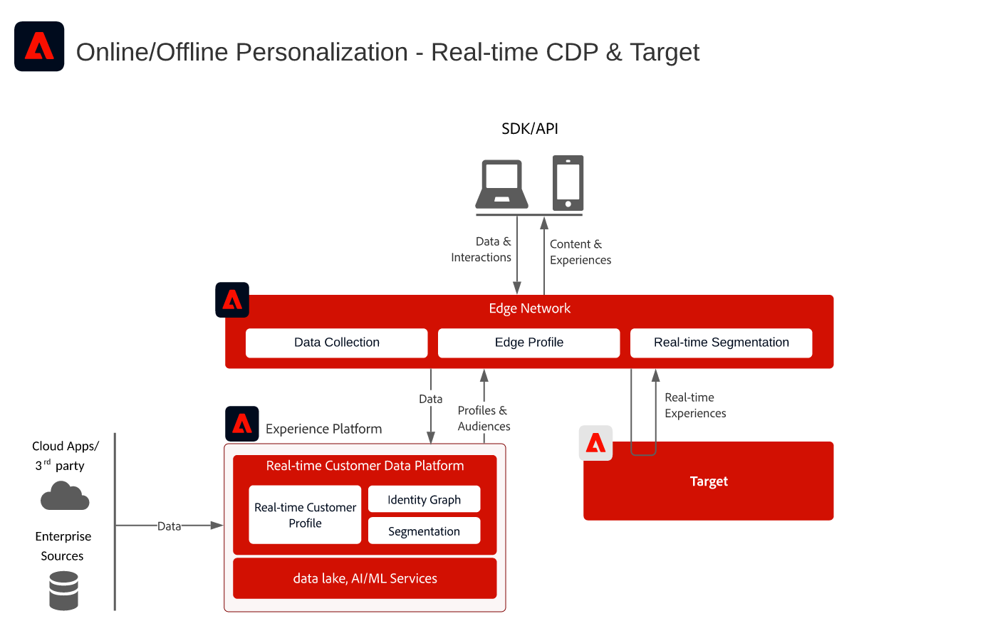
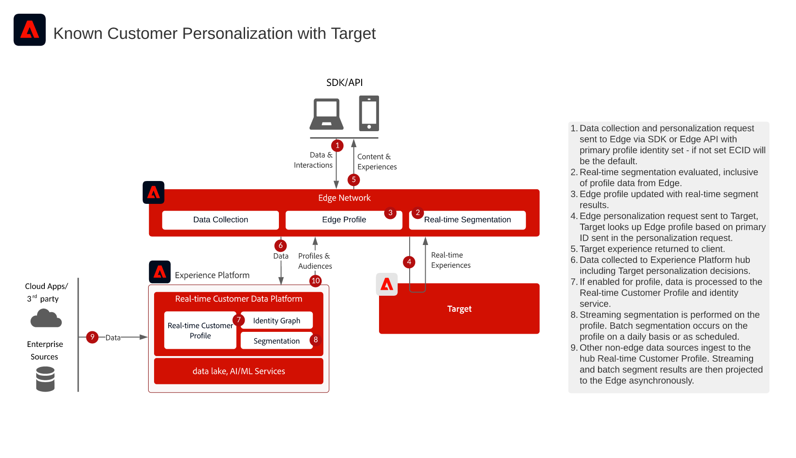

# RTCDP + Target Integration Overview

This architecture shows how [!DNL Real-Time Customer Data Platform] and [!DNL Adobe Target] integrate through the Edge Network. It helps you select between real-time audience evaluation at the edge and sharing streaming or batch audiences with Target.

## Applications

* [!DNL Real-Time Customer Data Platform]
* [!DNL Adobe Target]
* [!DNL Experience Platform] Edge Network
* Experience Platform Web SDK or Edge Network Server API

## Choose an integration approach

### Real-time audience evaluation at the edge

Use this approach when [!DNL Adobe Target] needs edge-evaluated audiences and profile attributes for same-page or next-page personalization. Implement the Web SDK or Edge Network Server API and configure a datastream with the [!DNL Adobe Target] and [!DNL Experience Platform] services enabled.

### Streaming and batch audience sharing to Target

Use this approach when audiences evaluated in [!DNL Real-Time Customer Data Platform] need to be available in [!DNL Adobe Target] without real-time edge evaluation. Configure the [!DNL Adobe Target] destination in the default production sandbox. Web SDK or Edge Network Server API implementation is required only for real-time edge evaluation or custom identity namespace lookups.

## Architecture diagram

This diagram shows the primary integration points among data collection, the Edge Network, [!DNL Real-Time Customer Data Platform], and [!DNL Adobe Target].

## Data flow diagram

This sequence shows how a client request reaches the Edge Network, evaluates audiences and profile context, sends a personalization request to [!DNL Adobe Target], and returns the resulting experience to the client.

## Implementation considerations

* [!DNL Adobe Target] and [!DNL Real-Time Customer Data Platform] must use the same IMS organization.
* The [!DNL Adobe Target] destination supports the default production sandbox in [!DNL Real-Time Customer Data Platform].
* For custom identity namespace lookups at the edge, use Web SDK or Edge Network Server API and include each identity in the identity map.
* If using at.js, profile integration supports only the ECID identity namespace.

## Related documentation

### Configure the integration

* [Adobe Target Connection for Real-time Customer Data Platform](https://experienceleague.adobe.com/docs/experience-platform/destinations/catalog/personalization/adobe-target-connection.html)
* [Edge datastream configuration](https://experienceleague.adobe.com/docs/experience-platform/edge/fundamentals/datastreams.html)

### Implement at the edge

* [Experience Platform Web SDK documentation](https://experienceleague.adobe.com/docs/experience-platform/edge/home.html)
* [Experience Platform Tags documentation](https://experienceleague.adobe.com/docs/experience-platform/tags/home.html)
* [Experience Cloud ID Service documentation](https://experienceleague.adobe.com/docs/id-service/using/home.html)

### Evaluate audiences

* [Experience Platform Segmentation Overview](https://experienceleague.adobe.com/docs/experience-platform/segmentation/home.html)
* [Real-time Segmentation](https://experienceleague.adobe.com/docs/experience-platform/segmentation/ui/edge-segmentation.html)
* [Streaming Segmentation](https://experienceleague.adobe.com/docs/experience-platform/segmentation/api/streaming-segmentation.html)
* [Merge Policy Configuration](https://experienceleague.adobe.com/docs/experience-platform/profile/merge-policies/ui-guide.html?lang=en#create-a-merge-policy)
