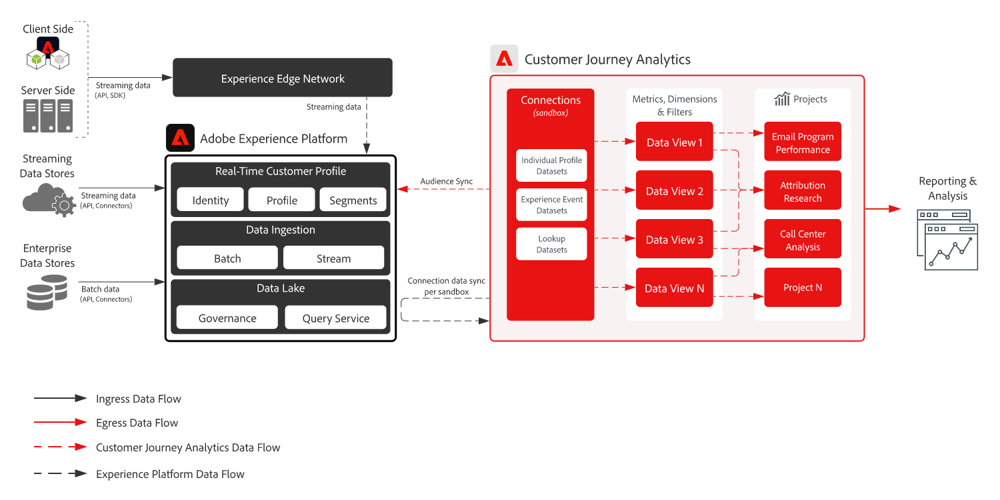

title: Adobe Customer Journey Analytics
description: Core architecture for unifying customer interaction data in Adobe Customer Journey Analytics, with B2B analysis and audience sharing derivations.
solution: Customer Journey Analytics, Experience Platform
---
# Adobe Customer Journey Analytics

Adobe Customer Journey Analytics unifies customer interaction data from Adobe Experience Platform and other sources into a journey-based analysis service. This architecture provides the core reference for cross-channel analysis, B2B CJA derivations, and publishing CJA audiences to Real-Time CDP.

## Customer Journey Analytics architecture

This diagram shows the core flow of customer interaction data into Customer Journey Analytics for connections, data views, analysis, and audience creation.

## Architecture derivations

- B2B Customer Journey Analytics extends the core architecture with account, opportunity, buying-group, and person dimensions for account-based analysis.
- CJA audience sharing publishes audiences created from Customer Journey Analytics to Real-Time CDP for activation and downstream journey execution.

## Primary data flows and integration points

- Customer interaction data is collected from web, mobile, commerce, CRM, and other sources into Adobe Experience Platform.
- Experience Platform datasets are selected in a Customer Journey Analytics connection.
- Data views expose metrics, dimensions, and calculated fields for cross-channel analysis.
- Customer Journey Analytics audiences can be published to Real-Time CDP for activation.
- Customer Journey Analytics insights can be used with Journey Optimizer through the dedicated integration architecture.

## Use case patterns supported

- [B2B analytics](/help/blueprints/use-case-patterns/b2b/account-analytics.md) -- Analyze account, opportunity, and person-level journeys with B2B dimensions.
- [Customer analytics and insight generation](/help/blueprints/use-case-patterns/analysis/customer-analytics-insight-generation.md) -- Analyze cross-channel behavior and generate journey insights.

## Further reading

- [Customer Journey Analytics overview](https://experienceleague.adobe.com/en/docs/analytics-platform/using/cja-overview/cja-overview)
- [Customer Journey Analytics connections](https://experienceleague.adobe.com/en/docs/analytics-platform/using/cja-connections/create-connection)
- [Publish Customer Journey Analytics audiences](https://experienceleague.adobe.com/en/docs/analytics-platform/using/cja-components/audiences/publish)