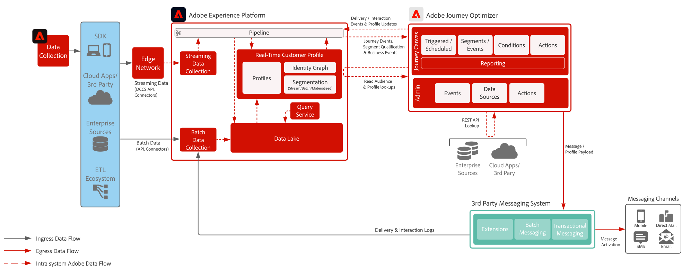

# Third-Party Messaging

>[!TIP]
>This architecture is also documented as a [use case pattern](/help/blueprints/use-case-patterns/campaign-management-orchestration/third-party-messaging.md) under Campaign Management & Orchestration.

Demonstrates how Adobe Journey Optimizer can be utilized with third-party messaging systems to send personalized communications.

 

## Architecture

 

The topology shows [!DNL Journey Optimizer] sending transactional payloads to a third-party
messaging application through a custom action or REST API integration. Use the [third-party
messaging use case pattern](/help/blueprints/use-case-patterns/campaign-management-orchestration/third-party-messaging.md)
for prerequisites, guardrails, and implementation guidance.

 

## Related documentation

* [Experience Platform documentation](https://experienceleague.adobe.com/docs/experience-platform.html)
* [Experience Platform Tags documentation](https://experienceleague.adobe.com/docs/experience-platform/tags/home.html)
* [Experience Platform Mobile SDK documentation](https://experienceleague.adobe.com/docs/mobile.html)
* [Journey Optimizer documentation](https://experienceleague.adobe.com/docs/journey-optimizer/using/ajo-home.html)
* [Journey Optimizer Product Description](https://helpx.adobe.com/legal/product-descriptions/adobe-journey-optimizer.html)
