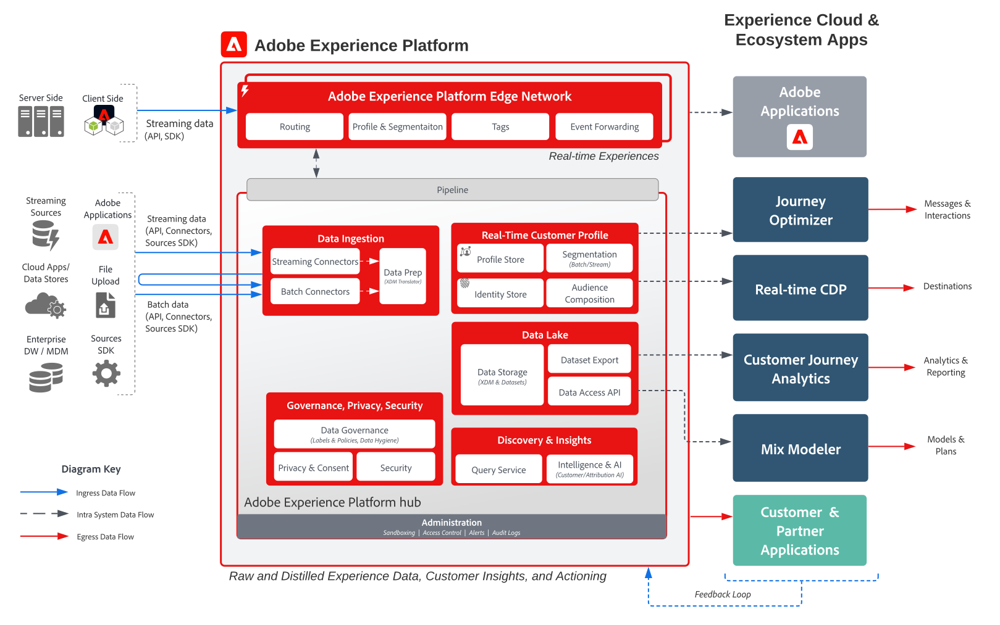
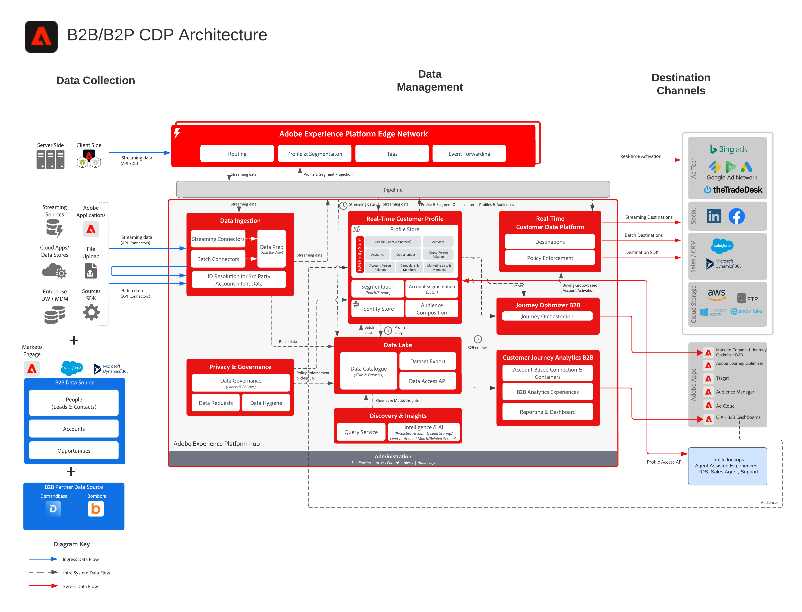
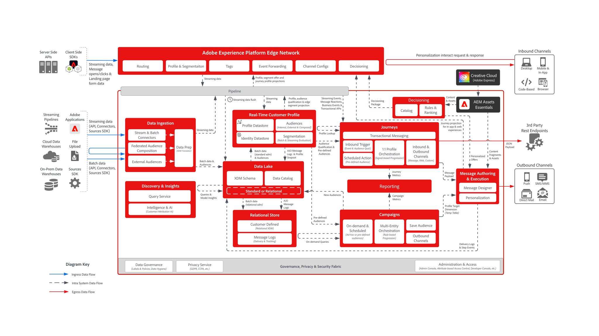

# Architecture diagrams

Architecture diagrams are visual, technical references that show how Adobe Experience Platform and applications fit together — system integration points, data and content flows, and sequence of operations. Use them to understand solution design before diving into the step-by-step guidance in [use case patterns](/help/blueprints/use-case-patterns/overview.md).

The diagrams are organized into the following categories. Select a card to jump to that category's landing page or lead diagram — use the left navigation to browse every diagram within a category.

<table style="table-layout:fixed; width:100%;">
<tr>
  <td style="width:33%; vertical-align:top; padding:10px; box-sizing:border-box;">
    
    

      <a href="architecture-overviews/overview.md">
        <strong>Architecture overviews</strong>
      </a>
      
How Experience Cloud applications, Experience Platform, and deployment SDKs fit together, plus guardrails and latencies.

    

  </td>
  <td style="width:33%; vertical-align:top; padding:10px; box-sizing:border-box;">
    
    

      <a href="audience-profile-activation/overview.md">
        <strong>Audience & profile activation</strong>
      </a>
      
How audiences and profiles are built in Adobe Real-Time CDP and activated to destinations and applications.

    

  </td>
  <td style="width:33%; vertical-align:top; padding:10px; box-sizing:border-box;">
    
    

      <a href="b2b-activation-marketing/overview.md">
        <strong>B2B activation & marketing</strong>
      </a>
      
Account-based and people-based audience activation with Real-Time Customer Data Platform B2B Edition across channels and destinations.

    

  </td>
</tr>
<tr>
  <td style="width:33%; vertical-align:top; padding:10px; box-sizing:border-box;">
    
    

      <a href="customer-insights/overview.md">
        <strong>Customer insights</strong>
      </a>
      
How Customer Journey Analytics unifies and analyzes cross-channel behavioral data, and integrates with Real-Time CDP and Journey Optimizer.

    

  </td>
  <td style="width:33%; vertical-align:top; padding:10px; box-sizing:border-box;">
    
    

      <a href="customer-journeys/journey-optimizer/journey-optimizer-overview.md">
        <strong>Customer journeys</strong>
      </a>
      
Event-driven journey orchestration with Journey Optimizer, decisioning on the edge and hub, and batch orchestration with Adobe Campaign.

    

  </td>
  <td style="width:33%; vertical-align:top; padding:10px; box-sizing:border-box;"></td>
</tr>
</table>

## Related content

* [Use case patterns](/help/blueprints/use-case-patterns/overview.md) — repeatable implementation approaches that build on these architectures
* [Key business objectives](/help/blueprints/business-objectives/overview.md) — the business outcomes these architectures help you achieve
* [Industry use cases](/help/blueprints/industry-use-cases/use-case-catalog.md) — vertical-specific applications of these patterns
