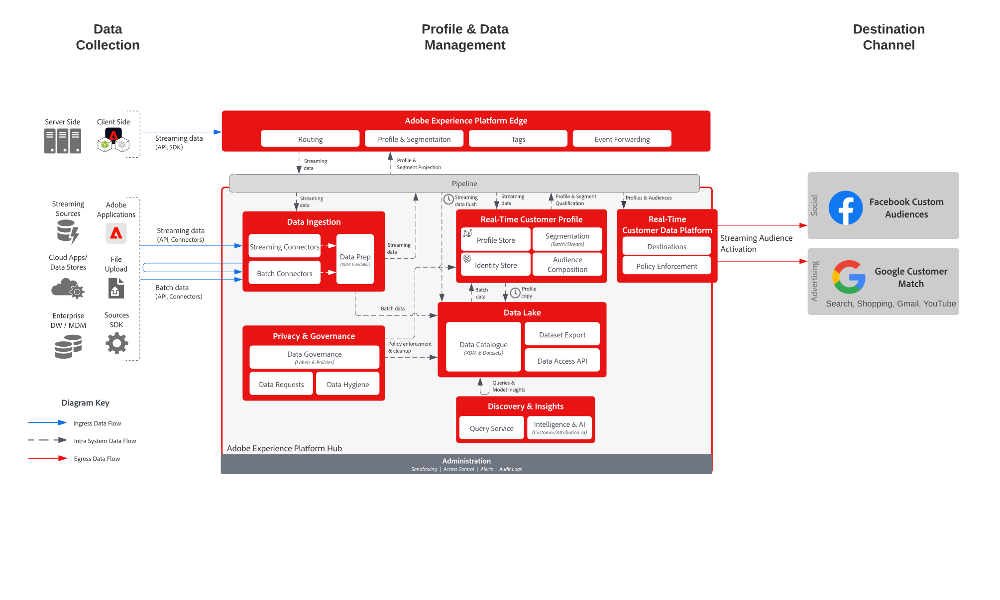

# Audience Activation to Social and Advertising Destinations

>[!TIP]
>This blueprint is also available as a [use case pattern](/help/blueprints/use-case-patterns/audience-building-activation/audience-activation-to-destinations.md) under Audience Building & Activation.

Ingest customer data from multiple sources to build a single profile view of the customer. You can segment these profiles to built audiences for marketing and personalization, share these audiences to Ad Networks such as Facebook and Google to target and personalization campaigns against those audiences. 

## Use cases

* Audience targeting for known audiences on social and advertising destinations.
* Online personalization with online and offline attributes.

## Applications

* Real-time Customer Data Platform

## Architecture

## Guardrails

[Profile & Segmentation Guardrails](https://experienceleague.adobe.com/docs/experience-platform/profile/guardrails.html?lang=en)

## Related documentation

Activation to Facebook Custom Audiences - [Destination Configuration](https://experienceleague.adobe.com/docs/experience-platform/destinations/catalog/social/facebook.html)

Activation to Google Customer Match - [Destination Configuration](https://experienceleague.adobe.com/docs/experience-platform/destinations/catalog/advertising/google-customer-match.html)