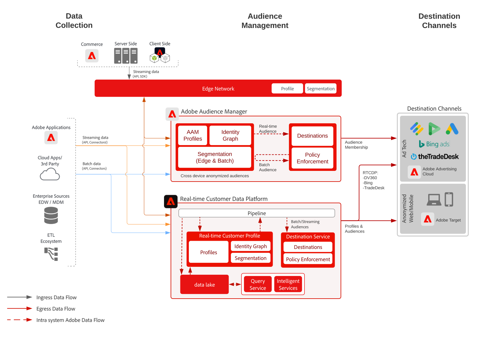

# Device Based - Anonymous Audience Targeting with Audience Manager

>[!TIP]
>This blueprint is also available as a [use case pattern](/help/blueprints/use-case-patterns/personalization/anonymous-visitor-web-personalization.md) under Personalization.

Anonymous audience activation is the ability to target and personalize to audiences across web, mobile, and advertising channels based on anonymous device and behavioral data. 

## Use cases

* Perform anonymous digital audience targeting and personalization on the website, mobile app, or on supported advertising channels.
* Optimize landing page and pre-authentication experiences based on known device and behavioral characteristics.
* Leverage the Audience Manager third party data network to further refine and expand your audiences for targeting.

## Applications

* Audience Manager
* Real-time Customer Data Platform

Both Audience Manager and Real-time Customer Data Platform can be leveraged to power Anonymous Audience Activation for onsite and advertising destinations. Note that Real-time Customer Data Platform supports only a subset of advertising destinations with anonymous device identifiers as cataloged in the [destinations documentation](https://experienceleague.adobe.com/docs/experience-platform/destinations/catalog/advertising/overview.html?lang=en).

## Architecture

 

## Implementation steps for Audience Manager

* For details on implementing Audience Manager see the following [documentation](https://experienceleague.adobe.com/docs/audience-manager/user-guide/implementation-integration-guides/implement-audience-manager.html).