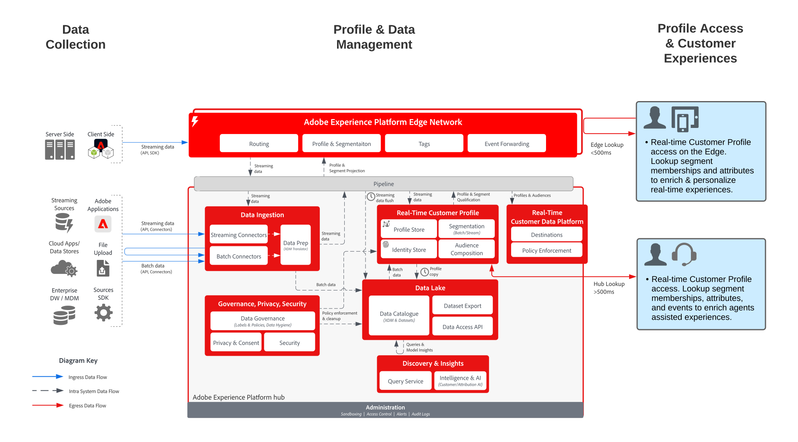

# Real-time Profile Access for Support and Sales Scenarios

Real-time Profile Access for Support and Sales Scenarios blueprint shows how external applications can access Adobe Experience Platform's [!UICONTROL Real-time Customer Profile].

External applications can access profiles with an API GET request. Attributes, events, segment memberships, and model-driven features stored in the profile can then be used in these external, non-Adobe applications.

With this capability, you could surface rich context when a customer calls your call center. Support agents could have visibility into the customer's lifetime value, propensity to churn or exposure to marketing campaigns, for example. Sales agents can also benefit from more context or insight into their customer.

>[!NOTE]
>
>Profile lookup on the hub is not intended for high throughput, low latency use cases such as web/mobile inbound personalization. Profile lookup on the hub is intended for lower latency scenarios such as agent assisted support or sales interactions. For low latency, high throughput scenarios such as web/mobile personalization, or real-time offer decisioning, the Edge profile should be leveraged. The Edge profile enables real-time access through the [Custom Personalization Connection](https://experienceleague.adobe.com/en/docs/experience-platform/destinations/catalog/personalization/custom-personalization) of Real-time Customer Data Platform.

## Use cases

* Provide deeper consumer context to agent-supported interactions, such as support and sales experiences. Using the profile lookup into Experience Platform, agents can receive more context on the consumer, such as recent purchases, campaign interactions, propensities, audience memberships, and other attributes and insights that are stored in the real-time customer profile.

## Architecture

## Guardrails

* [Guardrails for [!UICONTROL Real-time Customer Profile] data](https://experienceleague.adobe.com/docs/experience-platform/profile/guardrails.html)

## Implementation steps

1. [Create schemas](https://experienceleague.adobe.com/?recommended=ExperiencePlatform-D-1-2021.1.xdm) for data to be ingested.
1. [Create datasets](https://experienceleague.adobe.com/docs/platform-learn/tutorials/data-ingestion/create-datasets-and-ingest-data.html) for data to be ingested.
1. [Configure the correct identities and identity namespaces](https://experienceleague.adobe.com/docs/platform-learn/tutorials/identities/label-ingest-and-verify-identity-data.html) on the schema to be sure that ingested data can stitch into a unified profile.
1. [Enable the schemas and datasets for profile](https://experienceleague.adobe.com/docs/platform-learn/tutorials/profiles/bring-data-into-the-real-time-customer-profile.html).
1. [Ingest data](https://experienceleague.adobe.com/?recommended=ExperiencePlatform-D-1-2020.1.dataingestion) into Experience Platform.
1. [Set up merge policies](https://experienceleague.adobe.com/docs/platform-learn/tutorials/profiles/create-merge-policies.html).
1. Use the [Entities API to look up a profile attribute](https://experienceleague.adobe.com/docs/experience-platform/profile/api/entities.html).

## Related documentation

* [Adobe Experience Platform Activation product description](https://helpx.adobe.com/legal/product-descriptions/adobe-experience-platform0.html)
* [[!UICONTROL Real-time Customer Profile] documentation](https://experienceleague.adobe.com/docs/experience-platform/profile/home.html?lang=en)
* [Profile Guardrails](https://experienceleague.adobe.com/docs/experience-platform/profile/guardrails.html)
* [Profile Lookup API](https://www.adobe.io/apis/experienceplatform/home/api-reference.html)
