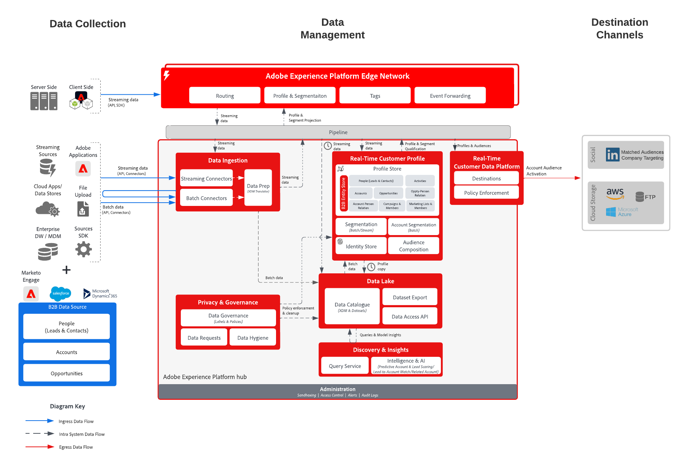

# B2B account activation to advertising destinations and file destinations

Account-Based Engagement allows B2B marketers to create audiences of accounts (i.e., lists of companies) and target those companies via destinations like LinkedIn that accept lists of companies as input or export to cloud storage destinations for targeting and sales outreach.

## Use cases

Using account-based engagement, marketers can unlock three key use cases:

* **Fill buying group gaps:** A marketer can advertise on accounts where they do not yet have contacts for the CMO or CIO roles. They can first build an audience of accounts without a contact with the title “CMO” or “CIO” and then activate the audience on LinkedIn. Within the destination, LinkedIn, they can then launch a campaign targeting that audience and specific people with “CMO” or “CIO” job titles to reach these new contacts and highlight the benefits of their offerings.
* **Upsell or cross-sell to other divisions of a company that is an existing customer:** A marketer can build an account audience that purchased product X between 3 and 9 months ago but does not yet own product Y. They can then activate, highlighting the benefits of product Y to that target audience.
* **Target companies that are using competing products:** A marketer can market to accounts to displace a competitor’s products, even without any contacts at those accounts. They can create an audience of accounts based on partner data showing ownership or usage of a competitor’s product, then activate via LinkedIn to source contacts at target accounts for expansion.

## Applications

* Real-time Customer Data Platform B2B Edition

## Integration patterns

* B2B data sources (Marketo, Salesforce, etc.) -> Real-time Customer Data Platform B2B Edition -> Destinations.
* Various B2B data sources can be used to map account, lead, opportunity, and people data to the B2B Edition of Real-time Customer Data Platform.

## Architecture

## Account audience destinations

* (Companies) LinkedIn Matched Audiences
* Cloud Storage destinations
    * Azure Data Lake
    * Data Landing Zone
    * SFTP
    * Azure Blob
    * AWS S3

## Guardrails

* Capped at 50 account segments per sandbox.
* Batch segmentation evaluation.
    * Automatically evaluated every 24 hours following the completion of the batch audience run and profile export jobs.
    * No edge, streaming, or ad-hoc evaluation support.
* Account attributes are available for export.
* Events of people.
    * Up to 30 days of event lookback, no ordering of event predicates.
    * AND / OR are supported (so you can say "A and B have to happen,"  but you can't say "A must happen 3 days before B").
* For cloud storage destinations, the export schedule supports the "After segment evaluation" option.
* [B2B Profile & Segmentation Guardrails](https://experienceleague.adobe.com/en/docs/experience-platform/rtcdp/intro/rtcdpb2b-intro/b2b-guardrails).

## Implementation steps for Real-time Customer Data Platform B2B Edition, account audience creation, and activation

* For implementation steps of Real-time Customer Data Platform B2B Edition, see the [Getting started with Real-Time Customer Data Platform B2B Editiond](https://experienceleague.adobe.com/en/docs/experience-platform/rtcdp/intro/rtcdpb2b-intro/b2b-tutorial) documentation.
* For Account Audience Creation steps, see the [Account audiences](https://experienceleague.adobe.com/en/docs/experience-platform/segmentation/ui/account-audiences) documentation.
* For Account Audience Activation steps, see the [Activate account audiences](https://experienceleague.adobe.com/en/docs/experience-platform/destinations/ui/activate/activate-account-audiences) documentation.
    * Required mapping for [(Companies) LinkedIn Matched Audiences destination](https://experienceleague.adobe.com/en/docs/experience-platform/destinations/ui/activate/activate-account-audiences#required-mappings).

## Implementation considerations

LinkedIn matched audiences have a few requirements, including the minimum audience size of 300 matched members. If the account audience activated for the company's linked matched audience destination does not meet the requirement, the audience definition needs to be modified to increase the audience size to launch a LinkedIn campaign.

## Related Documentation

* [B2B Edition of Real-time Customer Data Platform](https://experienceleague.adobe.com/en/docs/experience-platform/rtcdp/intro/rtcdpb2b-intro/b2b-overview)
* [Create and activate Account Audience Tutorial Video](https://experienceleague.adobe.com/en/docs/platform-learn/tutorials/audiences/create-audiences-with-b2b-data)
* [Create Account Audiences](https://experienceleague.adobe.com/en/docs/experience-platform/segmentation/ui/account-audiences)
* [Activate Account Audiences](https://experienceleague.adobe.com/en/docs/experience-platform/destinations/ui/activate/activate-account-audiences)
* [Adobe Experience Platform - LinkedIn Destination Connector](https://experienceleague.adobe.com/en/docs/experience-platform/destinations/catalog/social/linkedin)
