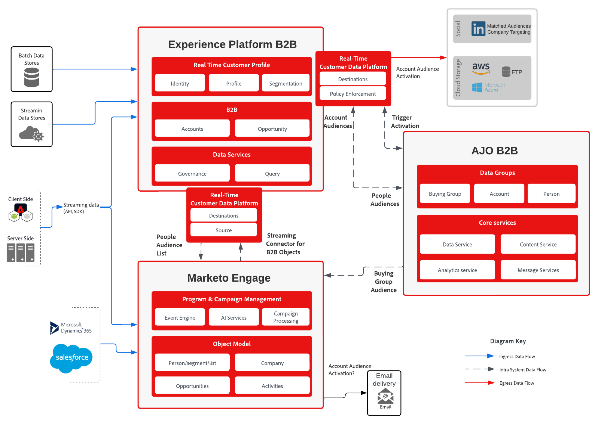

# Buying Group-based Marketing and Journey Management blueprint

Marketing teams currently face many challenges in providing Sales with qualified leads. One of these challenges is working with the right people in the organization and is usually evident in effort and accuracy. With _lead scoring_, the group is too narrow and teams might miss the right people. With _account scoring_, there is greater effort required to identify the right person with such a broad view of an account. 

This challenge is where the concept of **_buying group_** is introduced. A buying group enables marketers to find the right group of people in the account, and to work with these individuals through the lens of qualifying the leads and identifying their role in the group. 

## How buying groups are used to qualify leads and accounts

Creating and striving to complete a buying group increases the effectiveness of the marketing activity in qualifying leads to sales opportunities. Buying groups are hinged on matching leads to role templates that are linked to the Solution intent.

An example of a buying group could be _Acme Corp Seeds Buying Group_, which has a solution interest of _AI Driven Seeds_.

Buying groups represent a group of people at the company who are interested in a solution through a solution intent. And a buying group could be identified for more than one solution interest and the individuals appear in more than one buying group.

As a result of the enhanced B2B abilities provided by Journey Optimizer B2B Edition, you can now address these challenges:

* A lack of _customer-first_ marketing campaigns.
* Inconsistent Marketing Qualified lead (MQL) conversion to Sales Qualified lead (SQL), requiring alignment of initiatives with sales to nurture MQL
* Lack of a saleable mechanism to identify and target _compete_ accounts.
* Concentration risk in revenue and pipeline.

The following KPIs align well with measuring the success of use cases:

* **Awareness**: Are target customers seeing your ads and does it drive them to your website at a higher rate than before?
* **Engagement**: Are target customers coming to your website and engaging with content?
* **Time**: How much time does it take the Sales team to find and add contacts from various tools to the opportunity?
* **Cost**: How much money does each lead cost on each platform?

## Account-based marketing

A common use case, and the focus in this blueprint, is an account-based marketing initiative. This use case explores the point where your created buying group is populated with a lead when they are associated with a role and solution interest.

As you lead an individual through the journey, you gather more information on the lead (Buying Group Workflow), through forms, CRM Sync, and LinkedIn activation.

When a lead clearly demonstrates the solution interest, it indicates a business event defined by a business lens. At this point, the business is confident that this lead is really interested in a product. In Journey Optimizer B2B Edition, the lead is associated with a buying group for that solution in a roles template (such as influencers, decision makers, champions, and sponsors).

As the following diagram illustrates, you can collect details in forms or through LinkedIn activation and qualify a solution intent when interaction with a chat-bot occurred.

{zoomable="yes"}

When the buying group complete percentage is high enough, you share the group to the Sales team through SQL or an SOL to convert the leads in the account to a completed sale.

## Account-focused solution

The focus of B2B lead management is on accounts and their leads. The technical layer is set up to support the data that represents these characteristics, which is a requirement for successful account segmentation and journeys management.

### Requirements

The account-focused solution requires the following applications and services:

* Adobe Journey Optimizer B2B Edition
* Adobe Real-time Customer Data Platform (RTCDP) B2B Edition
* Adobe Marketo Engage

>[!NOTE]
>
>Licensing of Journey Optimizer B2B Edition should include the following items:
><ul><li>Journey Optimizer B2B Edition instance that is connected to Experience Platform B2B</li><li>Marketo Engage instance that is synced to RTCDP</li></ul>
> 
>For existing Marketo Engage customers, a connection to the existing instance is the recommended approach.
>  
>There are additional extensions available for the solution to enhance profile richness:
><ul><li>Additional sources to RTCDP to enrich the profile</li><li>RTCDP destination to Marketo Engage</li></ul>

Implementation of this solution also requires a clear understanding of the concept of _Account_ and _Buying group_, and how they amplify and accelerate your sales lead qualification. With this understanding, you must also identify the desired buying group completeness score.

### Architecture

{zoomable="yes"}

### Data schema

With any implementation of data driven marketing automation, the design of schemas is crucial for the success of the implementation. Before you design your schema, review the [B2B namespaces and schemas](https://experienceleague.adobe.com/en/docs/experience-platform/sources/connectors/adobe-applications/marketo/marketo-namespaces) and make sure that you understand the auto-generation utility that is available to generate a new schema in a new implementation scenario.

The schemas are specifically enriched with B2B data elements to support the rich relationship in profiles and include the account perspective through the `sourceKey` to tie events and profiles to the account schema. Schemas are a representation of your organizational requirements and the data collected and profiled. To meet these needs, B2B schemas are flexible and are an extension of the required B2B elements.

When designing the data schema for your organization, it is a best practice to represent and label the main entities in your ERD with the high-level entities. (Refer to the first diagram in the [RTCDP B2B schema documentation](https://experienceleague.adobe.com/en/docs/experience-platform/xdm/tutorials/relationship-b2b)). This process is very helpful for understanding the required data elements that you need to define in each schema.

At this stage, Experience Events are not yet able to influence journeys. In addition to the Experience Event schemas, it is recommended that you add properties to the account that represent major decisions based on user activities. These properties are used for split path elements in the journey designer.

>[!NOTE]
>
>Currently, the only relationship supported by Journey Optimizer B2B Edition is the direct relationships through the `personComponents[0].sourceAccountKey.sourceKey` attribute on the `Person` entity. Future expansion is planned to accommodate the account-person relation object in the B2b schema.

### Marketo Engage source connector

To enrich the account data elements, you can use Marketo Engage and its B2B data to enrich the RTCDP and Journey Optimizer B2B Edition Account view. Setting up the Marketo Engage Source Connector and mapping Marketo Engage data to RTCDP schema attributes allows data to flow from Marketo Engage to RTCDP, and if designated, to the profile.

For detailed information about the connector configuration and the required field mapping to the schema, refer to the [Marketo Engage connector documentation](https://experienceleague.adobe.com/en/docs/experience-platform/sources/connectors/adobe-applications/marketo/marketo).
    
### Guardrails

The Journey Optimizer B2B Edition guardrails are detailed in the [Product Description page](https://helpx.adobe.com/legal/product-descriptions/adobe-journey-optimizer-b2b.html).

Implementation-related guardrails

* All B2B Audience guardrails are described in the [B2B Audience and Profile Activation blueprint](https://experienceleague.adobe.com/en/docs/blueprints-learn/architecture/architecture-overview/deployment/guardrails) are directly transposed to the Journey Optimizer B2B Edition success.
* If activation is required through Marketo Engage channels in the account journey or where CRM Sync is used to enrich the account, the [Marketo Engage related guardrails](https://helpx.adobe.com/legal/product-descriptions/adobe-marketo-engage---product-description.html#performance-guardrails) are relevant.

Review the [Real-Time CDP Guardrails documentation](https://experienceleague.adobe.com/en/docs/experience-platform/rtcdp/guardrails/overview) for additional details for RTCDP Guardrails.

### Provisioning

* All instances are required to be on the same IMS organization.
* Only one Journey Optimizer B2B Edition instance can be linked to one Experience Platform sandbox.
* It is highly encouraged to implement the [Marketo Source Connector to Real-time Customer Data Platform](https://experienceleague.adobe.com/en/docs/experience-platform/sources/connectors/adobe-applications/marketo/marketo).

## Implementation

The following steps provide guidance for enabling buying groups in your Journey Optimizer B2B Edition instance, including audience activation to support expansion of your account base with a focus on missing buying group role templates.

### Pre-requisite steps

1. Define the XDM schema that is going to represent your business view of Accounts and Leads.

   As a first step, you define and create an experience schema designed to fit the B2B use case needs and covering the data sources, both batch and real time. This design should represent the way the business is thinking of the account and person entities and the use cases you wish to support. For the schema to be a B2B schema, the schema should follow the structures available in the [RTCDP B2B Schema documentation](https://experienceleague.adobe.com/en/docs/experience-platform/xdm/tutorials/relationship-b2b). 
  
   A useful practice is to take the entity names from the diagram and identify those entities in your schema by labeling them in the same way. Take note that some schemas require specific keys, such as `sourceKey`, to function in RTCDP B2B. For the short term, the _Many-to-Many_ relationship between account and person through Account Person Relationship is not supported in Journey Optimizer B2B. Use the accelerator scripts for the best starting point:

   * Use the [RTCDP B2B schema creation script](https://github.com/adobe/experience-platform-postman-samples/tree/master/Postman%20Collections/CDP%20Namespaces%20and%20Schemas%20Utility) to generate the initial schema
   * Add use case specific fields to the schemas generated to complete the schema to fit the organization need.

   At this stage, you have the connection between Marketo Engage and RTCDP and the schema structure to accept the account and person data to populate the datasets for the Account Segments is defined. The next step is to connect RTCDP with Marketo Engage and Journey Optimizer B2B Edition.

1. Configure the Marketo Engage connector, including the mapping of Marketo Engage to the XDM structure.

   With the XDM structure and fields in place, proceed to connect Marketo Engage to RTCDP using the connector, which feeds the datasets with data from Marketo Engage and Journey Optimizer B2B. Start by organizing the mapping for the fields from Marketo Engage to RTCDP classes. Use the information in the [connector documentation](https://experienceleague.adobe.com/en/docs/experience-platform/sources/connectors/adobe-applications/marketo/marketo#field-mapping-from-marketo-engage-to-xdm) to identify the fields that you want to include from your Marketo Engage implementation.

### Buying Group configuration

1. Create Account audiences in Journey Optimizer B2B Edition or RTCDP.

   Enable the Scheduling all audiences option in the Customer → Audiences → Browse page to enable Account Audiences. (In cases where this does not work, you must create a Customer Profile segment to be able to enable Account Audiences to be created.)

   To create a segment, follow the steps in the [account audiences documentation](https://experienceleague.adobe.com/en/docs/journey-optimizer-b2b/user/account-audiences/account-audience-overview). The use of Segment Builder with the data fields you have identified as key for your Account Audience would be the key activity in defining the Audience.

   At this stage, you know the Account leads to focus on through RTCDP and to use for the building blocks of the buying group.

1. Define the roles template.

   In each buying group, identify the roles that represent the role individuals take in the group you want to address. For example, you could use _decision maker_, _influencer_, and _champion_. Also define the weight and conditions for this role in the buying group.

   The [roles templates documentation](https://experienceleague.adobe.com/en/docs/journey-optimizer-b2b/user/buying-groups/buying-groups-role-templates) describes this process and how to define special conditions.

1. Define the solution interest.

   A solution interest is a way to indicate the buying groups focus for your marketing activities and strategy.

   To define a solution interest, follow the steps in the [solution interests documentation](https://experienceleague.adobe.com/en/docs/journey-optimizer-b2b/user/buying-groups/solution-interests). Keep in mind that you use it to match the buying group to a sales initiative in the organization.

1. Configure the buying group.

   With the building blocks of the buying group ready, configure the buying group for the solution interest and account audience with a target to complete the roles template with the right members of the account. With this configuration, assign a solution interest to the roles template that you identified and you give each role a weight in the sales success for that specific product.

   To build the buying group, follow the steps in the [buying groups documentation](https://experienceleague.adobe.com/en/docs/journey-optimizer-b2b/user/buying-groups/buying-groups-create).

   At this stage, you are ready to [create a journey](https://experienceleague.adobe.com/en/docs/journey-optimizer-b2b/user/account-journeys/journey-overview#get-started-with-a-journey) and start working with the Account Audience to build up the buying group and qualifying them for the solution interest.

### Audience activation 

Increase the buying group completeness through audience activation. 

1. Define a LinkedIn Ad Matched Account Audience.

   In addition to email and form fill activities, Journey Optimizer B2B Edition offers a LinkedIn Ad capability to increase the broadness of your account and support the effort to complete a buying group through the expansion of account leads span and increasing the reach of your marketing activities.

   To use LinkedIn Paid media for communicating with the accounts where buying groups are not completed or engaged enough, expand or engage with the Account Audience, use the [LinkedIn Account Matched Audiences capability](https://experienceleague.adobe.com/en/docs/journey-optimizer-b2b/user/account-audiences/linkedin-account-matched-audiences) to generate LinkedIn Ad audiences through Account Matched Audiences.

1. Activate the audience for buying groups.

>[!TIP]
>
>A couple of hints for successful campaigns:
>
>* A campaign should have role filters to fit buying groups with missing roles to increase the ROI.
>* To capture leads, direct leads to fill forms (LinkedIn or Marketo Engage forms) and retarget the form misses.
