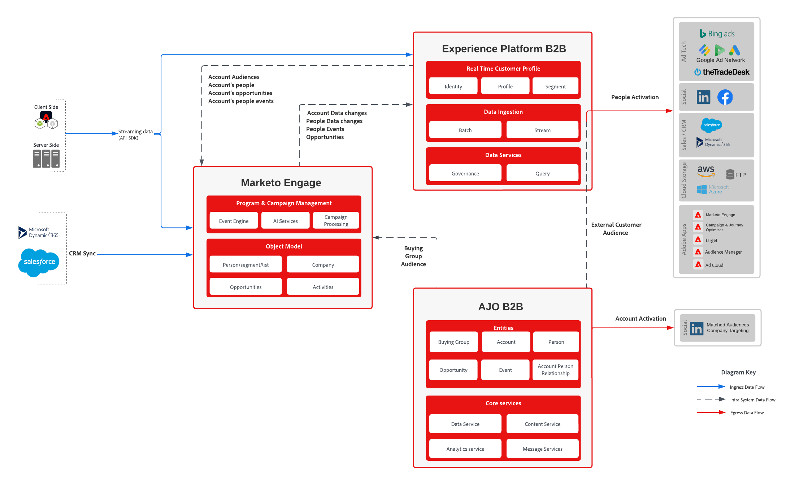

# B2B Journeys using Marketo Data blueprint

This comprehensive guide outlines the process of integrating Marketo Engage with Adobe Journey Optimizer B2B Edition. It covers the configuration of custom schema, ingestion of profiles and accounts, and the orchestration of personalized journeys for buying groups. By using Marketo Engage data, this blueprint ensures precise targeting and engagement across multiple channels, driving more qualified demand and enhancing customer experiences.

## Use cases

* **Create and Manage Buying Groups**: Use generative AI to assemble and manage buying groups within target accounts, ensuring comprehensive coverage of key stakeholders
* **Automate Member Assignment**: Automatically assign members to buying group roles based on defined criteria, such as content consumption and CRM data
* **Personalized Journeys**: Design and visualize multi-step journeys tailored to each buying group and member based on their role, account, product interest, and lifecycle stage
* **Real-Time Automation**: Automate the progression of accounts and buying groups through journeys with real-time engagement triggers and qualification scoring
* **Cross-Channel Engagement**: Engage buying groups across multiple channels, including email, SMS, ads, chat, events, and webinars, to streamline demand generation and qualification
* **AI-Driven Insights**: Use AI-driven insights to optimize content delivery and engagement strategies for individual buyers and entire buying groups
* **Unified Data Activation**: Activate unified account lists from Adobe Real-Time Customer Data Platform to provide the most recent and complete data for buying group creation and management
* **Enhanced Collaboration**: Coordinate marketing and sales efforts to create more precise selling opportunities and accelerate pipeline creation

## Applications

* Journey Optimizer B2B Edition
* Real-time Customer Data Platform B2B Edition
* Marketo Engage

## Integration patterns

| Integration | Description |
| :-- | :--- |
|[Marketo Engage connector](https://experienceleague.adobe.com/en/docs/experience-platform/sources/connectors/adobe-applications/marketo/marketo)| Adobe Experience Platform facilitates the ingestion of data from Marketo, providing capabilities to structure, label, and enhance the data using its services.|
|[Journey Optimizer B2B Edition - Marketo Engage action](https://experienceleague.adobe.com/en/docs/journey-optimizer-b2b/user/account-journeys/journey-nodes/action-nodes#marketo-engage-actions)| Synchronize Account-Based Marketing in Journey Optimizer B2B Edition with lead-based efforts in Marketo Engage using people-based actions to manage list memberships, people partitions, and request campaigns.|
|[Journey Optimizer B2B Edition - Marketo Engage assets](https://experienceleague.adobe.com/en/docs/journey-optimizer-b2b/user/content-management/assets/marketo-engage-dam/marketo-engage-design-studio)|Marketo Engage Design Studio is the default asset source for Journey Optimizer B2B Edition, enabling easy asset management for account journeys.|

## Architecture

{zoomable="yes"}

## Implementation steps

* Install B2B schemas and namespaces using either option below
  * Using [Postman collection](https://github.com/adobe/experience-platform-postman-samples/tree/master/Postman%20Collections/CDP%20Namespaces%20and%20Schemas%20Utility)
  * Using [templates](https://experienceleague.adobe.com/en/docs/experience-platform/sources/ui-tutorials/templates) in the Platform UI
* Build a data dictionary defining the mapping between Marketo fields and Experience Platform XDM schema
  * Use the [Marketo Object Metadata](https://experienceleague.adobe.com/en/docs/marketo/using/product-docs/administration/field-management/export-all-object-metadata) as a starting point
  * [Customize the XDM schema](https://experienceleague.adobe.com/en/docs/experience-platform/xdm/ui/fields/overview) to include your custom fields
  * Review the standard [XDM fields](https://experienceleague.adobe.com/en/docs/journey-optimizer-b2b/user/accounts/field-mapping) supported by Journey Optimizer B2B Edition. If you need additional fields, please open a support ticket to have them configured
    * **workEmail.address** is required on the Person data set
    * **accountName** is required on the Account data set
  * Add a new XDM field column to the exported Marketo metadata spreadsheet to record the intended mapping
* Configure the [Marketo Engage source connector](https://experienceleague.adobe.com/en/docs/experience-platform/sources/connectors/adobe-applications/marketo/marketo)
  * Use the data dictionary defined above to define the [Import mapping](https://experienceleague.adobe.com/en/docs/experience-platform/data-prep/ui/mapping#import-mapping) for the source connector
  * Recommendation is not to enable profile before taking into account the [Implementation considerations](#implementation-considerations)
  * Recommendation to ingest Persons, Companies, Opportunities and Activities at a minimum as these objects are the most useful when creating your Account audiences
* Implement [Identity Graph Linking Rules](https://experienceleague.adobe.com/en/docs/experience-platform/identity/features/identity-graph-linking-rules/overview) for People:
  * Define how Person records are linked using identity namespaces (for example, email, b2b_person).
  * Configure identity namespaces and identity stitching rules in AEP.
  * Validate linking using sample Person data and preview tools.
* Enable the Person, Companies, Opportunities and Activities data sets for [profile](https://experienceleague.adobe.com/en/docs/experience-platform/catalog/datasets/user-guide#enable-profile)
* Define your first [Account Audience](https://experienceleague.adobe.com/en/docs/journey-optimizer-b2b/user/accounts/account-audience-overview)
* Define [buying groups](https://experienceleague.adobe.com/en/docs/journey-optimizer-b2b/user/accounts/buying-groups/buying-groups-overview) or an [account journey](https://experienceleague.adobe.com/en/docs/journey-optimizer-b2b/user/account-journeys/journey-overview) using the Account Audience
  * The buying group job runs daily, processing new accounts qualifying as Account audience or newly associated people
  * Buying group maintenance runs every Friday at midnight CT, so removing members or adding newly qualified members only occurs on Fridays

## Recommended Setup

To streamline implementation and ensure compatibility with Adobe Journey Optimizer B2B Edition, the following setup is recommended:

* **Use the default identity fields:**
  * _email_ and _b2b_person_ should be retained as identity fields in the Person schema to support identity stitching and audience activation.
* **Use the default mappings for the Marketo Source Connector:**
  * Leverage the out-of-the-box field mappings provided by Adobe to simplify data ingestion and reduce configuration overhead.
* **Use default mappings for AJO B2B:**
  * Adopt the [standard field mappings](https://experienceleague.adobe.com/en/docs/journey-optimizer-b2b/user/accounts/field-mapping) for Journey Optimizer B2B Edition to ensure compatibility with buying group logic and journey orchestration.
* **Block field updates on all fields except email:**
  * In Marketo Engage, configure field management to [block updates](https://experienceleague.adobe.com/en/docs/marketo/using/product-docs/administration/field-management/block-updates-to-a-field) from Adobe Experience Platform for all fields except _email_. This helps maintain data integrity while still enabling identity resolution.
* **Implement identity linking rules using email as a unique identity namespace**
  * Configure [identity graph linking rules](https://experienceleague.adobe.com/en/docs/experience-platform/identity/features/identity-graph-linking-rules/overview) in Adobe Experience Platform to use _email_ explicitly as a unique identity namespace. These rules ensure that profiles are accurately stitched across data sources where _email_ is present, enabling robust identity resolution. Following Adobe’s best practices, define linking rules that prioritize email as a stable and globally unique identifier to maintain a consistent and privacy-compliant identity graph.
This setup provides a balance between ease of deployment and data governance, ensuring a reliable foundation for orchestrating B2B journeys.

## Implementation considerations

When implementing Adobe Journey Optimizer B2B Edition, it's crucial to understand the identity stitching capabilities provided by the Real-time Customer Data Platform. This platform performs identity stitching at both the person and account levels, ensuring a unified view of customer data.

### Key Points

* **Identity Stitching**: The platform stitches identities using default identifiers such as Marketo ID, CRM ID, and email. This helps in creating a comprehensive profile by merging data from different sources.
* **Potential Risks**: Using email as an identifier for stitching can lead to unintentional identity collapse. This means that different individuals who share the same email address might be incorrectly merged into a single profile. This identity collapse can negatively impact the accuracy of CRM data and compromise its integrity.
* **Merging Strategy**: B2B CDP employs a time-based merging strategy, where the most recent lastUpdatedDate for a particular profile attribute is used. This strategy ensures that the most recent data is reflected in the profile.
* **Considerations for Email**: It's essential to assess thoroughly the use of email as an identifier for merging profile fragments. While it can be beneficial, the risk of identity collapse must be carefully considered against the advantages. One downside is that without email as an identifier, external audience membership created by AJO B2B does not integrate into the existing profile.
* **Marketo Person Integration**: AJO B2B uses the Marketo person with the lowest Lead ID when multiple Marketo records merge into a single profile.

By keeping these points in mind, you can make informed decisions about how to configure identity stitching in Adobe Journey Optimizer B2B Edition, ensuring accurate and reliable customer profiles.

### Evaluating Identity Stitching Outcomes

Query Service can be used to see the impact of identity stitching in a non-profile enabled data set. The following query can be used to do the evaluation

#### Number of records ingested

This query returns the total number of records ingested into the person profile data set

```sql
select
    count(distinct b2b.personKey.sourceKey)
from
    marketo_person_ajo_b2b
```

#### Duplicate emails

This query returns the number of person records that will be merged as part of the platform's identity stitching

```sql

select
    SUM(personCount)
from
    (
        select
            emailAddress,
            count(*) as personCount
        from
            (
                select
                    MAX(workemail.address) as emailAddress
                from
                    marketo_person_ajo_b2b
                where
                    workemail.address IS NOT NULL
                group by
                    b2b.personKey.sourceKey
            )
        group by
            emailAddress
        having
            count(*) > 1
    )
```

#### Email addresses with duplicate records

This query returns the emails with the most duplicate records in the data set.  This list can be used to check some of these records to understand better how linking the identities may impact Marketo and CRM.  See the [Identity Service overview](https://experienceleague.adobe.com/en/docs/experience-platform/identity/home) for more details on how identity linking works.

```sql
select
    *
from
    (
        select
            emailAddress,
            MAX(personId) as personId,
            count(*) as personCount
        from
            (
                select
                    b2b.personKey.sourceKey,
                    MAX(workemail.address) as emailAddress,
                    MAX(b2b.personKey.sourceId) as personId
                from
                    marketo_person_ajo_b2b
                where
                    workemail.address IS NOT NULL
                group by
                    b2b.personKey.sourceKey
            )
        group by
            emailAddress
        having
            count(*) > 1
    )
order by
    personCount desc
```

### Options

#### Removing Email as Identity

After your analysis, if you determine email is not a valid field to use as an identity field, then the Person schema can be modified to [remove email as an identity field](https://experienceleague.adobe.com/en/docs/experience-platform/xdm/ui/fields/identity)

#### Block Updates from Adobe Experience Platform

If keeping email as an identity field is best for your use cases, there is the option to [block field updates](https://experienceleague.adobe.com/en/docs/marketo/using/product-docs/administration/field-management/block-updates-to-a-field) coming from AJO B2B and allows AJO B2B to run primarily on Marketo data.

## Guardrails

For a comprehensive understanding of the guardrails applicable to B2B Journeys with Marketo Engage, please refer to the following official documentation:

* [Adobe Journey Optimizer B2B Edition – Product Description](https://helpx.adobe.com/legal/product-descriptions/adobe-journey-optimizer-b2b.html)
Includes specific guardrails and usage parameters for Journey Optimizer B2B Edition.
* [Adobe Experience Platform Deployment Guardrails](https://experienceleague.adobe.com/en/docs/blueprints-learn/architecture/architecture-overview/deployment/guardrails?lang=en)
Covers general architectural and deployment guardrails across Adobe Experience Platform solutions.
* [Adobe Marketo Engage – Product Description](https://helpx.adobe.com/legal/product-descriptions/adobe-marketo-engage---product-description.html#performance-guardrails)
Details performance and usage guardrails for Marketo Engage, including activation and CRM sync considerations.
* [Real-Time CDP Guardrails](https://experienceleague.adobe.com/en/docs/experience-platform/rtcdp/guardrails/overview?lang=en)
Provides guidance on data ingestion, segmentation, and activation limits within the Real-Time Customer Data Platform.

## Related documentation

* [B2B Edition of Real-time Customer Data Platform](https://experienceleague.adobe.com/en/docs/experience-platform/rtcdp/intro/rtcdpb2b-intro/b2b-overview)
* [Getting Started with Real-time Customer Data Platform B2B Edition](https://experienceleague.adobe.com/en/docs/experience-platform/rtcdp/intro/rtcdpb2b-intro/b2b-tutorial)
* [Guardrails for Real-time Customer Data Platform B2B Edition](https://experienceleague.adobe.com/en/docs/experience-platform/rtcdp/intro/rtcdpb2b-intro/b2b-guardrails)
* [Adobe Experience Platform](https://experienceleague.adobe.com/en/docs/experience-platform)
* [Adobe Experience Platform Identity Service](https://experienceleague.adobe.com/en/docs/experience-platform/identity/home)
* [Marketo Engage](https://experienceleague.adobe.com/en/docs/marketo/using/home)
* [Adobe Experience Platform - Marketo Source Connector](https://experienceleague.adobe.com/en/docs/experience-platform/sources/connectors/adobe-applications/marketo/marketo)
* [Adobe Journey Optimizer B2B Edition Documentation](https://experienceleague.adobe.com/en/docs/journey-optimizer-b2b/user/guide-overview)
