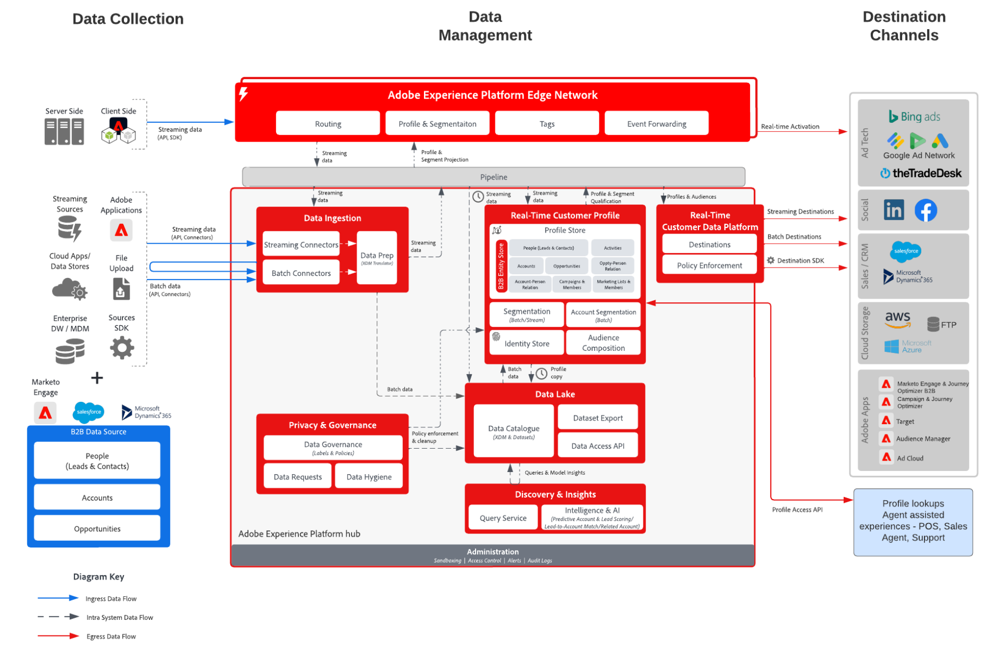

# B2B Audience and Profile Activation blueprint

Use account, opportunity, and lead information tied to a individual customer to create actionable b2b profiles for improved personalization and targeting across channels.

## Use cases

* Create audiences of people for targeting and personalization across channels against B2B data including accounts, opportunities, and leads.
* Activate audiences to any Experience Platform destinations for targeting and personalization.
* Create audiences of accounts (for example, lists of companies) and target those companies via destinations like LinkedIn that accept lists of companies as input or export to cloud storage destinations for targeting and sales outreach.

## Applications

* Real-time Customer Data Platform B2B Edition

## Integration patterns

* B2B data sources (Marketo, Salesforce, etc.) -> Real-time Customer Data Platform B2B Edition -> Destinations
* Various B2B data sources can be used to map account, lead, opportunity, and people data to the B2B Edition of Real-time Customer Data Platform.

## Architecture

## Guardrails

* Note that Marketo Engage related guardrails and implementation steps are only relevant when Marketo Engage is used as a source and/or destination.

* For additional details and guardrails for data model, size, and segmentation refer to the [deployment guardrails document](../experience-platform/deployment/guardrails.md)

### Multiple Instance and IMS Org Support:

The following outlines the supported patterns of mapping Experience Platform and Marketo Engage instances.

#### Marketo as a data source to Experience Platform:

* Multiple Marketo Engage instances to one Experience Platform instance is Supported. 
* One Marketo Engage instance to many Experience Platform instances is not supported.
* One Marketo Engage instance to one Experience Platform instance and multiple sandboxes is supported.

#### Marketo as a destination to Experience Platform:

* Experience Platform to many Marketo Engage instances is supported
* Many Experience Platform instances to one Marketo Engage instance is supported

#### Experience Platform Profile and Segmentation Guardrails:

* See the profile and segmentation guardrails for Experience Platform - [Profile and Segmentation Guardrails](https://experienceleague.adobe.com/docs/experience-platform/profile/guardrails.html?lang=en)
* B2B segments which include accounts, leads, opportunities uses multi-entity relationships which result in the segment evaluation becoming batch. Streaming segmentation is supported for segments which are limited to people and events.
* Include a batch b2b segment as input to a streaming or edge segment to support streaming b2b segment use cases. Batch segment membership is based on the latest daily batch segmentation evaluation result.

#### Experience Platform - Marketo Engage Source Connector: 

* Historic backfill can take up to 7 days to complete, depending on volume of data.
* Ongoing data updates and changes from Marketo are sent to Experience Platform via streaming API which can be latent up to around 10 minutes to the profile, and can take up to 60 minutes to the data lake depending on volume.

#### Experience Platform - Marketo Destination Connector:

* Streaming segment sharing from Real-time Customer Data Platform to Marketo Engage can take up to 15 minutes. Backfilling profiles that already existed in the segment prior to activation for the first time can take up to 24 hours.
* Batch segmentation is shared once per day based on the Experience Platform segmentation schedule. B2B segments that use multi-entity relationships, for example, segments that use data in the account and opportunity objects, are always executed in batch mode.

#### Marketo Engage Guardrails:

* Contacts and leads must be ingested and defined directly in Marketo Engage for the Real-time Customer Data Platform audience to match to a Marketo Engage contact and lead.
* The RTCDP Marketo destination can optionally create new leads in Marketo for customers who are in a segment but who don't exist in Marketo.

#### Destination Guardrails

* Please refer to the destination documentation for specific guidance on the destinations. [Destination Guardrails](https://experienceleague.adobe.com/docs/experience-platform/destinations/guardrails.html?lang=en)

## Implementation steps

For guidance on how to implement and configure the B2B Edition of the Real-time Customer Data Platform please see the B2B Edition of the Real-time Customer Data Platform Documentation. [B2B Edition of Real-time Customer Data Platform](https://experienceleague.adobe.com/docs/experience-platform/rtcdp/b2b-overview.html?lang=en)

Two possible implementation patters exist. Both the ability to ingest B2B data and profiles from Marketo Engage or the ability to ingest B2B data from other CRM data sources.

## Implementation considerations

Guidance on key considerations and configurations of the blueprint.

* CRM Integration with and without Marketo:
If the implementation uses Marketo Engage as a source and Marketo Engage is connected to the CRM, then the CRM data will automatically flow through the same connection, removing the need to connect the CRM directly to Platform unless there are additional CRM data objects that are not passed through Marketo. Use the Experience Platform source connector if additional tables need to be ingested. If the implementation will not be using Marketo Engage as a source connect the CRM source directly to Platform using the CRM source Experience Platform connector.
* The Marketo Engage destination connector for Platform, which pushes audiences to Marketo Engage for activation, shares audience members based on matching email addresses and ECIDs. It has the option to create a new lead if the contact does not already exist. When creating a new lead, up to 50 profile attributes (non-array or map attributes) in the Real-time Customer Data Platform can be mapped to Person fields in Marketo.

## Related documentation

* [B2B Edition of Real-time Customer Data Platform](https://experienceleague.adobe.com/docs/experience-platform/rtcdp/b2b-overview.html?lang=en)
* [Getting Started with Real-time Customer Data Platform B2B Edition](https://experienceleague.adobe.com/en/docs/experience-platform/rtcdp/intro/rtcdpb2b-intro/b2b-tutorial)
* [Guardrails for Real-time Customer Data Platform B2B Edition](https://experienceleague.adobe.com/en/docs/experience-platform/rtcdp/intro/rtcdpb2b-intro/b2b-guardrails)
* [Adobe Experience Platform](https://experienceleague.adobe.com/docs/experience-platform.html?lang=en)
* [Marketo Engage](https://experienceleague.adobe.com/docs/marketo/using/home.html) 
* [Adobe Experience Platform - Marketo Source Connector](https://experienceleague.adobe.com/docs/experience-platform/sources/connectors/adobe-applications/marketo/marketo.html?lang=en)
* [Adobe Experience Platform – Marketo Destination Connector](https://experienceleague.adobe.com/docs/marketo/using/product-docs/core-marketo-concepts/smart-lists-and-static-lists/static-lists/push-an-adobe-experience-cloud-segment-to-a-marketo-static-list.html)
