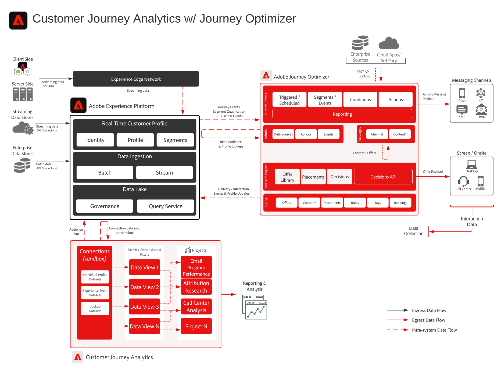

# Customer Journey Analytics with Journey Optimizer blueprint

Data from Journey Optimizer is shared to Experience Platform's data lake and is available for ingestion, analysis and reporting within Customer Journey Analytics. Journey delivery, interaction, and effectiveness can be analyzed and reported within Customer Journey Analytics.

Additionally audiences that are authored in Customer Journey Analytics can be published to the Experience Platform Real-time Customer Profile and are available for journey execution in Journey Optimizer.

## Implementation guide

See the following documentation for guidance on implementation and configuration of Journey Optimizer data within Customer Journey Analytics. [Documentation](https://experienceleague.adobe.com/docs/journey-optimizer/using/reporting/reports/sharing-overview.html)

## Architecture for Customer Journey Analytics with Journey Optimizer

{zoomable="yes"}

