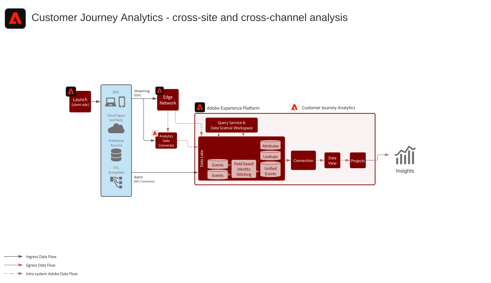

# Customer Journey Analytics blueprints

Customer Journey Analytics shows how brands can unify customer data and behavior from various interaction channels and sources to create a journey-based view of all customer interactions. Reporting and analysis can be performed in the Customer Journey Analytics application service to evaluate and gain insight into customer interaction and behavior patterns. 

## Customer Journey Analytics use cases

Common Use Cases include:

* Create and Publish Audiences to Real-time Customer Data Platform
* Top/bottom converting paths
* Channel engagement and conversion 
* Top viewed content
* Top Categories and products
* What campaigns resulted in conversion and increased engagement
* Tool usage analysis to optimize self-service experiences

A full list of use cases along with documentation can be found [here](https://experienceleague.adobe.com/docs/analytics-platform/using/cja-usecases/cja-usecases.html?lang=en).

## Architecture for Customer Journey Analytics

{zoomable="yes"}