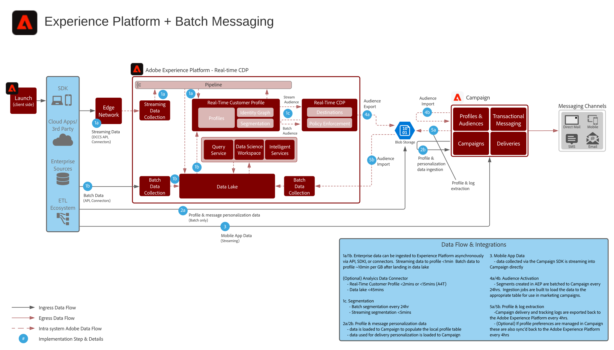

# Batch Messaging and Adobe Experience Platform

Execute scheduled and batch messaging campaigns using Adobe Experience Platform as a central hub for customer profiles and segmentation.

## Use Cases

* Scheduled email campaigns
* Onboarding and re-marketing campaigns

## Reference Architecture

## Integration Patterns

* Adobe Experience Platform → Adobe Campaign Classic
* Adobe Experience Platform → Adobe Campaign Standard

## Prerequisites

* Adobe Experience Platform
* Adobe Campaign Classic or Standard

## Guardrails

* Supports Campaign single organizational unit deployments only
* Campaign is source of truth for all active profiles meaning profiles must exist already in Campaign and new profiles should not be created based on Experience Platform segments.
* Note that segment membership realization from Experience Platform is latent for both batch (1 per day) and streaming (~5 min)

### Real-time Customer Data Platform segment sharing to campaign:

* Recommendation of 20 segment limit
* Activation is limited to every 24hrs
* Only union schema attributes available for activation (no support for array/maps/experience events). 
* Recommendation on no more than 20 attributes per segment
* 1 file per segment of all profiles with “realized” segment membership OR if segment membership is added as an attribute in the file both “realized” and “exited” profiles
* Incremental or full segment exports are supported
* File encryption is not supported
* Campaign export workflows to run at most every 4hrs
* See [profile and data ingestion guardrails for Experience Platform](https://experienceleague.adobe.com/docs/experience-platform/profile/guardrails.html)

## Implementation Steps and Considerations

### Adobe Experience Platform

* Schema / Datasets
  * Individual profile, experience event and multi-entity schemas are configured in Experience Platform based on customer supplied data
  * Campaign schemas are created for all of the following: broadLog / trackingLog / non-deliverable addresses / profile preferences (optional)
  * Dataset labels are added for governance
  * Policies are created for enforcing governance on destination

* Profile / Identity
  * Any customer specific namespaces are created for datasets
  * Identities are added to schemas
  * Schema and datasets are enabled for profile
  * Merge rules are setup if differing views of real-time customer profile (optional)
  * Segments are created for campaign usage

* Sources / Destinations
  * Data is ingested into Experience Platform leveraging streaming API’s & source connectors
  * Azure blob storage destination is configured for use with Campaign

* Mobile app deployment
  * Implement Campaign SDK for ACC or Experience Platform SDK for ACS.  If Launch is present recommendation is to use ACC/ACS extension with Experience Platform SDK.

* Campaign
  * Schemas configured for profile, lookup data and relevant delivery personalization data
  * Critical to understand at this point what the data model is within Experience Platform for profile and event data so you know what data will be required in Campaign
  * Import workflows
    * Simplified profile data is loaded onto Campaign sFTP and ingested
    * Orchestration and messaging personalization data is loaded onto Campaign sFTP ingested
    * Experience Platform segments are ingested from Azure blob via workflows

* Export workflows
  * Campaign logs are sent back to Experience Platform via workflows every 4hrs (broadLog, trackingLog, non-deliverable addresses)
  * Profile preferences are sent back to Experience Platform via consulting-built workflows every 4hrs (optional)

## FAQs & Reference Documentation

* [Adobe Experience Platform](https://experienceleague.adobe.com/docs/experience-platform.html?lang=en)
* [Campaign Classic](https://experienceleague.adobe.com/docs/campaign-classic.html?lang=en)
* [Campaign Standard](https://experienceleague.adobe.com/docs/campaign-standard.html?lang=en)
* [Launch](https://experienceleague.adobe.com/docs/launch.html?lang=en)
* [Adobe Experience Platform Mobile SDK](https://experienceleague.adobe.com/docs/mobile.html?lang=en)
