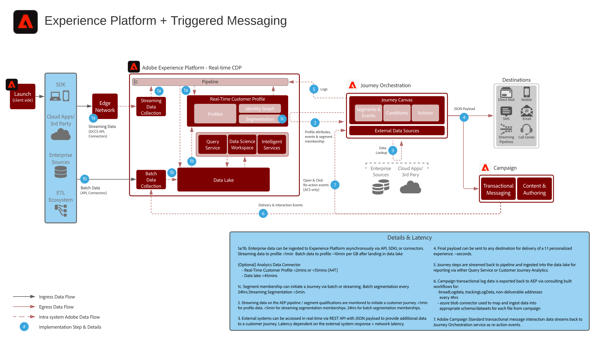

# Triggered Messaging and Adobe Experience Platform

Execute triggered messages and experiences using Adobe Experience Platform as a central hub streaming data, customer profiles and segmentation.

## Use Cases

* Triggered messages
* Registration Confirmations
* Shopping cart and application form abandons
* Location triggered messages

## Reference Architecture

## Integration Patterns

* Adobe Experience Platform -> Journey Orchestration

## Prerequisites

* Adobe Experience Platform
* Adobe Journey Orchestration

## Guardrails

Journey Orchestration

* See link for more details on limitations [Link](https://experienceleague.adobe.com/docs/journeys/using/starting-with-journeys/limitations.html?lang=en#starting-with-journeys)
* Capping is available via API setup today to ensure that the destination system is not saturated to the point of failure.  This means that messages that exceed the cap will be dropped completely and never sent.  Throttling is still not supported.
  * max connections - maximum number of http/s connections a destination can handle
  * max call count - maximum number of calls to be made in the periodInMs parameter
  * periodInMs - time in milliseconds
* Segment membership initiated journeys can operate in two modes:
  * batch segments (refreshed every 24hrs)
  * streaming segments (<5mins qualification)
* Batch segments – need to ensure you understand the daily volume of qualified users and ensure the destination system can handle the burst throughput per journey and across all journeys
* Streaming segments – need to ensure the initial burst of profile qualifications can be handled along with the daily streaming qualifying volume per journey and across all journeys
* Final destination must support REST API & JSON payload
* Does not support Offer Decisioning Service at this time
* See profile and data ingestion guardrails for Experience Platform - [Link](https://experienceleague.adobe.com/docs/experience-platform/profile/guardrails.html?lang=en)

Campaign Standard

* Can only support 14 tps (50k per hour) in throughput
* Segment membership initiated journey’s are not supported
* Re-action events to transactional message open/clicks are supported within JO
* Transactional messaging logs are not natively sync’d to Experience Platform at this time, this will require a manual configuration - Recommendation to export logs at most every 4hrs

## Implementation Steps and Considerations

Adobe Experience Platform

* Schema / Datasets
  * Individual profile, experience event and multi-entity schemas are configured in AEP based on customer supplied data
  * Campaign schemas are created for all of the following: broadLog / trackingLog / non-deliverable addresses / profile preferences (optional)
  * Dataset labels are added for governance
  * Policies are created for enforcing governance on destination

* Profile / Identity
  * Any customer specific namespaces are created for datasets
  * Identities are added to schemas
  * Schema and datasets are enabled for profile
  * Merge rules are setup if differing views of real-time customer profile (optional)
  * Segments are created for campaign usage

* Sources / Destinations
  * Data is ingested into AEP leveraging streaming API’s & source connectors
  * Azure blob storage destination is configured for use with Campaign

* Mobile app deployment
  * Implement Campaign SDK for ACC or AEP SDK for ACS.  If Launch is present recommendation is to use ACC/ACS extension with AEP SDK.

* Journey Orchestration
  * Streaming data used to initiate a customer journey needs to be configured within JO 1st to get an orchestration ID.  This orchestration ID Is then supplied to the developer to use with ingestion
  * External data sources need to be configured
  * Custom actions need to be configured

* Campaign Standard
  * Messaging templates need to be configured with appropriate personalization settings
  * Export workflows need to be configured to export transactional messaging logs. Recommendation is to run at most every 4hrs

## FAQs & Reference Documentation

* [Adobe Experience Platform](https://experienceleague.adobe.com/docs/experience-platform.html?lang=en)
* [Journey Orchestration](https://experienceleague.adobe.com/docs/journey-orchestration.html?lang=en)
* [Campaign Classic](https://experienceleague.adobe.com/docs/campaign-classic.html?lang=en)
* [Campaign Standard](https://experienceleague.adobe.com/docs/campaign-standard.html?lang=en)
* [Launch](https://experienceleague.adobe.com/docs/launch.html?lang=en)
* [Adobe Experience Platform Mobile SDK](https://experienceleague.adobe.com/docs/mobile.html?lang=en)
