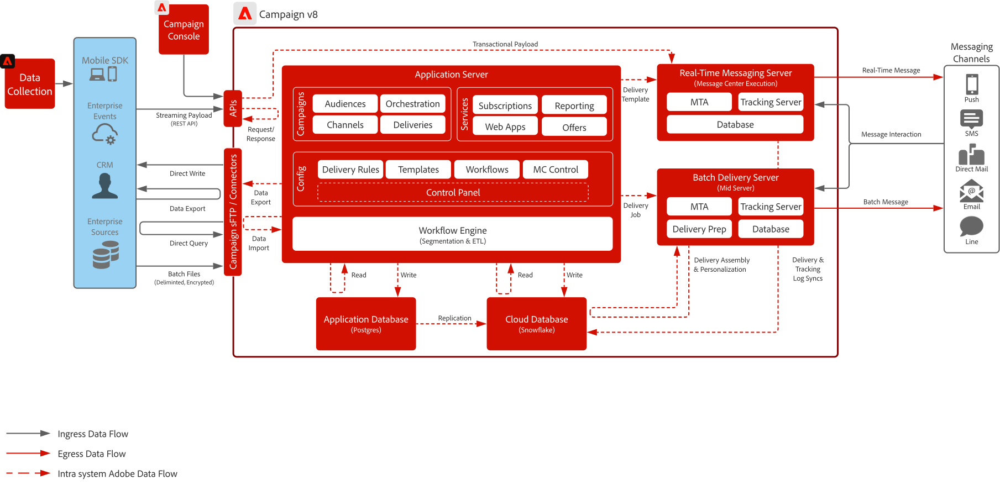
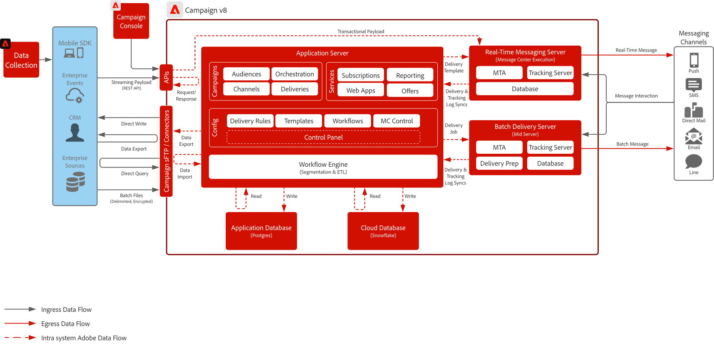

# Campaign v8 Blueprint

Adobe Campaign v8 is a next-generation campaign management platform designed for traditional marketing channels like email and direct mail. It offers robust ETL and data management capabilities to support complex segmentation and audience targeting, along with a powerful orchestration engine for building multi-touch, batch-driven marketing programs.

It also includes a scalable real-time messaging server that enables transactional communications—such as password resets, order confirmations, and e-receipts—by accepting complete payloads from external systems for immediate delivery.

## Use cases

>[!BEGINTABS]

>[!TAB Batch Campaign Execution]

- Design and deliver large-scale, scheduled marketing campaigns across email, SMS, and direct mail.
- Ideal for promotional blasts, newsletters, and seasonal offers with complex segmentation and targeting.

>[!TAB Multi-Touch Orchestration]

- Build multi-step, multi-channel programs that guide customers through a predefined marketing journey.
- Supports audience re-entry, conditional logic, and time-based transitions.

>[!TAB Data Management & ETL]

- Ingest, transform, and manage customer data from various sources to support precise targeting.
- Enables creation of custom schemas, calculated fields, and audience definitions.

>[!TAB Transactional Messaging]

- Send real-time, predefined messages triggered by external systems (e.g., password resets, order confirmations, e-receipts).
- Uses a scalable messaging server that accepts full payloads from IT systems for immediate delivery.

>[!ENDTABS]

 

## Architecture diagrams

Learn more about [Campaign v8 deployment models](https://experienceleague.adobe.com/docs/campaign/campaign-v8/config/architecture/architecture.html#ac-deployment){target="_blank"}.

### Campaign enterprise (FFDA) deployment

 

### Campaign v8 FDA deployment

 

## Integration patterns

| Scenario | Description | Technical Considerations |
| :-- | :--- | :--- |
| [[!DNL Real-time Customer Data Platform] with Adobe [!DNL Campaign]](rtcdp-and-campaign-v8.md) | Showcases how the Adobe Experience Platform and its Real-Time Customer Profile and centralized segmentation tool can be utilized with Adobe [!DNL Campaign] to deliver personalized conversations | <ul><li>Sharing of profiles and audiences from the [!DNL Real-Time CDP] to Adobe [!DNL Campaign] via use of cloud storage file exchange and Adobe [!DNL Campaign] ingestion workflows </li><li>Easily share delivery and interaction data from customer conversations back into the [!DNL Real-Time CDP] from Adobe [!DNL Campaign] to enhance both the Real-Time Customer Profile and provide cross-channel reporting on messaging campaigns</li></ul> |
| [[!DNL Journey Optimizer] with Adobe [!DNL Campaign]](ajo-and-campaign-v8.md) | Shows how you can use Adobe Journey Optimizer to orchestrate 1:1 experiences utilizing the Real-Time Customer Profile and leverage the native Adobe [!DNL Campaign] transactional messaging system to send the message | <ul><li>Can send up to 1M messages per hour via the Real-Time Message server<li>No throttling is performed from [!DNL Journey Optimizer] so ensure technical vetting by a Pre-Sales Enterprise Architect</li><li>Decision Management is not supported in payloads to Campaign v8</li></ul> |

 

## Prerequisites

The following prerequisites exist for this blueprint.

### Application server and real-time messaging server

- The Adobe [!DNL Campaign] Client Console is required to interact and use the [!DNL Campaign] v8 software. It is a windows based client and uses standard internet protocols (SOAP, HTTP, etc.). Ensure you have the necessary permissions enabled in your org to distribute, install and run software

- IP address allow-listing:
  - Identify the IP ranges that all users leverage during access to the client console.
  - Identity which enterprise systems are allowed to talk to the Real-Time messaging server and ensure they have a statically assigned IP or range that you can allow-list.
  - This can be setup and controlled via the Campaign Control Panel.
- sFTP key management:
  - Have SSH public keys available to use with the Campaign provided sFTP. This can be setup and controlled via the Campaign Control Panel.

### Email

- Have a subdomain ready to be used for message sending.
- Subdomain can either be fully delegated to Adobe (recommended) or CNAMEs can be used to point to Adobe-specific DNS servers (custom).
- Google TXT record is needed for each subdomain to ensure good deliverability.

### Mobile push

- Have a mobile developer available to deploy, configure and build the mobile app.
- Adobe is only providing a SDK to collect the necessary information from FCM (Android) and APNS (iOS) to send message payloads to their servers. How the mobile app needs to be coded, deployed, managed and debugged is the responsibility of the customer.

### Webapps (optional)

- Can delegate an additional subdomain for Campaign hosted unsubscribe and landing pages.
- SSL certificate is highly encouraged.

 

## Guardrails

### Application server sizing

- Storage can be scaled to up 200M profiles with potential to scale up to 1B profiles.
- Setup and control user access via Adobe [!DNL Admin Console].
- Data loading to [!DNL Campaign] is expected to be done through batch files:
  - API data loading support is primarily for managing of profiles or simple objects within the database (i.e. create and update). It is not intended to be used for loading large volumes of data or batch like operations.
  - Using APIs to read data for custom application purposes is not supported
  - Data loaded via API is staged in the application database and then replicated every hour to Cloud database
- Limits to API calls apply. Learn more in the [Adobe Campaign Product Description](https://helpx.adobe.com/legal/product-descriptions/adobe-campaign-managed-cloud-services.html){target="_blank"}.

### Batch messaging server sizing

- Can scale to handle up to 20M messages per hour

### Real-time messaging server sizing

- Can send up to 1M messages per hour 
- By default two real-time messaging servers are provisioned. Ability to scale up to eight real-time messaging servers.

### SMS configuration

- Campaign provides the ability to integrate with a SMS provider. The provider is procured by the customer and integrated with campaign for sending SMS based messages.
- Support is via the SMPP protocol.
- There are three (3) different kinds of SMS all of which Adobe can support:
  - SMS MT (Mobile Terminated): an SMS that is emitted by Adobe [!DNL Campaign] towards mobile phones through the SMPP provider.
  - SMS MO (Mobile Originated): an SMS that is sent by a mobile to Adobe [!DNL Campaign] through the SMPP provider.
  - SMS SR (Status Report) or DR or DLR (Delivery Receipt): a return receipt sent by the mobile to Adobe [!DNL Campaign] through the SMPP provider indicating that the SMS has been received successfully. Adobe [!DNL Campaign] may also receive SR indicating that the message could not be delivered, often with a description of the error. 

 

## Implementation steps

See the getting started guide for [Implementing Adobe Campaign v8](https://experienceleague.adobe.com/docs/campaign/campaign-v8/implement/implement.html)

## Related documentation

- [Campaign v8 documentation](https://experienceleague.adobe.com/docs/campaign-v8.html)
- [Campaign v8 Product Description](https://helpx.adobe.com/legal/product-descriptions/adobe-campaign-managed-cloud-services.html)
- [Experience Platform Tags documentation](https://experienceleague.adobe.com/docs/launch.html)
- [Experience Platform Mobile SDK documentation](https://experienceleague.adobe.com/docs/mobile.html)