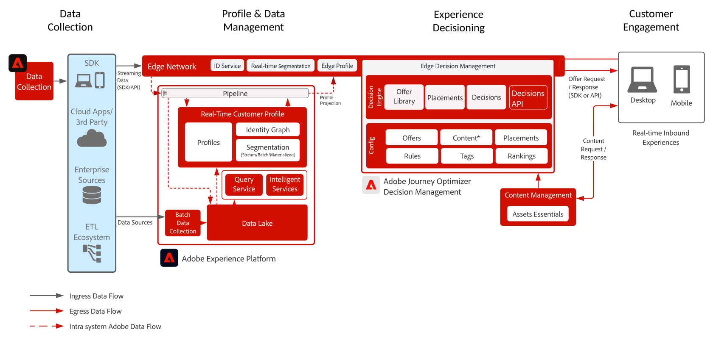

# Journey Optimizer - [!DNL Decision Management] on the Edge Blueprint

[!DNL Decision Management] is a service provided as part of [!DNL Journey Optimizer]. This blueprint outlines the use cases and technical capabilities of the application and provides a deep dive into the various architectural components and considerations that make up Decision Management.

>[!MORELIKETHIS]
>
>To learn more about [!DNL Decision Management], see the [blueprint overview](decision-management-overview.md) or visit the [product documentation](https://experienceleague.adobe.com/docs/journey-optimizer/using/offer-decisioniong/get-started-decision/starting-offer-decisioning.html).

[!DNL Decision Management] can be deployed in one of two ways. The first is via the [!DNL Experience Platform] Hub, which is a single data center architecture. In the "hub" approach offers are executed, personalized, and delivered in second latency. Thus the hub architecture is best suited for customer experience that do not demand sub-second latency, examples include offer decisions which are provided for kiosks or agent assisted experiences such as in call centers or in person interactions. 

The second approach is via the Experience Platform [!DNL Edge Network], which is a globally distributed geographically located infrastructure to serve fast sub-second and millisecond experiences. The end consumer experience being executed by the Edge infrastructure closest to the consumers geo-location to minimize latency. [!DNL Decision Management] on the Edge is designed to serve real-time consumer experiences. These include experiences such as web or mobile inbound personalization requests. 

This blueprint will cover the specifics of Decision Management on the Edge.

To learn more about Decision Management on the hub refer to the [Decision Management on the hub](decision-management-hub.md) blueprint.

## Use cases for Decision Management on the edge

* Streaming use cases where profile context latency is strict below 15 minute latency and decision management execution is sub-second.
* Online personalization via web or mobile inbound experiences.
* Cross channel journey execution - offer consistency across web, mobile, email, and other interaction channels through Adobe Journey Optimizer.

## Architecture

## Integration patterns

| Integration | Description |
| :-- | :--- |
|[Decision Management with Adobe Target](https://experienceleague.adobe.com/docs/target/using/integrate/ajo/offer-decision.html)| Decision Management can be integrated with Adobe Target such that offers can be tested and delivered as Target experiences.|

## Guardrails

* For Journey Optimizer guardrails refer to the following [Journey Optimizer Guardrails](https://experienceleague.adobe.com/docs/journey-optimizer/using/get-started/limitations.html).

* For Decision Management guardrails refer to the following [Decision Management Product Description](https://helpx.adobe.com/legal/product-descriptions/offer-decisioning-app-service.html).

[Guardrails and End to End Latency Guidance](https://experienceleague.adobe.com/docs/blueprints-learn/architecture/architecture-overview/guardrails.html)

## Related documentation

* [Adobe Experience Platform](https://experienceleague.adobe.com/docs/experience-platform.html)
* [Adobe Journey Optimizer](https://experienceleague.adobe.com/docs/journey-optimizer.html)
* [Adobe Journey Optimizer Decision Management](https://experienceleague.adobe.com/docs/journey-optimizer/using/offer-decisioniong/get-started-decision/starting-offer-decisioning.html) 
* [Adobe Journey Optimizer Product Description](https://helpx.adobe.com/legal/product-descriptions/adobe-journey-optimizer.html)
* [Adobe Decision Management Product Description](https://helpx.adobe.com/legal/product-descriptions/offer-decisioning-app-service.html)
