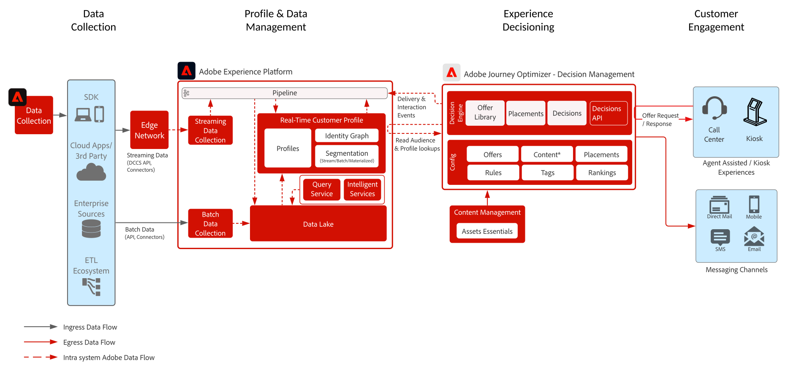

# Decision Management on the Hub Blueprint

To learn more about Decision Management refer to the product documentation [HERE](https://experienceleague.adobe.com/docs/journey-optimizer/using/offer-decisioniong/get-started-decision/starting-offer-decisioning.html) and the Decision Management Overview [HERE](decision-management-overview.md)

Adobe Decision Management is a service provided as part of Adobe Journey Optimizer. This blueprint outlines the use cases and technical capabilities of the application and provides a deep dive into the various architectural components and considerations that make up Decision Management.

Journey Optimizer is used to deliver the best offer and experience to your customers across all touch points at the right time. Decision Management makes personalization easy with a central library of marketing offers and a decision engine that applies rules and constraints to rich, real-time profiles created by Adobe Experience Platform to help you send your customers the right offer at the right time.

Decision Management can be deployed in one of two ways. The first is via the Adobe Experience Platform hub, which is a central data center architecture. In the "hub" approach offers are executed, personalized, and delivered in >500ms latency. Thus the hub architecture is best suited for customer experiences that do not demand sub-second latency, examples include offer decisions which are provided for kiosks or agent assisted experiences such as in call centers or in person interactions. Offers that are inserted into emails and outbound campaigns are also powered by the hub approach.

The second approach is via the Experience [!DNL [!DNL Edge Network]], which is a globally distributed geographically located infrastructure to serve fast sub-second and millisecond experiences. The end consumer experience being executed by the edge infrastructure closest to the consumers geo-location to minimize latency. Decision Management on the Edge is designed to serve real-time consumer experiences such as web or mobile inbound personalization requests. 

This blueprint will cover the specifics of Decision Management on the hub.

To learn more about Decision Management on the Edge refer to the [Decision Management on the edge](decision-management-edge.md) blueprint.

## Use cases for Decision Management on the hub

* Streaming use cases where profile context latency is not strict - 15 minute or above latency.
* Personalized offers on kiosks and in store experiences.
* Personalized offers via agent assisted experience such as to call centers or sales intereactions.
* Offers included in email, SMS, mobile push notifications or other outbound interactions.
* Provide offers to external ESP and messageing systems for delivery.
* Cross channel journey execution - offer consistency across web, mobile, email, and other interaction channels through Adobe Journey Optimizer.

>[!IMPORTANT]
>
>For offer and journey use cases that require accessing the profile for additional information and context. It is important to consider the associated latency of ingesting data to profile on the hub to ensure it is available at decision time. For scenarios where context is streaming or ingesting into profile and the offer or journey must have that context available within seconds or minutes of the offer decision, these scenarios are best served with Decision Management on the Edge. 

## Architecture

## Guardrails

* For Journey Optimizer guardrails refer to the following [Journey Optimizer Guardrails](https://experienceleague.adobe.com/docs/journey-optimizer/using/get-started/limitations.html).
* For Decision Management guardrails refer to the following [Decision Management Product Description](https://helpx.adobe.com/legal/product-descriptions/offer-decisioning-app-service.html).

[Guardrails and End to End Latency Guidance](/help/blueprints/experience-platform/guardrails.md)

## Implementation patterns

* Implemented in email, SMS, and outbound channels via direct integration with [Adobe Journey Optimizer](https://experienceleague.adobe.com/docs/journey-optimizer/using/offer-decisioniong/get-started-decision/offers-e2e.html).
* For server API based implementation of Decision Management leverage the [Decisioning API](https://experienceleague.adobe.com/docs/journey-optimizer/using/offer-decisioniong/api-reference/offer-delivery/decisioning-vs-edge-apis.html).
* For implementation of batch based decisioning to deliver offers in bulk to a message delivery application use the [Batch Decisioning API](https://experienceleague.adobe.com/docs/journey-optimizer/using/offer-decisioniong/api-reference/offer-delivery/batch-decisioning-api.html).
* For Edge based real-time experiences use the Web/Mobile SDK or the Edge Decisioning API as outlined in the [Decision Management on the Edge blueprint](decision-management-edge.md)

## Related documentation

* [Adobe Experience Platform](https://experienceleague.adobe.com/docs/experience-platform.html)
* [Adobe Journey Optimizer](https://experienceleague.adobe.com/docs/journey-optimizer.html)
* [Adobe Journey Optimizer Decision Management](https://experienceleague.adobe.com/docs/journey-optimizer/using/offer-decisioniong/get-started-decision/starting-offer-decisioning.html) 
* [Adobe Journey Optimizer Product Description](https://helpx.adobe.com/legal/product-descriptions/adobe-journey-optimizer.html)
* [Adobe Decision Management Product Description](https://helpx.adobe.com/legal/product-descriptions/offer-decisioning-app-service.html)
