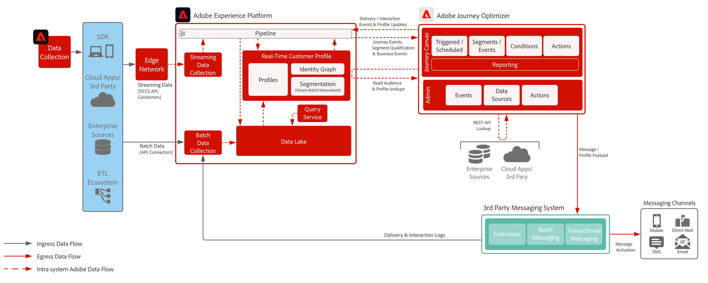

# 3rd-party Messaging blueprint

>[!TIP]
>This blueprint is also available as a [use case pattern](/help/blueprints/use-case-patterns/campaign-management-orchestration/third-party-messaging.md) under Campaign Management & Orchestration.

Demonstrates how Adobe Journey Optimizer can be utilized with 3rd party messaging systems to send personalized communications.

 

## Architecture

 

## Prerequisites

**Adobe Experience Platform**

* Schemas and datasets must be configured in the system before you can configure Journey Optimizer data sources
* For Experience Event class-based schemas, add 'Orchestration eventID field group when you want to have an event triggered that is not a rule-based event
* For Individual Profile class-based schemas, add the 'Profile test details' field group to be able to load test profiles for use with Journey Optimizer

**3rd-party Messaging Application**

* Must support REST API calls for sending transactional payloads

 

## Guardrails

[Journey Optimizer Guardrails Product Link](https://experienceleague.adobe.com/docs/journeys/using/starting-with-journeys/limitations.html)

[Guardrails and End to End Latency Guidance](https://experienceleague.adobe.com/docs/blueprints-learn/architecture/architecture-overview/guardrails.html)

 

## Implementation steps

### Adobe Experience Platform

#### Schema/datasets

1. [Configure schemas](https://experienceleague.adobe.com/?recommended=ExperiencePlatform-D-1-2021.1.xdm) in Experience Platform, based on customer-supplied data.
1. [Create datasets](https://experienceleague.adobe.com/docs/platform-learn/tutorials/data-ingestion/create-datasets-and-ingest-data.html) in Experience Platform for data to be ingested.
1. [Add data usage labels](https://experienceleague.adobe.com/docs/platform-learn/tutorials/data-governance/classify-data-using-governance-labels.html) in Experience Platform to the dataset for governance.
1. [Create policies](https://experienceleague.adobe.com/docs/platform-learn/tutorials/data-governance/create-data-usage-policies.html) that enforce governance on destinations.

#### Profile/identity

1. [Create any customer-specific namespaces](https://experienceleague.adobe.com/docs/platform-learn/tutorials/identities/label-ingest-and-verify-identity-data.html).
1. [Add identities to schemas](https://experienceleague.adobe.com/docs/platform-learn/tutorials/identities/label-ingest-and-verify-identity-data.html).
1. [Enable the schemas and datasets for Profile](https://experienceleague.adobe.com/en/docs/platform-learn/tutorials/profiles/bring-data-into-the-real-time-customer-profile).
1. [Set up merge policies](https://experienceleague.adobe.com/docs/platform-learn/tutorials/profiles/create-merge-policies.html) for differing views of [!UICONTROL Real-time Customer Profile] (optional).
1. Create segments for Journey usage.

#### Sources/destinations

1. [Ingest data into Experience Platform](https://experienceleague.adobe.com/?recommended=ExperiencePlatform-D-1-2020.1.dataingestion) using streaming APIs & source connectors.

### Journey Optimizer

1. Configure your Experience Platform datasource and determine what fields should be cached as part of the journey
1. Streaming data, used to initiate a customer journey, must be configured first to get an orchestration ID. This orchestration ID is then supplied to the developer to use during ingestion
1. Configure external data sources
1. Configure custom actions for 3rd party application

### Mobile push configuration (optional as 3rd party may collect tokens)

1. Implement Experience Platform Mobile SDK to collect push tokens and login information to tie back to known customer profiles
1. Leverage Adobe Tags and create a mobile property with the following extension:
    * Adobe Journey Optimizer
    * Adobe Experience Platform Edge Network
    * Identity for [!DNL Edge Network]
    * Mobile Core
1. Ensure you have a dedicated datastream for mobile app deployments vs. web deployments
1. For more information follow the [Adobe Journey Optimizer Mobile Guide](https://developer.adobe.com/client-sdks/documentation/adobe-journey-optimizer/)

 

## Related documentation

* [Experience Platform documentation](https://experienceleague.adobe.com/docs/experience-platform.html)
* [Experience Platform Tags documentation](https://experienceleague.adobe.com/docs/experience-platform/tags/home.html)
* [Experience Platform Mobile SDK documentation](https://experienceleague.adobe.com/docs/mobile.html)
* [Journey Optimizer documentation](https://experienceleague.adobe.com/docs/journey-optimizer/using/ajo-home.html)
* [Journey Optimizer Product Description](https://helpx.adobe.com/legal/product-descriptions/adobe-journey-optimizer.html)
