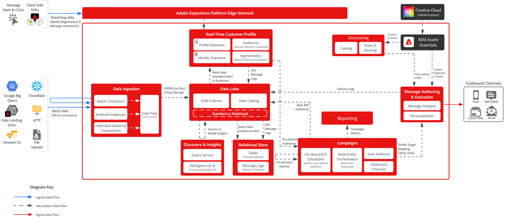

# [!DNL Journey Optimizer] - Campaign Orchestration Blueprint

AJO Campaign Orchestration enables marketers to design and execute scheduled, audience-based, multi-step communications across outbound channels like email, SMS, push and direct mail. Unlike AJO Journeys, which react to individual customer behaviors using real-time data from the Real-Time Customer Profile, campaigns are coordinated marketing efforts that target audiences at planned intervals. Together, campaigns and journeys offer complementary approaches—campaigns drive brand engagement strategies, while journeys deliver personalized, responsive experiences.

 

## Architecture

 

### Message Execution Architecture

 

### Relational Store - Data Ingestion Latency

 

## Architectural Considerations for Journeys

- **Data Architecture**: AJO Campaign Orchestration utilizes a relational database underneath for audience building and orchestration
- **Audience Portal Integration**: natively integrated with the Audience Portal within the Real-Time Customer Profile to both read from existing audiences and save new audiences to when building campaigns
- **On-demand Audience Creation**: build, evaluate and execute an audience immediately for urgent marketing use cases
- **Real-Time Customer Profile Integration:** source of truth for consent and communication history; supports 'skinny profile' design for personalization
- **Multi-entity Message Sending:** ability to send multiple messages per profile in a single delivery (e.g. send one message per reservation to the customer email address)
- **Multi-entity Segmentation**: start building an audience from any entity within the relational store (i.e. product, inventory, plan, etc.)

 

## Guardrails

[Orchestrated Campaigns Product Link](https://experienceleague.adobe.com/en/docs/journey-optimizer/using/campaigns/orchestrated-campaigns/guardrails)

[Guardrails and End to End Latency Guidance](https://experienceleague.adobe.com/docs/blueprints-learn/architecture/architecture-overview/deployment/guardrails)

 

## Related documentation

- [[!DNL Journey Optimizer] Orchestrated Campaigns](https://experienceleague.adobe.com/en/docs/journey-optimizer/using/campaigns/orchestrated-campaigns/orchestrated-campaigns-landing-page.html)
- [[!DNL Experience Platform] documentation](https://experienceleague.adobe.com/docs/experience-platform.html)
- [[!DNL Experience Platform] Tags documentation](https://experienceleague.adobe.com/docs/experience-platform/tags/home.html)
- [[!DNL Experience Platform Mobile SDK] documentation](https://experienceleague.adobe.com/docs/mobile.html)
- [[!DNL Journey Optimizer] documentation](https://experienceleague.adobe.com/docs/journey-optimizer/using/ajo-home.html)
- [[!DNL Journey Optimizer] product description](https://helpx.adobe.com/legal/product-descriptions/adobe-journey-optimizer.html)
