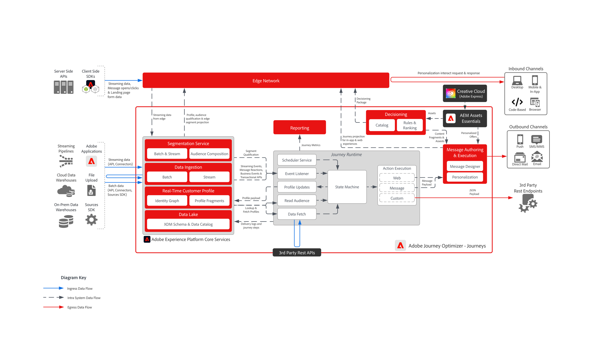

# [!DNL Journey Optimizer] - Journeys Blueprint

Adobe Journey Optimizer Journeys are real-time, event-driven workflows that deliver personalized, multi-step experiences based on individual customer behaviors. They support a wide range of channels—including email, SMS, push notifications, in-app messaging, code-based experiences and custom API-based integrations allowing brands to engage customers contextually across their preferred touchpoints.

 

## Architecture

 

## Architectural Considerations for Journeys

- **Profile Freshness**: AJO Journeys rely on real-time updates to the customer profile. Ensure that data sources feeding into Adobe Experience Platform (AEP) are configured for low-latency ingestion to maintain profile accuracy.
- **Scalable Event Processing:** Ensure that infrastructure can handle high volumes of journey triggers and message delivery.
- **Modular Integration:** Design APIs and custom actions to connect AJO with external systems for dynamic personalization.
- **Identity Resolution**: Accurate stitching of customer identities across devices and channels is critical. Misaligned identities can lead to broken or misdirected journeys.
- **Segment Qualification Timing**: Audience-based journeys depend on segment membership. Understand how often segments are evaluated and how that timing affects journey entry and personalization.
- **Journey Entry Conditions**: Profiles must meet specific conditions to enter a journey. These conditions should be carefully designed to avoid unintended exclusions or overlaps.
- **Audience Evaluation & Latency**: Read Audience steps depend on segment evaluations within Adobe Experience Platform, which may not occur in real time. Architect journeys with awareness of evaluation frequency and latency to avoid delays in audience qualification and ensure timely personalization.

 

## Guardrails

[[!DNL Journey Optimizer] Guardrails Product Link](https://experienceleague.adobe.com/en/docs/journey-optimizer/using/get-started/guardrails)

[Guardrails and End to End Latency Guidance](https://experienceleague.adobe.com/docs/blueprints-learn/architecture/architecture-overview/deployment/guardrails)

 

## Related documentation

- [[!DNL Experience Platform] documentation](https://experienceleague.adobe.com/docs/experience-platform)
- [[!DNL Experience Platform] Tags documentation](https://experienceleague.adobe.com/docs/experience-platform/tags/home)
- [[!DNL Experience Platform Mobile SDK] documentation](https://experienceleague.adobe.com/docs/mobile)
- [[!DNL Journey Optimizer] documentation](https://experienceleague.adobe.com/docs/journey-optimizer/using/ajo-home)
- [[!DNL Journey Optimizer] product description](https://helpx.adobe.com/legal/product-descriptions/adobe-journey-optimizer)