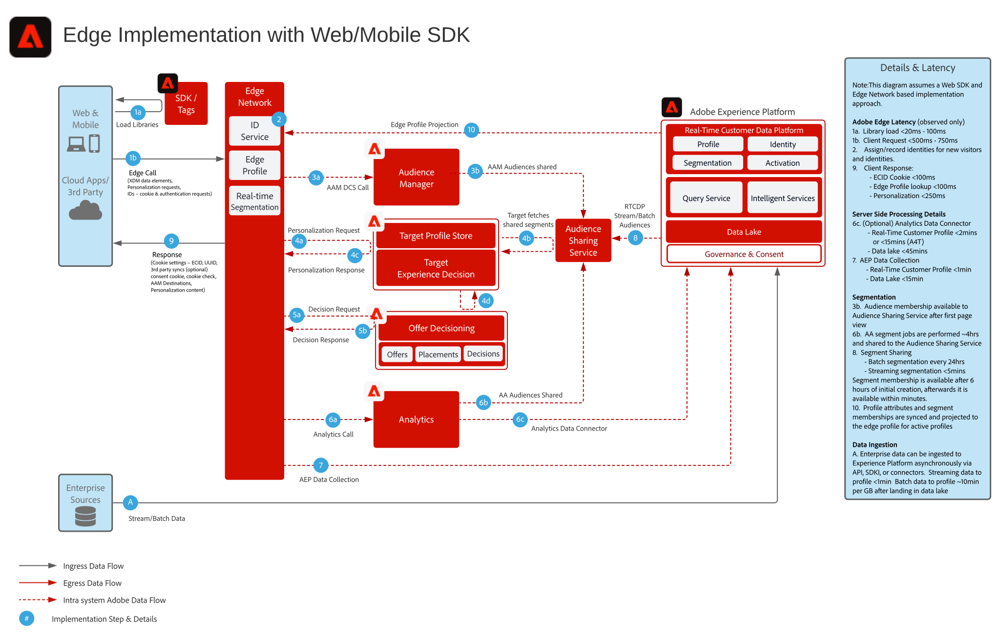

# Experience Platform Web SDK & [!DNL Edge Network] architecture diagram

For an overview and detail on the Web and Mobile SDK, and the [!DNL Edge Network] Server API see the following.

* [Web SDK overview](https://experienceleague.adobe.com/en/docs/experience-platform/web-sdk/home)
* [Mobile SDK overview](https://developer.adobe.com/client-sdks/documentation/)
* [[!DNL Edge Network] Server API](https://experienceleague.adobe.com/docs/experience-platform/edge-network-server-api/overview.html)

For a detailed outline of what application functionality is supported in the Web SDK see the following documentation.

* [Web SDK application functionality support](https://github.com/orgs/adobe/projects/18/views/1)

For details related to migration from application specific SDKs to the Web and Mobile SDKs see the following documentation.

* [Identity Services](https://experienceleague.adobe.com/docs/experience-platform/edge/identity/overview.html)
* [Analytics](https://experienceleague.adobe.com/docs/experience-platform/edge/data-collection/adobe-analytics/analytics-overview.html)
* [Target](https://experienceleague.adobe.com/docs/experience-platform/edge/personalization/adobe-target/target-overview.html)
* [Analytics for Target](https://experienceleague.adobe.com/docs/experience-platform/edge/personalization/adobe-target/a4t/overview.html)

## Experience Platform Web/Mobile SDK or [!DNL Edge Network] Server API deployment

The below architecture diagram illustrates the deployment and data collection utilizing the Experience Platform Web SDK.

Sequence Diagram of Experience Edge, Experience Platform Services, and Applications

## Reference documentation

* [Implement Adobe Experience Cloud with Web SDK tutorial](https://experienceleague.adobe.com/docs/platform-learn/implement-web-sdk/overview.html)
* [Implement Adobe Experience Cloud in mobile apps tutorial](https://experienceleague.adobe.com/docs/platform-learn/implement-mobile-sdk/overview.html)
