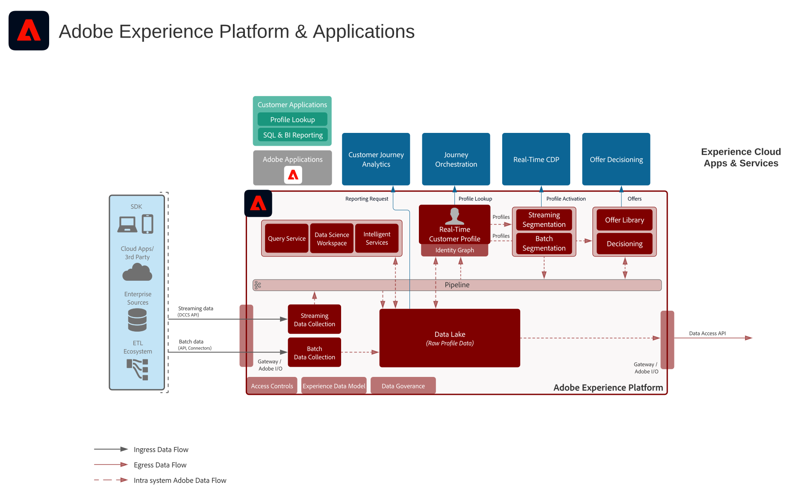

# Adobe Experience Platform and applications architecture diagrams

These architecture diagrams show how Experience Platform (AEP) relates to other Experience Cloud applications and application services.

>[!MORELIKETHIS]
>
>[Integration Configurations for Experience Cloud Applications Integrations](https://experienceleague.adobe.com/docs/integrations-learn/experience-cloud/overview.html?lang=en).

## Architecture diagram

This architecture diagram shows how Adobe Experience Platform relates to Adobe Experience Cloud applications and application services.

## Overview diagram

## Detailed architecture diagram

>[!VIDEO](https://video.tv.adobe.com/v/32456/?quality=12&learn=on)

## AEP and Experience Cloud application integrations

| Application                  | Experience Platform to Application | Application to Experience Platform |
|------------------------------|-----------------------------------|-----------------------------------|
| **Ad Cloud**                 | - Audiences defined in Real-time Customer Data Platform can be shared to Ad Cloud for targeting via Audience Manager. | - No current integration |
| **Analytics**                 | - Data collected via the Web/Mobile SDK can be forwarded to Adobe Analytics. | - Data collected by Analytics can be sent to Experience Platform data lake and profile store. [Analytics Data Connector](https://experienceleague.adobe.com/docs/experience-platform/sources/connectors/adobe-applications/analytics.html?lang=en) |
| **Audience Manager**          | - Audiences defined in Real-time Customer Data Platform can be shared to Audience Manager for activation to 3rd party cookie destinations. | - Data collected and evaluated along with audience membership from Audience Manager can be shared to Experience Platform data lake and profile store. [Audience Manager Source Connector](https://experienceleague.adobe.com/docs/experience-platform/sources/connectors/adobe-applications/audience-manager.html?lang=en) |
| **Adobe Campaign**          | - Audiences defined in Real-time Customer Data Platform can be shared to Campaign Classic to initiate campaigns. | - Interaction and campaign data collected by Campaign can be ingested into Experience Platform for further use in audience building, Customer Journey Analytics, and Query Service. |
| **Campaign Standard**         | - Audiences defined in Real-time Customer Data Platform can be shared to Campaign Standard to initiate campaigns. | - Interaction and campaign data collected by Campaign can be ingested into Experience Platform for further use. |
| **Customer Journey Analytics** | - Data collected and ingested into Experience Platform data lake is available for processing in Customer Journey Analytics.   - Profile and audience data from Real-time Customer Data Platform can be ingested into CJA. [RTCDP to CJA integration](https://experienceleague.adobe.com/docs/analytics-platform/using/cja-usecases/ingest-aep-segments.html?lang=en) | - Build audiences in CJA and share audience results to Real-time Customer Data Platform. [CJA Audience Publishing](https://experienceleague.adobe.com/docs/analytics-platform/using/cja-components/audiences/publish.html?lang=en) |
| **Experience Manager**        | - The Experience Platform profile can be accessed server-side to power personalized experiences in Experience Manager. | - No current integration, interactions performed on Experience Manager sites are collected via the Experience Platform Web and Mobile SDK. |
| **Journey Optimizer**         | - Data events and profiles ingested into Experience Platform are made available to Journey Optimizer. | - Interaction and campaign data produced by Journey Optimizer is collected into Experience Platform for further use. |
| **Adobe Commerce**            | - Profiles and audiences built in Real-time Customer Data Platform can be used for personalization in Adobe Commerce. | - Data native to Adobe Commerce can be sent to Experience Platform via an Adobe Commerce source connector. |
| **Marketo**                   | - Audiences defined in Real-time Customer Data Platform can be shared to Marketo to initiate campaigns and update objects. | - Marketo accounts, contacts, and campaign data are ingested into Experience Platform for further analysis. [Marketo Engage Connector](https://experienceleague.adobe.com/docs/experience-platform/sources/connectors/adobe-applications/marketo/marketo.html?lang=en) |
| **Real-Time CDP**             | - Data ingested into Experience Platform is the source for real-time customer profiles that power Real-time Customer Data Platform. | - Audience and profile metrics are sent to Experience Platform data lake for insights. |
| **Target**                    | - Audiences and Profile Attributes from Real-time Customer Data Platform can be shared to Target for personalization. | - Data collected for Target experiences can be sent to Experience Platform for audience building and analytics. |
