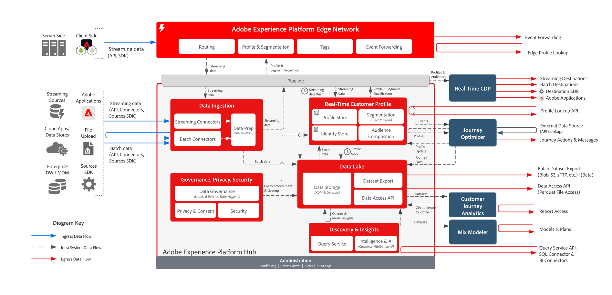

# Adobe Experience Platform data flow architecture diagrams

## Data flow diagram

The below diagram illustrates the various paths for data ingestion and egress out of Adobe Experience Platform.

## Data ingress and egress patterns

For a detailed list of all data ingestion, collection, ingress and egress patterns see the [Data Ingestion Documentation](https://experienceleague.adobe.com/en/docs/experience-platform/collection/home).