# Use case catalog

Industry use cases show how organizations in specific verticals apply Adobe Experience Platform and applications to achieve measurable business outcomes. Each use case describes a concrete business scenario, its expected impact, and links to the [use case pattern](/help/blueprints/use-case-patterns/overview.md) that provides detailed implementation guidance.

Browse by industry to find use cases relevant to your organization, then follow the pattern links for implementation references including decision guidance, function chains, and Experience League documentation.

| Industry | Key Themes |
| --- | --- |
| [Automotive](automotive/automotive-overview.md) | Vehicle purchase journey, service lifecycle, connected car experiences, owner loyalty |
| [B2B](b2b/b2b-overview.md) | Account-based marketing, lead scoring, pipeline acceleration, customer expansion |
| [Financial Services](financial-services/financial-services-overview.md) | Product recommendations, churn prevention, life-stage offers, fraud personalization |
| [Healthcare](healthcare/healthcare-overview.md) | Appointment management, medication adherence, patient onboarding, care coordination |
| [Insurance](insurance/insurance-overview.md) | Policy renewal, claims experience, risk prevention, cross-sell optimization |
| [Media & Entertainment](media-entertainment/media-entertainment-overview.md) | Content recommendations, subscription retention, trial conversion, cross-platform engagement |
| [Retail](retail/retail-overview.md) | Product personalization, cart recovery, cross-sell optimization, loyalty engagement |
| [Telecommunications](telecommunications/telecommunications-overview.md) | Device upgrades, churn prevention, plan optimization, network engagement |
| [Travel & Hospitality](travel-hospitality/travel-hospitality-overview.md) | Booking personalization, abandonment recovery, loyalty programs, seasonal campaigns |
| [Technology](technology/technology-overview.md) | Event collection, real-time data forwarding, analytics integration, edge deployment |

## How use cases connect to implementation guidance

Each use case links to a **use case pattern** — a repeatable implementation approach that describes the function chain, decision points, and configuration steps needed to bring the use case to life. Use case patterns in turn connect to [key business objectives](/help/blueprints/business-objectives/overview.md), helping you align implementation work with strategic outcomes.

```
Industry Use Case → Use Case Pattern → Key Business Objective
```

## Browse by industry

>[!BEGINTABS]

>[!TAB Retail]

| | Use Case | Description | Maturity | Pattern |
| --- | --- | --- | --- | --- |
|  | [Abandoned Cart Email Recovery](retail/retail-overview.md#abandoned-cart-email-recovery) | Automatically send personalized email reminders to customers who abandoned their shopping cart, including cart contents and relevant offers. | [!BADGE Foundational]{type=Neutral} | [Event-Triggered Messaging](/help/blueprints/use-case-patterns/campaign-management-orchestration/event-triggered-messaging.md) |
|  | [Inventory-Based Urgency Campaigns](retail/retail-overview.md#inventory-based-urgency-campaigns) | Trigger real-time alerts and campaigns when product inventory is low, creating urgency and encouraging immediate purchase. | [!BADGE Foundational]{type=Neutral} | [Event-Triggered Messaging](/help/blueprints/use-case-patterns/campaign-management-orchestration/event-triggered-messaging.md) |
|  | [Price Drop Alerts](retail/retail-overview.md#price-drop-alerts) | Notify customers via email or push when products in their wishlist or previously viewed items drop in price. | [!BADGE Foundational]{type=Neutral} | [Event-Triggered Messaging](/help/blueprints/use-case-patterns/campaign-management-orchestration/event-triggered-messaging.md) |
|  | [Out-of-Stock Notifications](retail/retail-overview.md#out-of-stock-notifications) | Allow customers to sign up for notifications when out-of-stock products become available, then automatically notify them via email or SMS. | [!BADGE Foundational]{type=Neutral} | [Event-Triggered Messaging](/help/blueprints/use-case-patterns/campaign-management-orchestration/event-triggered-messaging.md) |
|  | [Personalized Product Recommendations](retail/retail-overview.md#personalized-product-recommendations) | Show personalized product recommendations on homepage, category pages, and product detail pages based on browsing history, purchase history, and similar customer behavior. | [!BADGE Emerging]{type=Informative} | [Behavioral Recommendation](/help/blueprints/use-case-patterns/personalization/behavioral-recommendation.md) |
|  | [Personalized Category Pages](retail/retail-overview.md#personalized-category-pages) | Dynamically personalize category pages to show most relevant products first based on customer preferences, past purchases, and browsing behavior. | [!BADGE Emerging]{type=Informative} | [Behavioral Recommendation](/help/blueprints/use-case-patterns/personalization/behavioral-recommendation.md) |
|  | [New Customer Welcome Series](retail/retail-overview.md#new-customer-welcome-series) | Automate a multi-email welcome series for new customers with personalized product recommendations, brand story, and special offers. | [!BADGE Emerging]{type=Informative} | [Multi-Step Orchestrated Journey](/help/blueprints/use-case-patterns/campaign-management-orchestration/multi-step-orchestrated-journey.md) |
|  | [Replenishment Reminders](retail/retail-overview.md#replenishment-reminders) | Send automated reminders to customers for products they purchase regularly (subscription items, consumables) to encourage repeat purchases. | [!BADGE Emerging]{type=Informative} | [Multi-Step Orchestrated Journey](/help/blueprints/use-case-patterns/campaign-management-orchestration/multi-step-orchestrated-journey.md) |
|  | [Post-Purchase Follow-Up Campaigns](retail/retail-overview.md#post-purchase-follow-up-campaigns) | Send post-purchase emails with product care tips, related products, review requests, and loyalty program information. | [!BADGE Emerging]{type=Informative} | [Multi-Step Orchestrated Journey](/help/blueprints/use-case-patterns/campaign-management-orchestration/multi-step-orchestrated-journey.md) |
|  | [Social Proof Personalization](retail/retail-overview.md#social-proof-personalization) | Display personalized social proof based on customer profile and preferences. | [!BADGE Emerging]{type=Informative} | [Known-Visitor Web/App Personalization](/help/blueprints/use-case-patterns/personalization/known-visitor-web-app-personalization.md) |
|  | [Cross-Sell and Upsell Recommendations](retail/retail-overview.md#cross-sell-and-upsell-recommendations) | Display relevant cross-sell and upsell products at checkout, in email, and on product pages based on purchase patterns and product relationships. | [!BADGE Advanced]{type=Caution} | [Offer Decisioning](/help/blueprints/use-case-patterns/personalization/offer-decisioning.md) |
| 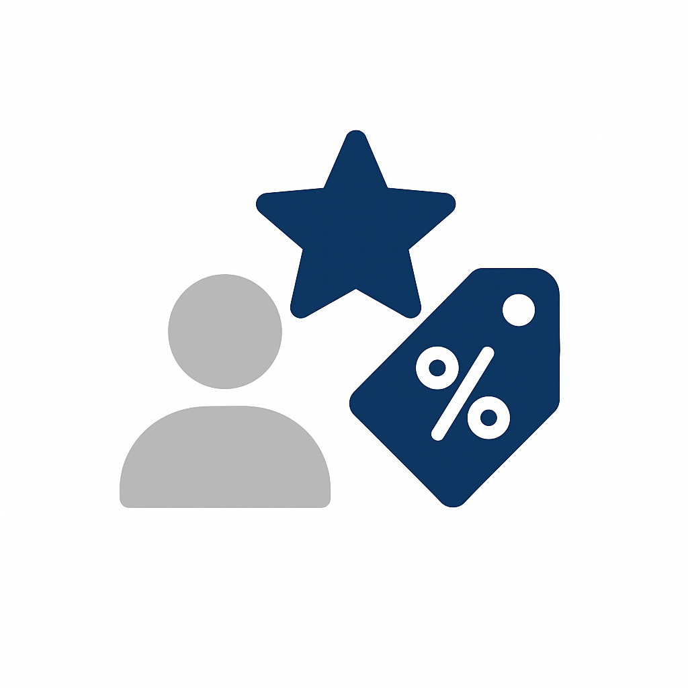 | [VIP Customer Exclusive Offers](retail/retail-overview.md#vip-customer-exclusive-offers) | Identify high-value customers and provide exclusive offers, early access to sales, and personalized shopping experiences. | [!BADGE Advanced]{type=Caution} | [Cross-Channel Journey with Decisioning](/help/blueprints/use-case-patterns/campaign-management-orchestration/cross-channel-journey-with-decisioning.md) |
|  | [AI Product Advisor](retail/retail-overview.md#ai-product-advisor) | Deploy a conversational AI advisor that guides shoppers through product discovery using natural dialogue, real-time inventory, and personalized profile data. | [!BADGE Advanced]{type=Caution} | [Brand Concierge Conversational Experience](/help/blueprints/use-case-patterns/conversational-experience/brand-concierge-conversational-experience.md) |
|  | [Cross-Channel Attribution Analysis](retail/retail-overview.md#cross-channel-attribution-analysis) | Measure how email, paid, and in-store touchpoints contribute to purchase conversion using multi-touch attribution models. | [!BADGE Advanced]{type=Caution} | [Customer Analytics & Insight Generation](/help/blueprints/use-case-patterns/analysis/customer-analytics-insight-generation.md) |
|  | [Audience Segmentation & Activation for Paid Media](retail/retail-overview.md#audience-segmentation--activation-for-paid-media) | Build high-value audience segments from unified customer profiles and activate them across paid media destinations such as Google Ads, Meta, and The Trade Desk for acquisition and retargeting campaigns. | [!BADGE Emerging]{type=Informative} | [Audience Activation to Destinations](/help/blueprints/use-case-patterns/audience-building-activation/audience-activation-to-destinations.md) |
|  | [Customer Suppression for Acquisition Campaigns](retail/retail-overview.md#customer-suppression-for-acquisition-campaigns) | Suppress existing customers and recent converters from acquisition ad spend by activating exclusion audiences to paid media destinations, reducing wasted spend. | [!BADGE Foundational]{type=Neutral} | [Audience Activation to Destinations](/help/blueprints/use-case-patterns/audience-building-activation/audience-activation-to-destinations.md) |
|  | [Personalized Web Experiences for Known Visitors](retail/retail-overview.md#personalized-web-experiences-for-known-visitors) | Deliver personalized hero banners, product recommendations, and promotional content to authenticated website visitors based on their real-time profile, segment membership, and behavioral history. | [!BADGE Advanced]{type=Caution} | [Known-Visitor Web/App Personalization](/help/blueprints/use-case-patterns/personalization/known-visitor-web-app-personalization.md) |
|  | [Anonymous Visitor Web Personalization](retail/retail-overview.md#anonymous-visitor-web-personalization) | Personalize content for unidentified website visitors using in-session behavioral signals such as pages viewed, product categories browsed, and referral source. | [!BADGE Emerging]{type=Informative} | [Anonymous Visitor Web Personalization](/help/blueprints/use-case-patterns/personalization/anonymous-visitor-web-personalization.md) |
|  | [Welcome Series Journey](retail/retail-overview.md#welcome-series-journey) | Orchestrate a multi-step welcome journey for newly registered customers, delivering onboarding content, product education, and a first-purchase incentive across email and push channels. | [!BADGE Emerging]{type=Informative} | [Multi-Step Orchestrated Journey](/help/blueprints/use-case-patterns/campaign-management-orchestration/multi-step-orchestrated-journey.md) |
|  | [Cart Abandonment Recovery](retail/retail-overview.md#cart-abandonment-recovery) | Trigger real-time email and push notifications when a customer abandons their shopping cart, with personalized product reminders and time-limited incentives to complete the purchase. | [!BADGE Emerging]{type=Informative} | [Event-Triggered Messaging](/help/blueprints/use-case-patterns/campaign-management-orchestration/event-triggered-messaging.md) |
|  | [Post-Purchase Engagement Journey](retail/retail-overview.md#post-purchase-engagement-journey) | Deliver post-purchase communications including order confirmation, shipping updates, cross-sell recommendations, and review requests through an orchestrated multi-step journey. | [!BADGE Emerging]{type=Informative} | [Multi-Step Orchestrated Journey](/help/blueprints/use-case-patterns/campaign-management-orchestration/multi-step-orchestrated-journey.md) |
|  | [Loyalty Tier Upgrade Campaign](retail/retail-overview.md#loyalty-tier-upgrade-campaign) | Identify customers approaching loyalty tier thresholds and deliver targeted campaigns encouraging them to reach the next tier with personalized offers based on purchase history and preferences. | [!BADGE Advanced]{type=Caution} | [Multi-Step Orchestrated Journey](/help/blueprints/use-case-patterns/campaign-management-orchestration/multi-step-orchestrated-journey.md) |
|  | [Cross-Channel Campaign Orchestration](retail/retail-overview.md#cross-channel-campaign-orchestration) | Orchestrate coordinated marketing campaigns across email, SMS, push, and web channels with journey branching, wait steps, and frequency capping to maximize engagement without fatigue. | [!BADGE Advanced]{type=Caution} | [Cross-Channel Journey with Decisioning](/help/blueprints/use-case-patterns/campaign-management-orchestration/cross-channel-journey-with-decisioning.md) |
|  | [Brand Concierge Conversational Experience](retail/retail-overview.md#brand-concierge-conversational-experience) | Deploy an AI-powered, brand-safe conversational agent across digital properties to provide personalized product guidance, site navigation help, and seamless handoff to live agents. | [!BADGE Advanced]{type=Caution} | [Brand Concierge Conversational Experience](/help/blueprints/use-case-patterns/conversational-experience/brand-concierge-conversational-experience.md) |
|  | [Check-in Reminder with App Download CTA](retail/retail-overview.md#check-in-reminder-with-app-download-cta) | Remind guests to check-in, and encourage them to download the app in order to access information easily. | [!BADGE Foundational]{type=Neutral} | [Event-Triggered Messaging](/help/blueprints/use-case-patterns/campaign-management-orchestration/event-triggered-messaging.md) |
|  | [Birthday Campaigns for Fans](retail/retail-overview.md#birthday-campaigns-for-fans) | Target fans on their birthday with a personalized birthday message and an exclusive offer. | [!BADGE Emerging]{type=Informative} | [Event-Triggered Messaging](/help/blueprints/use-case-patterns/campaign-management-orchestration/event-triggered-messaging.md) |
|  | [Birthday Campaigns for Shoppers](retail/retail-overview.md#birthday-campaigns-for-shoppers) | Target shoppers on their birthday with a personalized birthday message and an exclusive offer. | [!BADGE Emerging]{type=Informative} | [Event-Triggered Messaging](/help/blueprints/use-case-patterns/campaign-management-orchestration/event-triggered-messaging.md) |
|  | [Game Day Promotion Campaigns](retail/retail-overview.md#game-day-promotion-campaigns) | Target fans to buy tickets for an upcoming game with personalized promotions and offers. | [!BADGE Emerging]{type=Informative} | [Batch Outbound Message Activation](/help/blueprints/use-case-patterns/campaign-management-orchestration/batch-outbound-message-activation.md) |
|  | [Product Promotion Campaigns](retail/retail-overview.md#product-promotion-campaigns) | Target shoppers to buy products during an ongoing product promotion campaign. | [!BADGE Emerging]{type=Informative} | [Batch Outbound Message Activation](/help/blueprints/use-case-patterns/campaign-management-orchestration/batch-outbound-message-activation.md) |
|  | [Shopping Cart Abandon](retail/retail-overview.md#shopping-cart-abandon) | Re-engage customers who abandon their shopping cart with personalized reminders and incentives to complete the purchase. | [!BADGE Emerging]{type=Informative} | [Event-Triggered Messaging](/help/blueprints/use-case-patterns/campaign-management-orchestration/event-triggered-messaging.md) |

>[!TAB Automotive]

| | Use Case | Description | Maturity | Pattern |
| --- | --- | --- | --- | --- |
|  | [Service Appointment Reminders](automotive/automotive-overview.md#service-appointment-reminders) | Send personalized service appointment reminders based on vehicle mileage, service history, and customer preferences. | [!BADGE Foundational]{type=Neutral} | [Event-Triggered Messaging](/help/blueprints/use-case-patterns/campaign-management-orchestration/event-triggered-messaging.md) |
|  | [Vehicle Recall Notifications](automotive/automotive-overview.md#vehicle-recall-notifications) | Send personalized recall notifications with service scheduling options and safety information based on customer vehicle and location. | [!BADGE Foundational]{type=Neutral} | [Event-Triggered Messaging](/help/blueprints/use-case-patterns/campaign-management-orchestration/event-triggered-messaging.md) |
|  | [Test Drive Scheduling](automotive/automotive-overview.md#test-drive-scheduling) | Enable personalized test drive scheduling with dealer recommendations and vehicle availability based on customer preferences and location. | [!BADGE Foundational]{type=Neutral} | [Event-Triggered Messaging](/help/blueprints/use-case-patterns/campaign-management-orchestration/event-triggered-messaging.md) |
|  | [New Model Launch Campaigns](automotive/automotive-overview.md#new-model-launch-campaigns) | Target customers who may be interested in new model launches based on their current vehicle, preferences, and purchase history. | [!BADGE Foundational]{type=Neutral} | [Batch Outbound Message Activation](/help/blueprints/use-case-patterns/campaign-management-orchestration/batch-outbound-message-activation.md) |
|  | [Trade-In Value Campaigns](automotive/automotive-overview.md#trade-in-value-campaigns) | Proactively offer trade-in value assessments and campaigns to customers who may be ready to upgrade their vehicle. | [!BADGE Emerging]{type=Informative} | [Multi-Step Orchestrated Journey](/help/blueprints/use-case-patterns/campaign-management-orchestration/multi-step-orchestrated-journey.md) |
|  | [Parts and Accessories Recommendations](automotive/automotive-overview.md#parts-and-accessories-recommendations) | Recommend relevant parts, accessories, and upgrades based on vehicle model, ownership duration, and customer preferences. | [!BADGE Emerging]{type=Informative} | [Behavioral Recommendation](/help/blueprints/use-case-patterns/personalization/behavioral-recommendation.md) |
|  | [Warranty and Extended Service Plans](automotive/automotive-overview.md#warranty-and-extended-service-plans) | Recommend warranty and extended service plans at optimal times based on vehicle age, mileage, and customer purchase patterns. | [!BADGE Emerging]{type=Informative} | [Multi-Step Orchestrated Journey](/help/blueprints/use-case-patterns/campaign-management-orchestration/multi-step-orchestrated-journey.md) |
|  | [Connected Car Feature Activation](automotive/automotive-overview.md#connected-car-feature-activation) | Personalize connected car feature recommendations and activation campaigns based on vehicle capabilities and customer tech preferences. | [!BADGE Emerging]{type=Informative} | [Multi-Step Orchestrated Journey](/help/blueprints/use-case-patterns/campaign-management-orchestration/multi-step-orchestrated-journey.md) |
|  | [Dealer Network Coordination](automotive/automotive-overview.md#dealer-network-coordination) | Enable personalized dealer recommendations and coordination based on customer location, preferences, and dealer inventory. | [!BADGE Emerging]{type=Informative} | [Known-Visitor Web/App Personalization](/help/blueprints/use-case-patterns/personalization/known-visitor-web-app-personalization.md) |
|  | [Vehicle Purchase Journey Personalization](automotive/automotive-overview.md#vehicle-purchase-journey-personalization) | Personalize the vehicle purchase journey from research to purchase with relevant vehicle recommendations, financing options, and dealer information. | [!BADGE Advanced]{type=Caution} | [Cross-Channel Journey with Decisioning](/help/blueprints/use-case-patterns/campaign-management-orchestration/cross-channel-journey-with-decisioning.md) |
|  | [Financing and Insurance Offers](automotive/automotive-overview.md#financing-and-insurance-offers) | Present personalized financing and insurance offers based on customer credit profile, vehicle selection, and purchase timeline. | [!BADGE Advanced]{type=Caution} | [Offer Decisioning](/help/blueprints/use-case-patterns/personalization/offer-decisioning.md) |
|  | [Owner Loyalty Programs](automotive/automotive-overview.md#owner-loyalty-programs) | Personalize owner loyalty program communications, rewards, and exclusive offers based on ownership history and loyalty tier. | [!BADGE Advanced]{type=Caution} | [Cross-Channel Journey with Decisioning](/help/blueprints/use-case-patterns/campaign-management-orchestration/cross-channel-journey-with-decisioning.md) |

>[!TAB Financial Services]

| | Use Case | Description | Maturity | Pattern |
| --- | --- | --- | --- | --- |
| 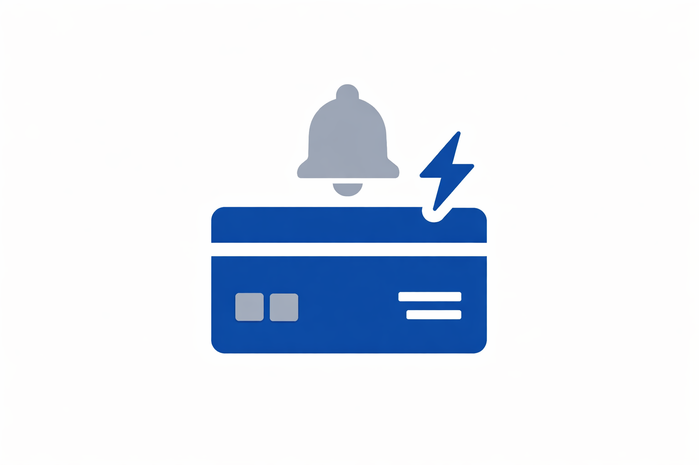 | [Transaction-Based Alerts and Recommendations](financial-services/financial-services-overview.md#transaction-based-alerts-and-recommendations) | Send real-time alerts for transactions and provide personalized recommendations based on spending patterns and account activity. | [!BADGE Foundational]{type=Neutral} | [Event-Triggered Messaging](/help/blueprints/use-case-patterns/campaign-management-orchestration/event-triggered-messaging.md) |
|  | [Credit Card Application Abandonment Recovery](financial-services/financial-services-overview.md#credit-card-application-abandonment-recovery) | Identify customers who started but did not complete credit card applications and re-engage them with personalized messaging and offers. | [!BADGE Foundational]{type=Neutral} | [Event-Triggered Messaging](/help/blueprints/use-case-patterns/campaign-management-orchestration/event-triggered-messaging.md) |
|  | [Fraud Alert Personalization](financial-services/financial-services-overview.md#fraud-alert-personalization) | Personalize fraud alerts and security communications based on customer communication preferences and past interaction history. | [!BADGE Foundational]{type=Neutral} | [Event-Triggered Messaging](/help/blueprints/use-case-patterns/campaign-management-orchestration/event-triggered-messaging.md) |
|  | [High-Value Lead Nurturing](financial-services/financial-services-overview.md#high-value-lead-nurturing) | Identify high-value prospects based on profile data and behavior, then nurture them with personalized content and offers through automated journeys. | [!BADGE Emerging]{type=Informative} | [Multi-Step Orchestrated Journey](/help/blueprints/use-case-patterns/campaign-management-orchestration/multi-step-orchestrated-journey.md) |
|  | [Personalized Account Dashboard](financial-services/financial-services-overview.md#personalized-account-dashboard) | Personalize online banking dashboard and mobile app experience based on customer account activity, preferences, and financial goals. | [!BADGE Emerging]{type=Informative} | [Known-Visitor Web/App Personalization](/help/blueprints/use-case-patterns/personalization/known-visitor-web-app-personalization.md) |
|  | [Investment Portfolio Recommendations](financial-services/financial-services-overview.md#investment-portfolio-recommendations) | Provide personalized investment recommendations based on customer risk profile, investment history, and financial goals. | [!BADGE Emerging]{type=Informative} | [Behavioral Recommendation](/help/blueprints/use-case-patterns/personalization/behavioral-recommendation.md) |
| 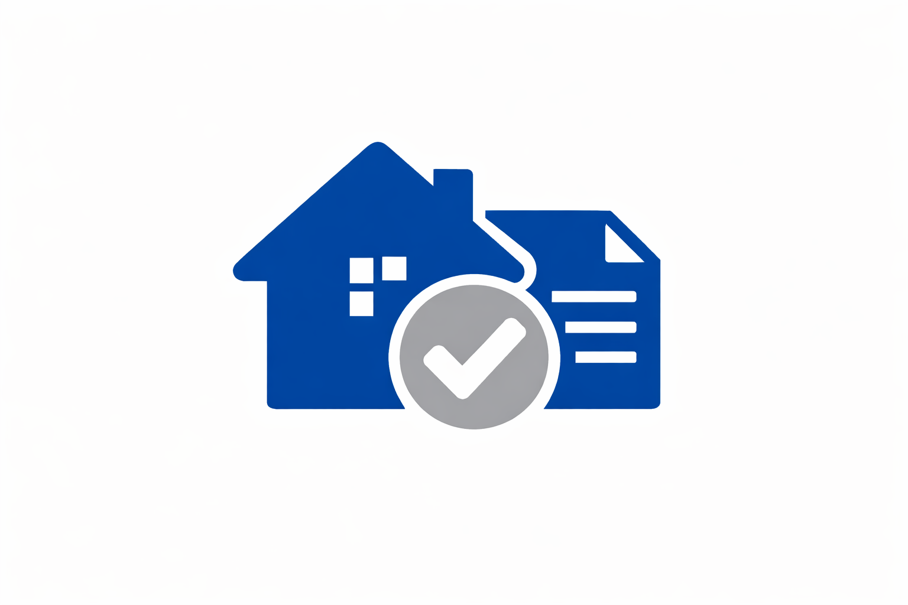 | [Mortgage Pre-Approval Campaigns](financial-services/financial-services-overview.md#mortgage-pre-approval-campaigns) | Target customers who are likely to be in the market for a mortgage based on profile data, behavior, and life stage indicators. | [!BADGE Emerging]{type=Informative} | [Multi-Step Orchestrated Journey](/help/blueprints/use-case-patterns/campaign-management-orchestration/multi-step-orchestrated-journey.md) |
|  | [Product Recommendation for Existing Customers](financial-services/financial-services-overview.md#product-recommendation-for-existing-customers) | Recommend relevant financial products to existing customers based on their profile, transaction history, and life stage. | [!BADGE Advanced]{type=Caution} | [Offer Decisioning](/help/blueprints/use-case-patterns/personalization/offer-decisioning.md) |
|  | [Churn Prevention Campaigns](financial-services/financial-services-overview.md#churn-prevention-campaigns) | Identify customers at risk of churning using AI-powered prediction and engage them with retention offers and personalized communications. | [!BADGE Advanced]{type=Caution} | [Cross-Channel Journey with Decisioning](/help/blueprints/use-case-patterns/campaign-management-orchestration/cross-channel-journey-with-decisioning.md) |
| 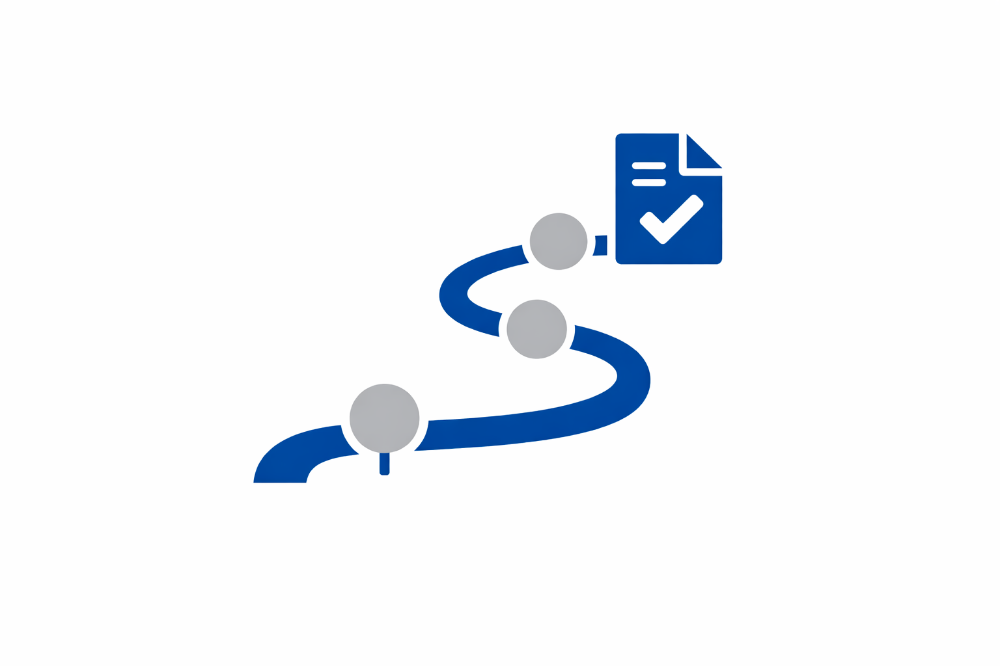 | [Life Stage-Based Product Offers](financial-services/financial-services-overview.md#life-stage-based-product-offers) | Identify customers entering new life stages and proactively offer relevant financial products and services. | [!BADGE Advanced]{type=Caution} | [Cross-Channel Journey with Decisioning](/help/blueprints/use-case-patterns/campaign-management-orchestration/cross-channel-journey-with-decisioning.md) |
| 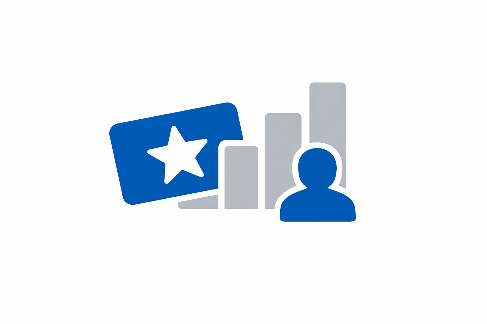 | [Loyalty Program Engagement](financial-services/financial-services-overview.md#loyalty-program-engagement) | Personalize loyalty program communications, rewards, and offers based on customer tier, points balance, and redemption history. | [!BADGE Advanced]{type=Caution} | [Cross-Channel Journey with Decisioning](/help/blueprints/use-case-patterns/campaign-management-orchestration/cross-channel-journey-with-decisioning.md) |
|  | [Personalized Financial Education Content](financial-services/financial-services-overview.md#personalized-financial-education-content) | Deliver personalized financial education content, tips, and resources based on customer financial profile, goals, and interests. | [!BADGE Advanced]{type=Caution} | [Cross-Channel Journey with Decisioning](/help/blueprints/use-case-patterns/campaign-management-orchestration/cross-channel-journey-with-decisioning.md) |
|  | [AI Financial Product Guide](financial-services/financial-services-overview.md#ai-financial-product-guide) | Help customers understand financial products and navigate account options through conversational AI grounded in compliance-reviewed content and real-time profile data. | [!BADGE Advanced]{type=Caution} | [Brand Concierge Conversational Experience](/help/blueprints/use-case-patterns/conversational-experience/brand-concierge-conversational-experience.md) |
| 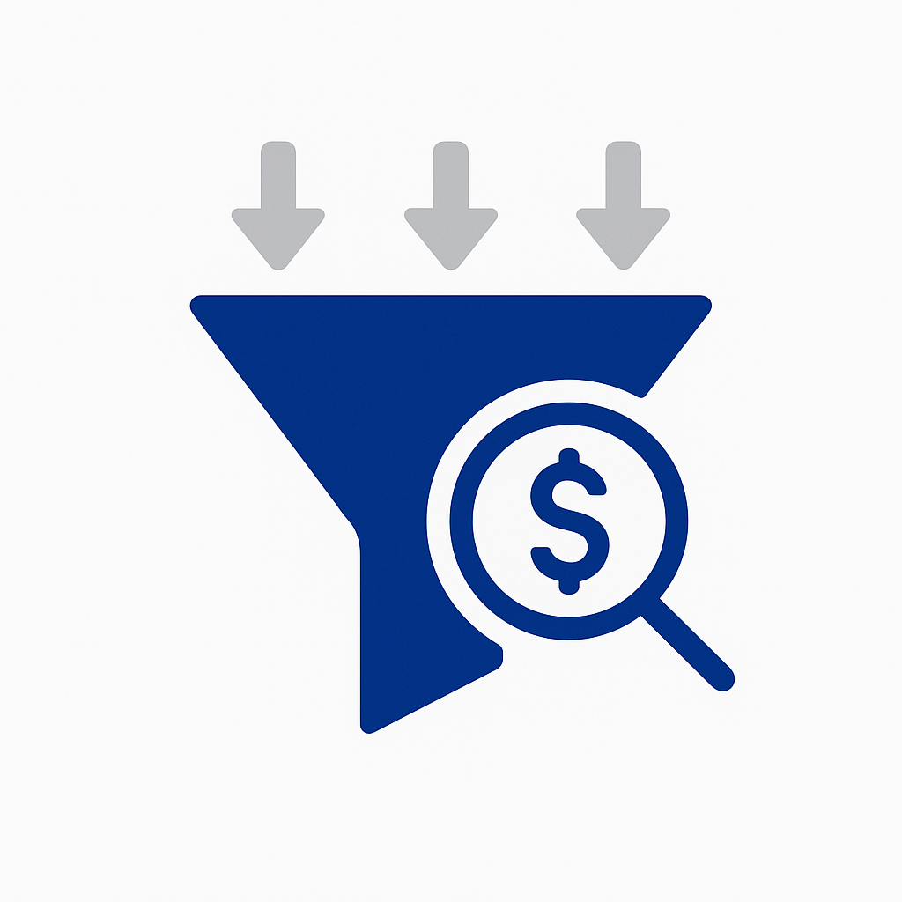 | [Product Adoption Funnel and Churn Driver Analysis](financial-services/financial-services-overview.md#product-adoption-funnel-and-churn-driver-analysis) | Identify where customers drop off in onboarding flows and which behaviors predict product attrition. | [!BADGE Advanced]{type=Caution} | [Customer Analytics & Insight Generation](/help/blueprints/use-case-patterns/analysis/customer-analytics-insight-generation.md) |
|  | [Next-Best Offer Decisioning](financial-services/financial-services-overview.md#next-best-offer-decisioning) | Use centralized decision logic to select the most relevant offer for each customer across channels, combining eligibility rules, business constraints, and AI-powered ranking strategies. | [!BADGE Advanced]{type=Caution} | [Offer Decisioning](/help/blueprints/use-case-patterns/personalization/offer-decisioning.md) |
|  | [Customer Journey Analytics Dashboard](financial-services/financial-services-overview.md#customer-journey-analytics-dashboard) | Build cross-channel analytics workspaces combining web, app, email, and call center data to visualize customer journeys, identify drop-off points, and measure campaign attribution. | [!BADGE Emerging]{type=Informative} | [Customer Analytics & Insight Generation](/help/blueprints/use-case-patterns/analysis/customer-analytics-insight-generation.md) |

>[!TAB Healthcare]

| | Use Case | Description | Maturity | Pattern |
| --- | --- | --- | --- | --- |
|  | [Appointment Reminder Automation](healthcare/healthcare-overview.md#appointment-reminder-automation) | Send personalized appointment reminders via email, SMS, and push notifications based on patient preferences and appointment type. | [!BADGE Foundational]{type=Neutral} | [Event-Triggered Messaging](/help/blueprints/use-case-patterns/campaign-management-orchestration/event-triggered-messaging.md) |
|  | [Post-Visit Follow-Up Campaigns](healthcare/healthcare-overview.md#post-visit-follow-up-campaigns) | Automatically send post-visit surveys, care instructions, and follow-up appointment reminders based on visit type and patient needs. | [!BADGE Foundational]{type=Neutral} | [Event-Triggered Messaging](/help/blueprints/use-case-patterns/campaign-management-orchestration/event-triggered-messaging.md) |
|  | [Lab Results Notification](healthcare/healthcare-overview.md#lab-results-notification) | Notify patients when lab results are available through their preferred communication channel with personalized messaging. | [!BADGE Foundational]{type=Neutral} | [Event-Triggered Messaging](/help/blueprints/use-case-patterns/campaign-management-orchestration/event-triggered-messaging.md) |
| 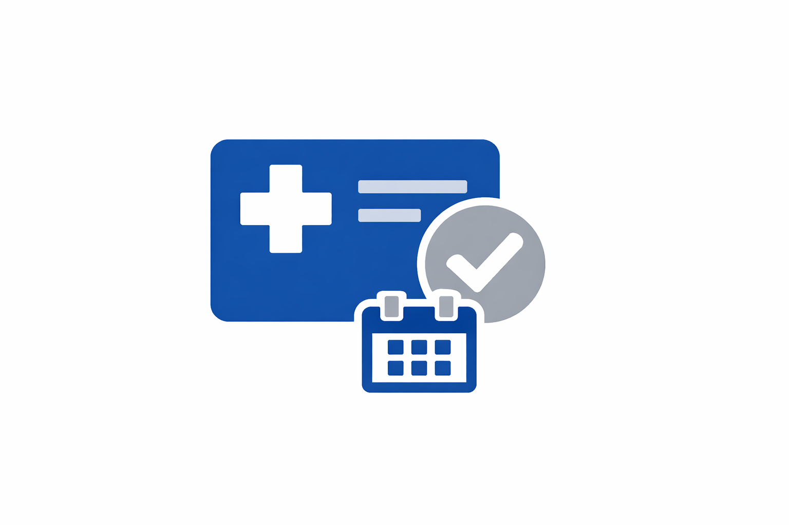 | [Insurance Coverage Verification](healthcare/healthcare-overview.md#insurance-coverage-verification) | Proactively verify and communicate insurance coverage information to patients before appointments to reduce billing issues and improve patient experience. | [!BADGE Foundational]{type=Neutral} | [Event-Triggered Messaging](/help/blueprints/use-case-patterns/campaign-management-orchestration/event-triggered-messaging.md) |
|  | [Telehealth Appointment Reminders](healthcare/healthcare-overview.md#telehealth-appointment-reminders) | Send personalized reminders for telehealth appointments with connection instructions, preparation tips, and technical support information. | [!BADGE Foundational]{type=Neutral} | [Event-Triggered Messaging](/help/blueprints/use-case-patterns/campaign-management-orchestration/event-triggered-messaging.md) |
|  | [Preventive Care Reminders](healthcare/healthcare-overview.md#preventive-care-reminders) | Proactively remind patients about recommended preventive care based on their age, medical history, and risk factors. | [!BADGE Foundational]{type=Neutral} | [Batch Outbound Message Activation](/help/blueprints/use-case-patterns/campaign-management-orchestration/batch-outbound-message-activation.md) |
|  | [Medication Adherence Campaigns](healthcare/healthcare-overview.md#medication-adherence-campaigns) | Send personalized reminders and educational content to help patients adhere to medication schedules and treatment plans. | [!BADGE Emerging]{type=Informative} | [Multi-Step Orchestrated Journey](/help/blueprints/use-case-patterns/campaign-management-orchestration/multi-step-orchestrated-journey.md) |
|  | [Chronic Disease Management Programs](healthcare/healthcare-overview.md#chronic-disease-management-programs) | Personalize chronic disease management communications, educational content, and monitoring reminders based on patient condition and treatment plan. | [!BADGE Emerging]{type=Informative} | [Multi-Step Orchestrated Journey](/help/blueprints/use-case-patterns/campaign-management-orchestration/multi-step-orchestrated-journey.md) |
| 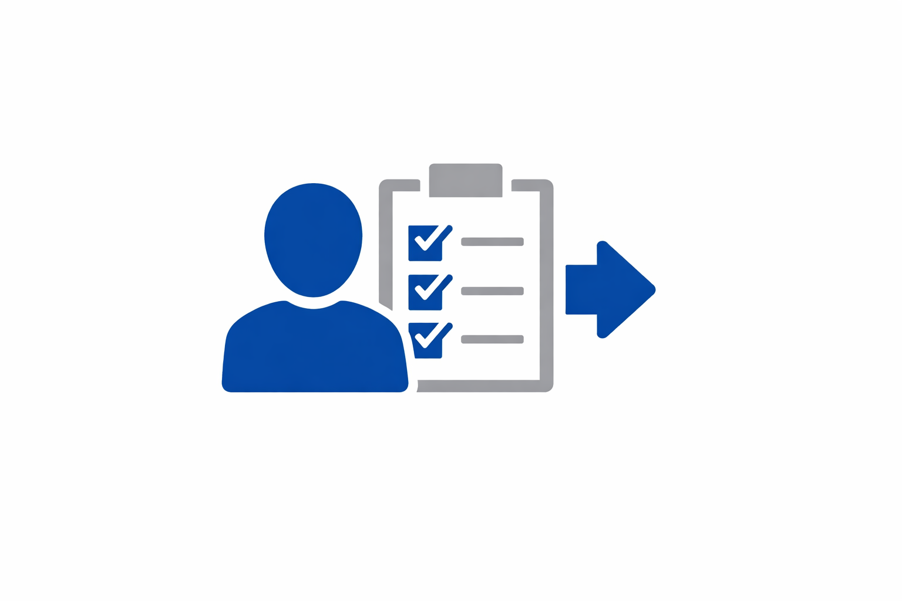 | [New Patient Onboarding Journey](healthcare/healthcare-overview.md#new-patient-onboarding-journey) | Automate a multi-step onboarding journey for new patients with welcome information, portal access instructions, and appointment scheduling guidance. | [!BADGE Emerging]{type=Informative} | [Multi-Step Orchestrated Journey](/help/blueprints/use-case-patterns/campaign-management-orchestration/multi-step-orchestrated-journey.md) |
|  | [Wellness Program Engagement](healthcare/healthcare-overview.md#wellness-program-engagement) | Personalize wellness program communications, challenges, and rewards based on patient health goals, activity level, and preferences. | [!BADGE Emerging]{type=Informative} | [Multi-Step Orchestrated Journey](/help/blueprints/use-case-patterns/campaign-management-orchestration/multi-step-orchestrated-journey.md) |
| 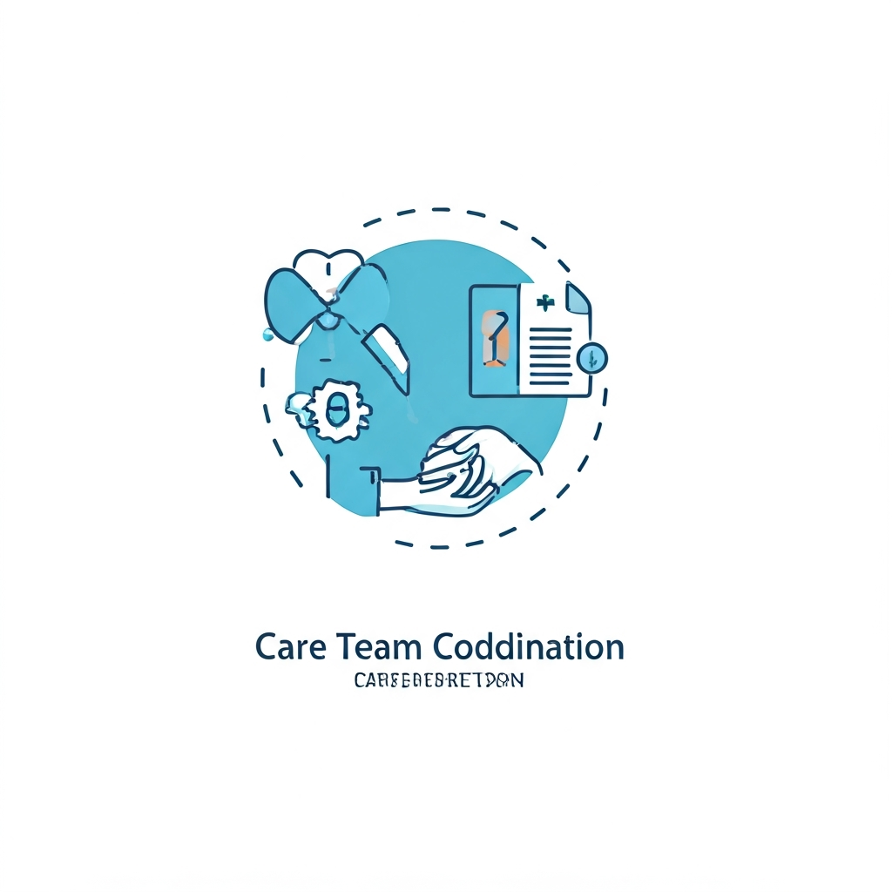 | [Care Team Coordination](healthcare/healthcare-overview.md#care-team-coordination) | Enable personalized communication and coordination between patients and their care team members based on care plan and preferences. | [!BADGE Emerging]{type=Informative} | [Multi-Step Orchestrated Journey](/help/blueprints/use-case-patterns/campaign-management-orchestration/multi-step-orchestrated-journey.md) |
| 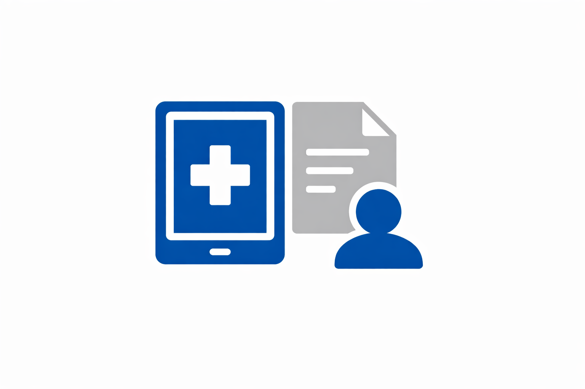 | [Personalized Health Content Delivery](healthcare/healthcare-overview.md#personalized-health-content-delivery) | Deliver personalized health education content, wellness tips, and resources based on patient conditions, interests, and health goals. | [!BADGE Advanced]{type=Caution} | [Cross-Channel Journey with Decisioning](/help/blueprints/use-case-patterns/campaign-management-orchestration/cross-channel-journey-with-decisioning.md) |
|  | [Patient Journey Funnel and Care Gap Analysis](healthcare/healthcare-overview.md#patient-journey-funnel-and-care-gap-analysis) | Identify where patients disengage from care pathways and which member populations have gaps in recommended care. | [!BADGE Advanced]{type=Caution} | [Customer Analytics & Insight Generation](/help/blueprints/use-case-patterns/analysis/customer-analytics-insight-generation.md) |
|  | [Patient Portal Content Personalization](healthcare/healthcare-overview.md#patient-portal-content-personalization) | Personalize the patient portal experience based on in-session browsing behavior and engagement history | [!BADGE Advanced]{type=Caution} | [Behavioral Recommendation](/help/blueprints/use-case-patterns/personalization/behavioral-recommendation.md) |
|  | [Patient Engagement & Appointment Reminders](healthcare/healthcare-overview.md#patient-engagement--appointment-reminders) | Send personalized appointment reminders, health tips, and follow-up care communications through compliant, consent-aware multi-channel journeys. | [!BADGE Emerging]{type=Informative} | [Event-Triggered Messaging](/help/blueprints/use-case-patterns/campaign-management-orchestration/event-triggered-messaging.md) |

>[!TAB Insurance]

| | Use Case | Description | Maturity | Pattern |
| --- | --- | --- | --- | --- |
|  | [Policy Renewal Campaigns](insurance/insurance-overview.md#policy-renewal-campaigns) | Send personalized policy renewal reminders and offers based on customer policy history, claims, and preferences. | [!BADGE Foundational]{type=Neutral} | [Multi-Step Orchestrated Journey](/help/blueprints/use-case-patterns/campaign-management-orchestration/multi-step-orchestrated-journey.md) |
| 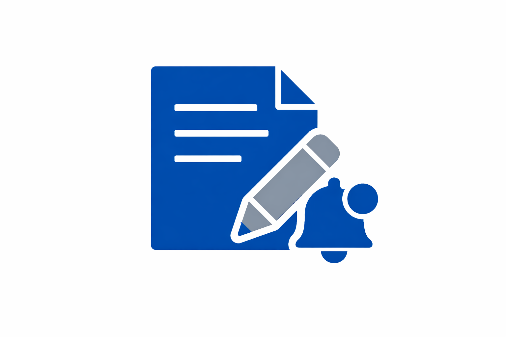 | [Policy Change Notifications](insurance/insurance-overview.md#policy-change-notifications) | Send personalized notifications about policy changes, updates, and new coverage options based on customer policy and preferences. | [!BADGE Foundational]{type=Neutral} | [Event-Triggered Messaging](/help/blueprints/use-case-patterns/campaign-management-orchestration/event-triggered-messaging.md) |
| 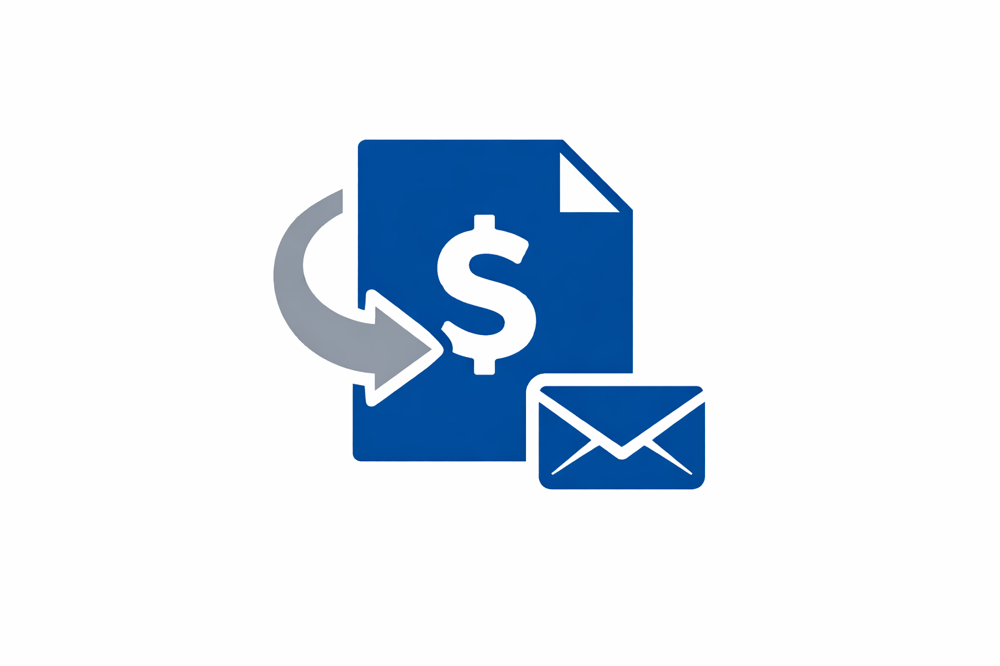 | [Quote Abandonment Recovery](insurance/insurance-overview.md#quote-abandonment-recovery) | Re-engage customers who started but did not complete insurance quotes with personalized follow-up and offers. | [!BADGE Foundational]{type=Neutral} | [Event-Triggered Messaging](/help/blueprints/use-case-patterns/campaign-management-orchestration/event-triggered-messaging.md) |
|  | [Claims Fraud Prevention](insurance/insurance-overview.md#claims-fraud-prevention) | Use AI-powered fraud detection to identify suspicious claims and personalize investigation communications while maintaining customer trust. | [!BADGE Foundational]{type=Neutral} | [Event-Triggered Messaging](/help/blueprints/use-case-patterns/campaign-management-orchestration/event-triggered-messaging.md) |
| 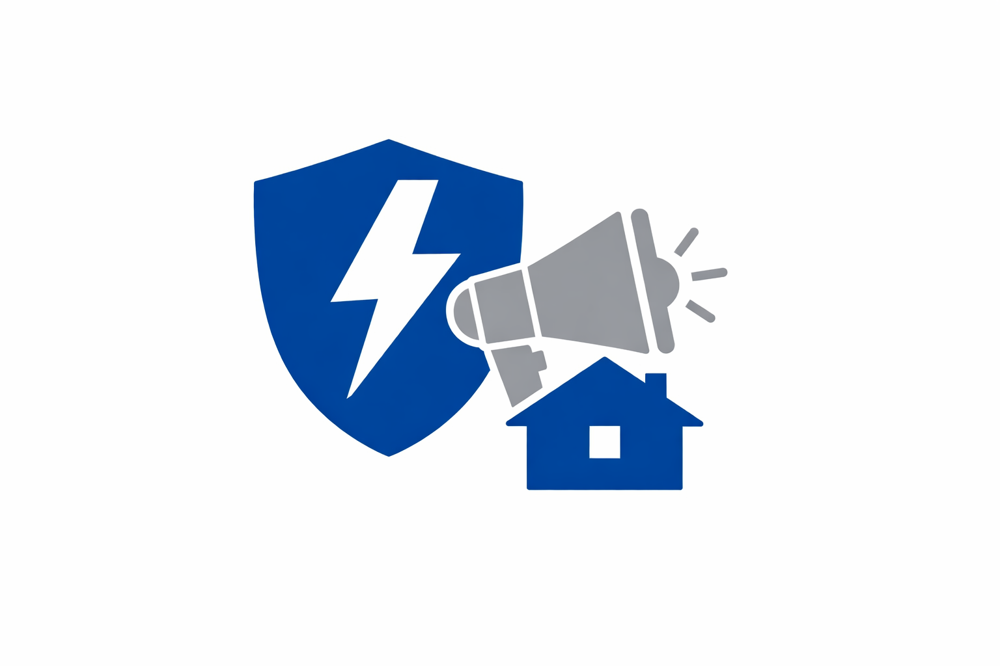 | [Catastrophic Event Response](insurance/insurance-overview.md#catastrophic-event-response) | Proactively communicate with customers in affected areas during natural disasters or catastrophic events with personalized support and claims information. | [!BADGE Foundational]{type=Neutral} | [Event-Triggered Messaging](/help/blueprints/use-case-patterns/campaign-management-orchestration/event-triggered-messaging.md) |
|  | [Agent and Broker Coordination](insurance/insurance-overview.md#agent-and-broker-coordination) | Enable personalized communication and coordination between customers and their agents/brokers based on policy needs and preferences. | [!BADGE Foundational]{type=Neutral} | [Batch Outbound Message Activation](/help/blueprints/use-case-patterns/campaign-management-orchestration/batch-outbound-message-activation.md) |
|  | [Claims Process Personalization](insurance/insurance-overview.md#claims-process-personalization) | Personalize claims process communications, updates, and support based on claim type, customer preferences, and claim history. | [!BADGE Emerging]{type=Informative} | [Multi-Step Orchestrated Journey](/help/blueprints/use-case-patterns/campaign-management-orchestration/multi-step-orchestrated-journey.md) |
| 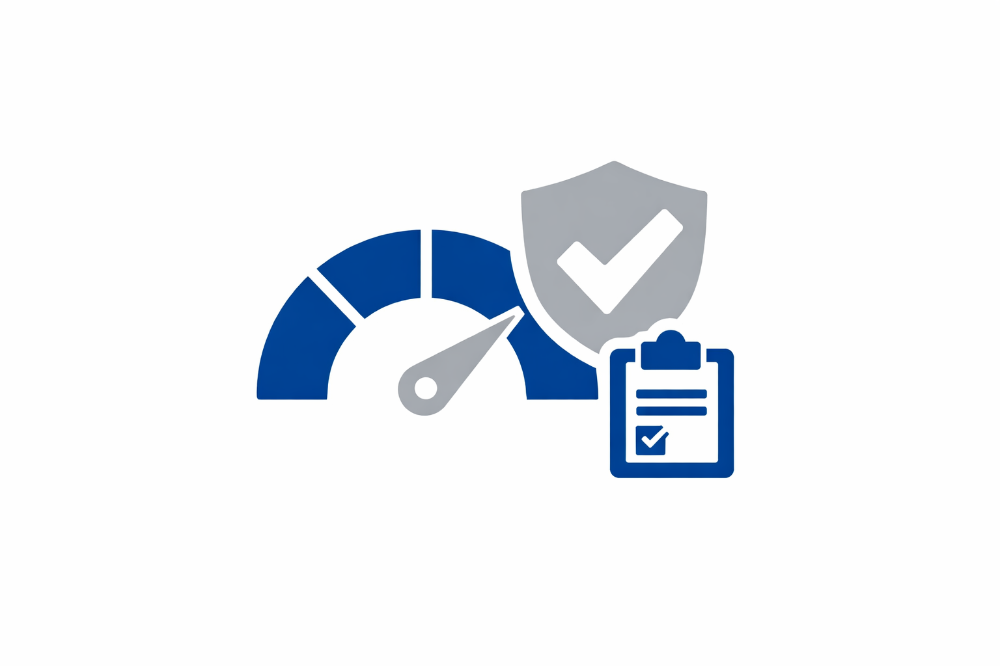 | [Risk Assessment and Prevention](insurance/insurance-overview.md#risk-assessment-and-prevention) | Provide personalized risk assessment information and prevention tips based on customer policy type, location, and risk factors. | [!BADGE Emerging]{type=Informative} | [Multi-Step Orchestrated Journey](/help/blueprints/use-case-patterns/campaign-management-orchestration/multi-step-orchestrated-journey.md) |
| 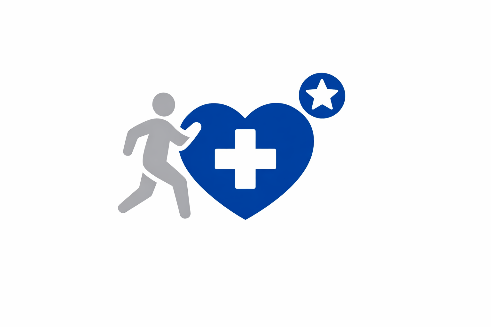 | [Wellness and Prevention Programs](insurance/insurance-overview.md#wellness-and-prevention-programs) | Personalize wellness program communications and rewards for health/life insurance customers based on participation and goals. | [!BADGE Emerging]{type=Informative} | [Multi-Step Orchestrated Journey](/help/blueprints/use-case-patterns/campaign-management-orchestration/multi-step-orchestrated-journey.md) |
|  | [Cross-Sell Product Recommendations](insurance/insurance-overview.md#cross-sell-product-recommendations) | Recommend additional insurance products based on customer existing policies, life stage, and risk profile. | [!BADGE Advanced]{type=Caution} | [Offer Decisioning](/help/blueprints/use-case-patterns/personalization/offer-decisioning.md) |
| 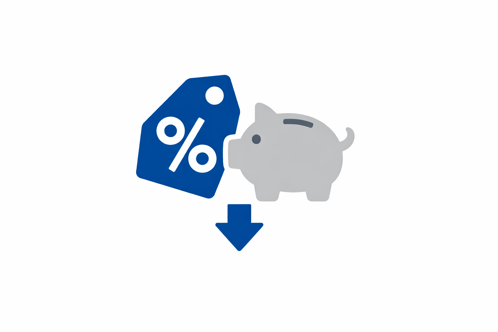 | [Discount and Savings Opportunities](insurance/insurance-overview.md#discount-and-savings-opportunities) | Identify and communicate personalized discount opportunities based on customer profile and behavior. | [!BADGE Advanced]{type=Caution} | [Offer Decisioning](/help/blueprints/use-case-patterns/personalization/offer-decisioning.md) |
|  | [Policyholder Portal Content Personalization](insurance/insurance-overview.md#policyholder-portal-content-personalization) | Personalize the authenticated portal and app experience based on behavior and policy portfolio | [!BADGE Advanced]{type=Caution} | [Behavioral Recommendation](/help/blueprints/use-case-patterns/personalization/behavioral-recommendation.md) |

>[!TAB Media & Entertainment]

| | Use Case | Description | Maturity | Pattern |
| --- | --- | --- | --- | --- |
|  | [New Content Release Notifications](media-entertainment/media-entertainment-overview.md#new-content-release-notifications) | Notify subscribers about new content releases that match their preferences and viewing history. | [!BADGE Foundational]{type=Neutral} | [Event-Triggered Messaging](/help/blueprints/use-case-patterns/campaign-management-orchestration/event-triggered-messaging.md) |
|  | [Watchlist and Favorites Reminders](media-entertainment/media-entertainment-overview.md#watchlist-and-favorites-reminders) | Send reminders to users about content in their watchlist or favorites that they have not watched yet. | [!BADGE Foundational]{type=Neutral} | [Event-Triggered Messaging](/help/blueprints/use-case-patterns/campaign-management-orchestration/event-triggered-messaging.md) |
|  | [Live Event Viewing Reminders](media-entertainment/media-entertainment-overview.md#live-event-viewing-reminders) | Notify users about upcoming live events, sports games, or premieres that match their interests and viewing history. | [!BADGE Foundational]{type=Neutral} | [Event-Triggered Messaging](/help/blueprints/use-case-patterns/campaign-management-orchestration/event-triggered-messaging.md) |
|  | [Content Completion Campaigns](media-entertainment/media-entertainment-overview.md#content-completion-campaigns) | Remind users to finish watching or listening to content they started but did not complete. | [!BADGE Foundational]{type=Neutral} | [Event-Triggered Messaging](/help/blueprints/use-case-patterns/campaign-management-orchestration/event-triggered-messaging.md) |
|  | [Content Recommendation Engine](media-entertainment/media-entertainment-overview.md#content-recommendation-engine) | Generate personalized content recommendations using behavioral signals and selection strategies, delivered via web, email, and in-app channels. | [!BADGE Emerging]{type=Informative} | [Behavioral Recommendation](/help/blueprints/use-case-patterns/personalization/behavioral-recommendation.md) |
| 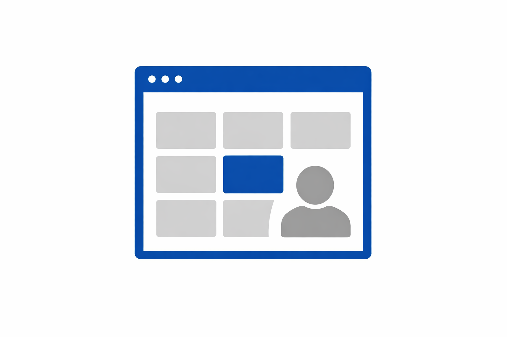 | [Personalized Homepage Experience](media-entertainment/media-entertainment-overview.md#personalized-homepage-experience) | Dynamically personalize homepage and content discovery pages to show most relevant content first based on user profile and behavior. | [!BADGE Emerging]{type=Informative} | [Behavioral Recommendation](/help/blueprints/use-case-patterns/personalization/behavioral-recommendation.md) |
|  | [Personalized Playlist Generation](media-entertainment/media-entertainment-overview.md#personalized-playlist-generation) | Automatically generate and update personalized playlists based on user listening history, preferences, and mood indicators. | [!BADGE Emerging]{type=Informative} | [Behavioral Recommendation](/help/blueprints/use-case-patterns/personalization/behavioral-recommendation.md) |
|  | [Free Trial Conversion Campaigns](media-entertainment/media-entertainment-overview.md#free-trial-conversion-campaigns) | Engage free trial users with personalized content recommendations and offers to encourage subscription conversion before trial ends. | [!BADGE Emerging]{type=Informative} | [Multi-Step Orchestrated Journey](/help/blueprints/use-case-patterns/campaign-management-orchestration/multi-step-orchestrated-journey.md) |
|  | [Cross-Platform Content Sync](media-entertainment/media-entertainment-overview.md#cross-platform-content-sync) | Provide seamless content experience across devices by syncing watch history, preferences, and recommendations in real time. | [!BADGE Emerging]{type=Informative} | [Known-Visitor Web/App Personalization](/help/blueprints/use-case-patterns/personalization/known-visitor-web-app-personalization.md) |
|  | [Social Sharing Personalization](media-entertainment/media-entertainment-overview.md#social-sharing-personalization) | Personalize social sharing prompts and recommendations based on user social connections and content preferences. | [!BADGE Emerging]{type=Informative} | [Known-Visitor Web/App Personalization](/help/blueprints/use-case-patterns/personalization/known-visitor-web-app-personalization.md) |
|  | [Subscription Churn Prevention](media-entertainment/media-entertainment-overview.md#subscription-churn-prevention) | Identify subscribers at risk of canceling and engage them with personalized content recommendations, offers, and retention campaigns. | [!BADGE Advanced]{type=Caution} | [Cross-Channel Journey with Decisioning](/help/blueprints/use-case-patterns/campaign-management-orchestration/cross-channel-journey-with-decisioning.md) |
|  | [Premium Feature Upsell](media-entertainment/media-entertainment-overview.md#premium-feature-upsell) | Identify users who would benefit from premium features and present personalized upsell offers based on their usage patterns. | [!BADGE Advanced]{type=Caution} | [Offer Decisioning](/help/blueprints/use-case-patterns/personalization/offer-decisioning.md) |
|  | [Subscriber Churn Driver and Content Engagement Analysis](media-entertainment/media-entertainment-overview.md#subscriber-churn-driver-and-content-engagement-analysis) | Identify content engagement patterns that precede subscriber cancellation and measure retention impact by content type and cohort. | [!BADGE Advanced]{type=Caution} | [Customer Analytics & Insight Generation](/help/blueprints/use-case-patterns/analysis/customer-analytics-insight-generation.md) |

>[!TAB Telecommunications]

| | Use Case | Description | Maturity | Pattern |
| --- | --- | --- | --- | --- |
| 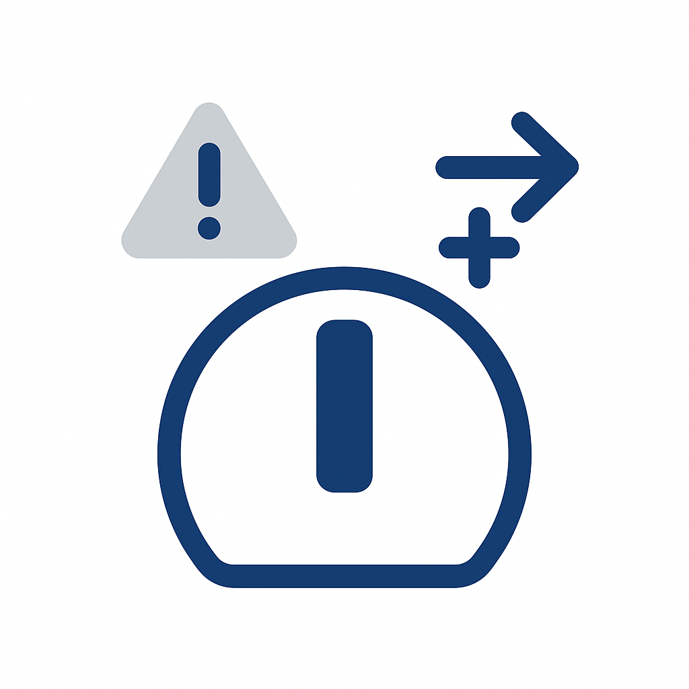 | [Data Usage Alerts and Recommendations](telecommunications/telecommunications-overview.md#data-usage-alerts-and-recommendations) | Send personalized alerts when customers approach data limits and recommend plan upgrades or add-ons based on usage patterns. | [!BADGE Foundational]{type=Neutral} | [Event-Triggered Messaging](/help/blueprints/use-case-patterns/campaign-management-orchestration/event-triggered-messaging.md) |
|  | [Service Outage Notifications](telecommunications/telecommunications-overview.md#service-outage-notifications) | Proactively notify customers about service outages in their area with personalized updates and compensation offers. | [!BADGE Foundational]{type=Neutral} | [Event-Triggered Messaging](/help/blueprints/use-case-patterns/campaign-management-orchestration/event-triggered-messaging.md) |
| 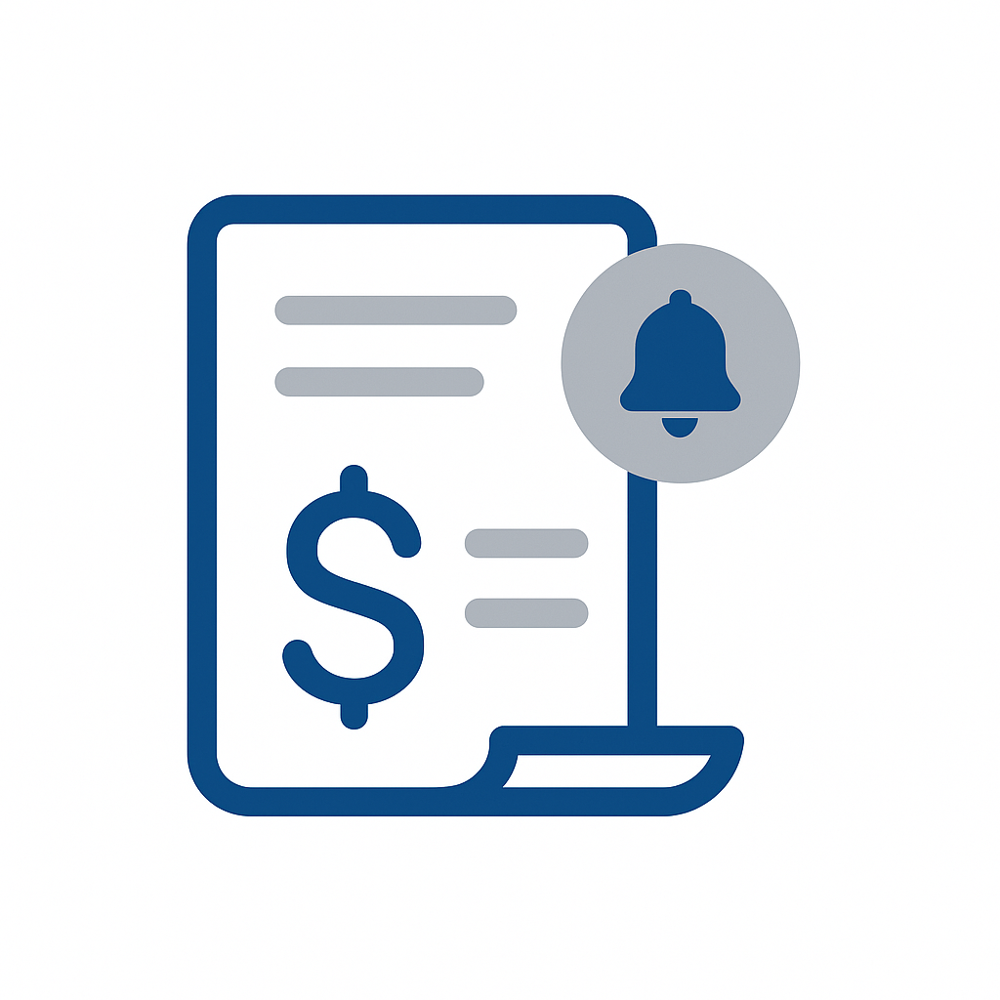 | [Bill Payment Reminders](telecommunications/telecommunications-overview.md#bill-payment-reminders) | Send personalized bill payment reminders through preferred channels with payment options and account balance information. | [!BADGE Foundational]{type=Neutral} | [Event-Triggered Messaging](/help/blueprints/use-case-patterns/campaign-management-orchestration/event-triggered-messaging.md) |
| 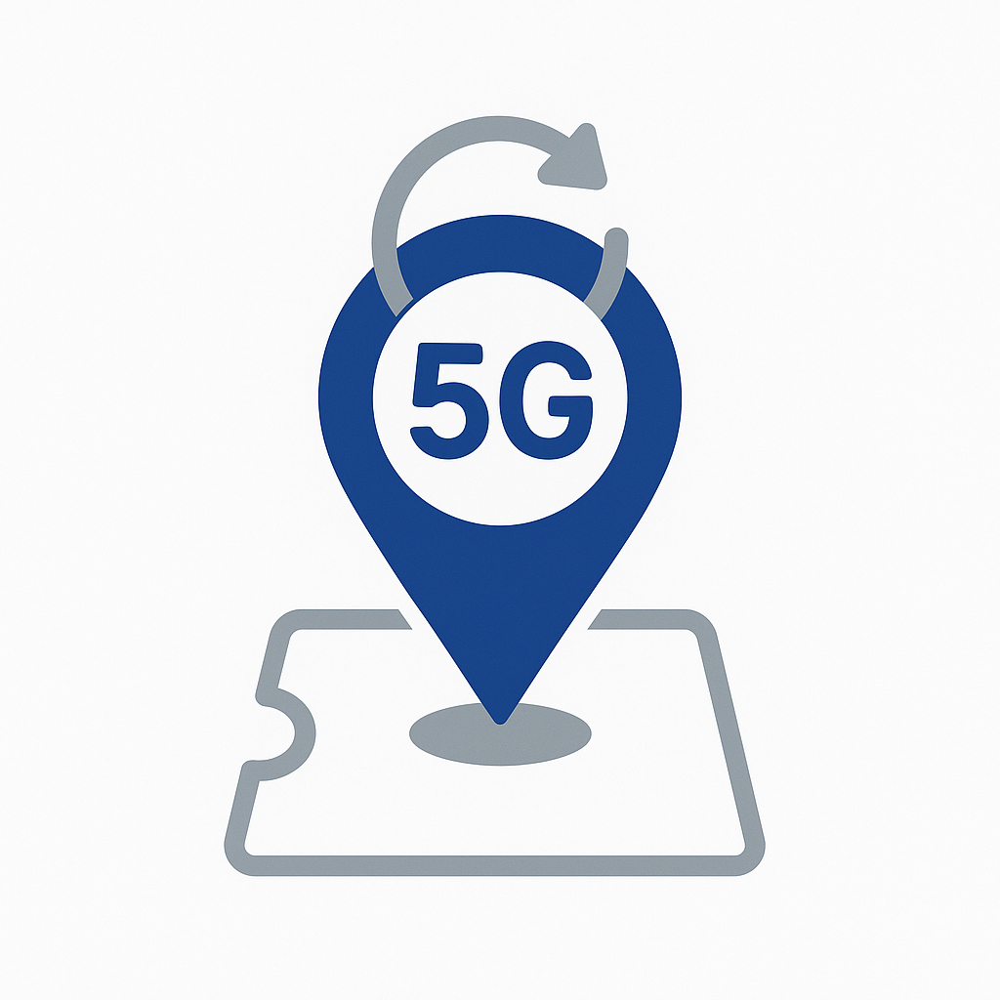 | [5G Upgrade Campaigns](telecommunications/telecommunications-overview.md#5g-upgrade-campaigns) | Target customers eligible for 5G network upgrades with personalized offers and benefits based on their location and usage patterns. | [!BADGE Foundational]{type=Neutral} | [Batch Outbound Message Activation](/help/blueprints/use-case-patterns/campaign-management-orchestration/batch-outbound-message-activation.md) |
|  | [Plan Optimization Campaigns](telecommunications/telecommunications-overview.md#plan-optimization-campaigns) | Analyze customer usage patterns and recommend optimal plan changes to save money or get better features based on their needs. | [!BADGE Emerging]{type=Informative} | [Multi-Step Orchestrated Journey](/help/blueprints/use-case-patterns/campaign-management-orchestration/multi-step-orchestrated-journey.md) |
|  | [New Customer Onboarding Journey](telecommunications/telecommunications-overview.md#new-customer-onboarding-journey) | Automate a personalized onboarding journey for new customers with welcome information, account setup guidance, and feature tutorials. | [!BADGE Emerging]{type=Informative} | [Multi-Step Orchestrated Journey](/help/blueprints/use-case-patterns/campaign-management-orchestration/multi-step-orchestrated-journey.md) |
|  | [Network Performance Personalization](telecommunications/telecommunications-overview.md#network-performance-personalization) | Personalize network performance information and recommendations based on customer location, device, and usage patterns. | [!BADGE Emerging]{type=Informative} | [Known-Visitor Web/App Personalization](/help/blueprints/use-case-patterns/personalization/known-visitor-web-app-personalization.md) |
|  | [Device Upgrade Recommendations](telecommunications/telecommunications-overview.md#device-upgrade-recommendations) | Identify customers eligible for device upgrades and present personalized device recommendations and upgrade offers. | [!BADGE Advanced]{type=Caution} | [Cross-Channel Journey with Decisioning](/help/blueprints/use-case-patterns/campaign-management-orchestration/cross-channel-journey-with-decisioning.md) |
|  | [Churn Prevention for High-Value Customers](telecommunications/telecommunications-overview.md#churn-prevention-for-high-value-customers) | Identify high-value customers at risk of churning and engage them with personalized retention offers and proactive customer service. | [!BADGE Advanced]{type=Caution} | [Cross-Channel Journey with Decisioning](/help/blueprints/use-case-patterns/campaign-management-orchestration/cross-channel-journey-with-decisioning.md) |
|  | [Family Plan Management](telecommunications/telecommunications-overview.md#family-plan-management) | Personalize communications and offers for family plan administrators based on family usage patterns and individual member needs. | [!BADGE Advanced]{type=Caution} | [Cross-Channel Journey with Decisioning](/help/blueprints/use-case-patterns/campaign-management-orchestration/cross-channel-journey-with-decisioning.md) |
|  | [Add-On Service Recommendations](telecommunications/telecommunications-overview.md#add-on-service-recommendations) | Recommend relevant add-on services based on customer plan, usage, and preferences. | [!BADGE Advanced]{type=Caution} | [Offer Decisioning](/help/blueprints/use-case-patterns/personalization/offer-decisioning.md) |
|  | [AI Plan Advisor](telecommunications/telecommunications-overview.md#ai-plan-advisor) | Guide subscribers through personalized plan selection using conversational AI grounded in real-time usage data, account profile, and the full plan catalog. | [!BADGE Advanced]{type=Caution} | [Brand Concierge Conversational Experience](/help/blueprints/use-case-patterns/conversational-experience/brand-concierge-conversational-experience.md) |
|  | [Churn Propensity and Network Experience Analytics](telecommunications/telecommunications-overview.md#churn-propensity-and-network-experience-analytics) | Correlate network quality events and service contacts with subscriber churn to identify which experience failures drive attrition. | [!BADGE Advanced]{type=Caution} | [Customer Analytics & Insight Generation](/help/blueprints/use-case-patterns/analysis/customer-analytics-insight-generation.md) |
|  | [Churn Prevention & Win-Back](telecommunications/telecommunications-overview.md#churn-prevention--win-back) | Use predictive models and behavioral signals to identify at-risk customers and trigger personalized retention campaigns with tailored offers before they churn. | [!BADGE Advanced]{type=Caution} | [Cross-Channel Journey with Decisioning](/help/blueprints/use-case-patterns/campaign-management-orchestration/cross-channel-journey-with-decisioning.md) |

>[!TAB Travel & Hospitality]

| | Use Case | Description | Maturity | Pattern |
| --- | --- | --- | --- | --- |
|  | [Cart Abandonment Recovery Journey](travel-hospitality/travel-hospitality-overview.md#cart-abandonment-recovery-journey) | Automatically detect when a customer abandons their cart and trigger a multi-step email journey with personalized offers to encourage completion. | [!BADGE Foundational]{type=Neutral} | [Event-Triggered Messaging](/help/blueprints/use-case-patterns/campaign-management-orchestration/event-triggered-messaging.md) |
|  | [Multi-Channel Booking Reminders](travel-hospitality/travel-hospitality-overview.md#multi-channel-booking-reminders) | Send personalized booking reminders via email, SMS, and push notifications to customers who have started but not completed bookings. | [!BADGE Foundational]{type=Neutral} | [Event-Triggered Messaging](/help/blueprints/use-case-patterns/campaign-management-orchestration/event-triggered-messaging.md) |
|  | [Seasonal Campaign Personalization](travel-hospitality/travel-hospitality-overview.md#seasonal-campaign-personalization) | Personalize campaigns and offers based on seasonal preferences, past seasonal bookings, and current seasonal trends. | [!BADGE Foundational]{type=Neutral} | [Batch Outbound Message Activation](/help/blueprints/use-case-patterns/campaign-management-orchestration/batch-outbound-message-activation.md) |
|  | [Personalized Homepage for New Visitors](travel-hospitality/travel-hospitality-overview.md#personalized-homepage-for-new-visitors) | Show personalized recommendations on homepage based on visitor geographic location, browsing behavior, and segment membership. | [!BADGE Emerging]{type=Informative} | [Anonymous Visitor Web Personalization](/help/blueprints/use-case-patterns/personalization/anonymous-visitor-web-personalization.md) |
|  | [High-Intent Visitor Targeting](travel-hospitality/travel-hospitality-overview.md#high-intent-visitor-targeting) | Identify visitors with high purchase intent using AI-powered propensity scoring and target them with personalized offers and content. | [!BADGE Emerging]{type=Informative} | [Known-Visitor Web/App Personalization](/help/blueprints/use-case-patterns/personalization/known-visitor-web-app-personalization.md) |
|  | [Post-Booking Upsell Campaigns](travel-hospitality/travel-hospitality-overview.md#post-booking-upsell-campaigns) | After a customer completes a booking, automatically trigger upsell campaigns for upgrades, excursions, and other ancillaries. | [!BADGE Emerging]{type=Informative} | [Multi-Step Orchestrated Journey](/help/blueprints/use-case-patterns/campaign-management-orchestration/multi-step-orchestrated-journey.md) |
|  | [Win-Back Campaigns for Lapsed Customers](travel-hospitality/travel-hospitality-overview.md#win-back-campaigns-for-lapsed-customers) | Identify lapsed customers and engage them with personalized win-back offers and content based on their past preferences. | [!BADGE Emerging]{type=Informative} | [Multi-Step Orchestrated Journey](/help/blueprints/use-case-patterns/campaign-management-orchestration/multi-step-orchestrated-journey.md) |
|  | [Dynamic Itinerary Recommendations](travel-hospitality/travel-hospitality-overview.md#dynamic-itinerary-recommendations) | Show personalized itineraries and destinations based on customer past bookings, browsing history, and preferences. | [!BADGE Emerging]{type=Informative} | [Known-Visitor Web/App Personalization](/help/blueprints/use-case-patterns/personalization/known-visitor-web-app-personalization.md) |
|  | [Recently Browsed Products on Homepage](travel-hospitality/travel-hospitality-overview.md#recently-browsed-products-on-homepage) | Display recently viewed destinations on the homepage to remind visitors of their interest and encourage return visits. | [!BADGE Emerging]{type=Informative} | [Known-Visitor Web/App Personalization](/help/blueprints/use-case-patterns/personalization/known-visitor-web-app-personalization.md) |
|  | [Group Booking Recommendations](travel-hospitality/travel-hospitality-overview.md#group-booking-recommendations) | Identify customers who frequently book group travel and proactively recommend group packages and family-friendly options. | [!BADGE Emerging]{type=Informative} | [Behavioral Recommendation](/help/blueprints/use-case-patterns/personalization/behavioral-recommendation.md) |
|  | [Exit Intent Modal with Targeted Offers](travel-hospitality/travel-hospitality-overview.md#exit-intent-modal-with-targeted-offers) | When a visitor shows exit intent, display a personalized modal with relevant offers based on their segment and browsing behavior. | [!BADGE Advanced]{type=Caution} | [Offer Decisioning](/help/blueprints/use-case-patterns/personalization/offer-decisioning.md) |
|  | [Loyalty Program Personalization](travel-hospitality/travel-hospitality-overview.md#loyalty-program-personalization) | Personalize website experience, offers, and communications based on customer loyalty tier. | [!BADGE Advanced]{type=Caution} | [Cross-Channel Journey with Decisioning](/help/blueprints/use-case-patterns/campaign-management-orchestration/cross-channel-journey-with-decisioning.md) |
|  | [AI Booking Concierge](travel-hospitality/travel-hospitality-overview.md#ai-booking-concierge) | Guide guests through itinerary planning, room selection, and ancillary options using conversational AI grounded in real-time availability and loyalty profile data. | [!BADGE Advanced]{type=Caution} | [Brand Concierge Conversational Experience](/help/blueprints/use-case-patterns/conversational-experience/brand-concierge-conversational-experience.md) |
|  | [Birthday Campaigns for Guests](travel-hospitality/travel-hospitality-overview.md#birthday-campaigns-for-guests) | Target guests on their birthday with a personalized birthday message and an exclusive offer. | [!BADGE Emerging]{type=Informative} | [Event-Triggered Messaging](/help/blueprints/use-case-patterns/campaign-management-orchestration/event-triggered-messaging.md) |
|  | [Destination Promotion Campaigns](travel-hospitality/travel-hospitality-overview.md#destination-promotion-campaigns) | Target guests to make a reservation during an ongoing travel destination promotion. | [!BADGE Emerging]{type=Informative} | [Batch Outbound Message Activation](/help/blueprints/use-case-patterns/campaign-management-orchestration/batch-outbound-message-activation.md) |

>[!TAB B2B]

| | Use Case | Description | Maturity | Pattern |
| --- | --- | --- | --- | --- |
|  | [Webinar and Demo Scheduling](b2b/b2b-overview.md#webinar-and-demo-scheduling) | Personalize webinar invitations and demo scheduling based on prospect interests, industry, and engagement history. | [!BADGE Foundational]{type=Neutral} | [Event-Triggered Messaging](/help/blueprints/use-case-patterns/campaign-management-orchestration/event-triggered-messaging.md) |
|  | [Account-Based Marketing Personalization](b2b/b2b-overview.md#account-based-marketing-personalization) | Personalize marketing communications for target accounts based on buying signals | [!BADGE Advanced]{type=Caution} | [B2B Audience Activation](/help/blueprints/use-case-patterns/audience-building-activation/b2b-audience-activation.md) |
|  | [Lead Scoring and Nurturing](b2b/b2b-overview.md#lead-scoring-and-nurturing) | Automatically score leads based on profile data and behavior, then route high-scoring leads to sales with personalized nurture campaigns for others. | [!BADGE Emerging]{type=Informative} | [Multi-Step Orchestrated Journey](/help/blueprints/use-case-patterns/campaign-management-orchestration/multi-step-orchestrated-journey.md) |
|  | [Content Personalization for Prospects](b2b/b2b-overview.md#content-personalization-for-prospects) | Personalize website content, resources, and offers based on prospect industry, role, company size, and engagement history. | [!BADGE Emerging]{type=Informative} | [Known-Visitor Web/App Personalization](/help/blueprints/use-case-patterns/personalization/known-visitor-web-app-personalization.md) |
|  | [Event Registration and Follow-Up](b2b/b2b-overview.md#event-registration-and-follow-up) | Automate personalized event registration confirmations, reminders, and post-event follow-up based on event type and attendee profile. | [!BADGE Emerging]{type=Informative} | [Multi-Step Orchestrated Journey](/help/blueprints/use-case-patterns/campaign-management-orchestration/multi-step-orchestrated-journey.md) |
|  | [Product Trial Conversion Campaigns](b2b/b2b-overview.md#product-trial-conversion-campaigns) | Engage trial users with personalized product recommendations, training resources, and offers to encourage conversion to paid plans. | [!BADGE Emerging]{type=Informative} | [Multi-Step Orchestrated Journey](/help/blueprints/use-case-patterns/campaign-management-orchestration/multi-step-orchestrated-journey.md) |
|  | [Customer Success and Onboarding](b2b/b2b-overview.md#customer-success-and-onboarding) | Personalize customer onboarding journeys with relevant training, resources, and support based on product purchased and customer profile. | [!BADGE Emerging]{type=Informative} | [Multi-Step Orchestrated Journey](/help/blueprints/use-case-patterns/campaign-management-orchestration/multi-step-orchestrated-journey.md) |
|  | [Competitive Replacement Campaigns](b2b/b2b-overview.md#competitive-replacement-campaigns) | Target prospects using competitor products with personalized messaging, migration offers, and competitive comparisons. | [!BADGE Emerging]{type=Informative} | [Multi-Step Orchestrated Journey](/help/blueprints/use-case-patterns/campaign-management-orchestration/multi-step-orchestrated-journey.md) |
|  | [Case Study and ROI Personalization](b2b/b2b-overview.md#case-study-and-roi-personalization) | Deliver personalized case studies, ROI calculators, and success stories based on prospect industry, company size, and use case. | [!BADGE Emerging]{type=Informative} | [Known-Visitor Web/App Personalization](/help/blueprints/use-case-patterns/personalization/known-visitor-web-app-personalization.md) |
|  | [Customer Advocacy Programs](b2b/b2b-overview.md#customer-advocacy-programs) | Identify and engage satisfied customers for advocacy opportunities based on usage and satisfaction data. | [!BADGE Emerging]{type=Informative} | [Multi-Step Orchestrated Journey](/help/blueprints/use-case-patterns/campaign-management-orchestration/multi-step-orchestrated-journey.md) |
|  | [Contract Renewal Campaigns](b2b/b2b-overview.md#contract-renewal-campaigns) | Proactively engage customers approaching contract renewal with personalized offers, usage insights, and renewal incentives. | [!BADGE Advanced]{type=Caution} | [Cross-Channel Journey with Decisioning](/help/blueprints/use-case-patterns/campaign-management-orchestration/cross-channel-journey-with-decisioning.md) |
|  | [Upsell and Expansion Opportunities](b2b/b2b-overview.md#upsell-and-expansion-opportunities) | Identify customers ready for product upgrades or additional licenses based on usage patterns and growth indicators. | [!BADGE Advanced]{type=Caution} | [Cross-Channel Journey with Decisioning](/help/blueprints/use-case-patterns/campaign-management-orchestration/cross-channel-journey-with-decisioning.md) |
|  | [B2B Account-Based Audience Activation](b2b/b2b-overview.md#b2b-account-based-audience-activation) | Build account-level audiences combining firmographic data, buying group signals, and person-level engagement, then activate them to LinkedIn, demand-side platforms, and CRM destinations. | [!BADGE Advanced]{type=Caution} | [B2B Audience Activation](/help/blueprints/use-case-patterns/audience-building-activation/b2b-audience-activation.md) |
|  | [Buying Group Journey Orchestration](b2b/b2b-overview.md#buying-group-journey-orchestration) | Orchestrate account-level journeys that nurture buying group members based on their roles, engagement scores, and account qualification status, with automated handoff to sales. | [!BADGE Advanced]{type=Caution} | [Buying Group-Based Marketing](/help/blueprints/use-case-patterns/campaign-management-orchestration/buying-group-based-marketing.md) |
|  | [Account-Based Marketing (ABM) Personalization](b2b/b2b-overview.md#account-based-marketing-abm-personalization) | Personalize marketing communications and content for target accounts based on account profile, engagement history, and buying signals. | [!BADGE Advanced]{type=Caution} | [B2B Audience Activation](/help/blueprints/use-case-patterns/audience-building-activation/b2b-audience-activation.md) |

>[!TAB Technology]

| | Use Case | Description | Maturity | Pattern |
| --- | --- | --- | --- | --- |
|  | [Real-Time Event Forwarding](technology/technology-overview.md#real-time-event-forwarding) | Forward real-time behavioral events collected via the Edge Network to third-party analytics, data warehouses, and partner platforms for enrichment and activation. | [!BADGE Foundational]{type=Neutral} | [Event Forwarding](/help/blueprints/use-case-patterns/audience-building-activation/event-forwarding.md) |

>[!ENDTABS]
