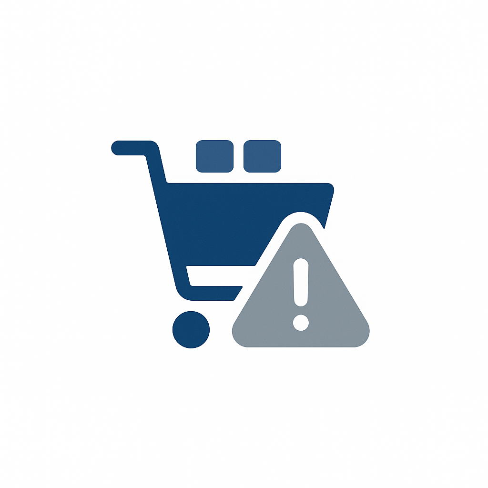

# Use case catalog

Explore industry use cases for [!DNL Adobe Experience Platform] and applications. Browse by industry to see use cases for your vertical, by maturity level to find the right starting point for your organization, or by implementation pattern to understand which technical approach fits your needs.

Each use case links to detailed implementation guidance through a use case pattern, which describes the function chain, decision points, and configuration steps needed to bring the use case to life.

## Browse by industry

>[!BEGINTABS]

>[!TAB Retail]

Retail organizations use [!DNL Adobe Experience Platform] to unify customer data from online stores, physical locations, and loyalty programs into a single view of each shopper.

| | Use Case | Description | Maturity | Pattern |
| --- | --- | --- | --- | --- |
|  | [Personalized Product Recommendations](retail/retail-overview.md#personalized-product-recommendations) | Show personalized products based on browsing and purchase history | [!BADGE Emerging]{type=Informative} | [Behavioral Recommendation](/help/blueprints/use-case-patterns/personalization/behavioral-recommendation.md) |
|  | [Abandoned Cart Email Recovery](retail/retail-overview.md#abandoned-cart-email-recovery) | Send personalized reminders for abandoned shopping carts | [!BADGE Foundational]{type=Neutral} | [Event-Triggered Messaging](/help/blueprints/use-case-patterns/campaign-management-orchestration/event-triggered-messaging.md) |
|  | [Inventory-Based Urgency Campaigns](retail/retail-overview.md#inventory-based-urgency-campaigns) | Trigger real-time alerts when product inventory is low | [!BADGE Foundational]{type=Neutral} | [Event-Triggered Messaging](/help/blueprints/use-case-patterns/campaign-management-orchestration/event-triggered-messaging.md) |
|  | [Cross-Sell and Upsell Recommendations](retail/retail-overview.md#cross-sell-and-upsell-recommendations) | Display relevant cross-sell and upsell products at checkout and in email | [!BADGE Advanced]{type=Caution} | [Offer Decisioning](/help/blueprints/use-case-patterns/personalization/offer-decisioning.md) |
|  | [New Customer Welcome Series](retail/retail-overview.md#new-customer-welcome-series) | Automate a multi-email welcome series with personalized recommendations | [!BADGE Emerging]{type=Informative} | [Multi-Step Orchestrated Journey](/help/blueprints/use-case-patterns/campaign-management-orchestration/multi-step-orchestrated-journey.md) |
|  | [Price Drop Alerts](retail/retail-overview.md#price-drop-alerts) | Notify customers when wishlist or viewed items drop in price | [!BADGE Foundational]{type=Neutral} | [Event-Triggered Messaging](/help/blueprints/use-case-patterns/campaign-management-orchestration/event-triggered-messaging.md) |
|  | [Replenishment Reminders](retail/retail-overview.md#replenishment-reminders) | Send automated reminders for regularly purchased consumable products | [!BADGE Emerging]{type=Informative} | [Multi-Step Orchestrated Journey](/help/blueprints/use-case-patterns/campaign-management-orchestration/multi-step-orchestrated-journey.md) |
|  | [Personalized Category Pages](retail/retail-overview.md#personalized-category-pages) | Dynamically reorder category pages based on each customer's preferences | [!BADGE Emerging]{type=Informative} | [Behavioral Recommendation](/help/blueprints/use-case-patterns/personalization/behavioral-recommendation.md) |
|  | [Post-Purchase Follow-Up Campaigns](retail/retail-overview.md#post-purchase-follow-up-campaigns) | Send care tips, review requests, and related product suggestions | [!BADGE Emerging]{type=Informative} | [Multi-Step Orchestrated Journey](/help/blueprints/use-case-patterns/campaign-management-orchestration/multi-step-orchestrated-journey.md) |
| | [VIP Customer Exclusive Offers](retail/retail-overview.md#vip-customer-exclusive-offers) | Provide exclusive offers and early access to high-value customers | [!BADGE Advanced]{type=Caution} | [Cross-Channel Journey with Decisioning](/help/blueprints/use-case-patterns/campaign-management-orchestration/cross-channel-journey-with-decisioning.md) |
| | [Out-of-Stock Notifications](retail/retail-overview.md#out-of-stock-notifications) | Notify customers when out-of-stock products become available | [!BADGE Foundational]{type=Neutral} | [Event-Triggered Messaging](/help/blueprints/use-case-patterns/campaign-management-orchestration/event-triggered-messaging.md) |
| | [Social Proof Personalization](retail/retail-overview.md#social-proof-personalization) | Display personalized reviews and ratings based on customer profile | [!BADGE Emerging]{type=Informative} | [Known-Visitor Web/App Personalization](/help/blueprints/use-case-patterns/personalization/known-visitor-web-app-personalization.md) |

>[!TAB Financial Services]

Financial services use cases are coming soon. [View current Financial Services use cases](financial-services/financial-services-overview.md).

>[!TAB Healthcare]

Healthcare use cases are coming soon. [View current Healthcare use cases](healthcare/healthcare-overview.md).

>[!TAB Automotive]

Automotive use cases are coming soon. [View current Automotive use cases](automotive/automotive-overview.md).

>[!TAB Travel & Hospitality]

Travel & Hospitality use cases are coming soon. [View current Travel & Hospitality use cases](travel-hospitality/travel-hospitality-overview.md).

>[!TAB Telecommunications]

Telecommunications use cases are coming soon. [View current Telecommunications use cases](telecommunications/telecommunications-overview.md).

>[!TAB Media & Entertainment]

Media & Entertainment use cases are coming soon. [View current Media & Entertainment use cases](media-entertainment/media-entertainment-overview.md).

>[!TAB Insurance]

Insurance use cases are coming soon. [View current Insurance use cases](insurance/insurance-overview.md).

>[!TAB B2B]

B2B use cases are coming soon. [View current B2B use cases](b2b/b2b-overview.md).

>[!ENDTABS]

## Browse by maturity level

>[!BEGINTABS]

>[!TAB Foundational]

Basic, proven patterns using single-channel delivery. Ideal starting points for organizations beginning their [!DNL Experience Platform] journey.

| | Use Case | Industry | Business Impact | Pattern |
| --- | --- | --- | --- | --- |
|  | [Abandoned Cart Email Recovery](retail/retail-overview.md#abandoned-cart-email-recovery) | Retail | 25-35% cart recovery rate | [Event-Triggered Messaging](/help/blueprints/use-case-patterns/campaign-management-orchestration/event-triggered-messaging.md) |
|  | [Inventory-Based Urgency Campaigns](retail/retail-overview.md#inventory-based-urgency-campaigns) | Retail | 30-40% increase in conversion | [Event-Triggered Messaging](/help/blueprints/use-case-patterns/campaign-management-orchestration/event-triggered-messaging.md) |
|  | [Price Drop Alerts](retail/retail-overview.md#price-drop-alerts) | Retail | 20-30% conversion rate | [Event-Triggered Messaging](/help/blueprints/use-case-patterns/campaign-management-orchestration/event-triggered-messaging.md) |
| | [Out-of-Stock Notifications](retail/retail-overview.md#out-of-stock-notifications) | Retail | 40-50% conversion rate | [Event-Triggered Messaging](/help/blueprints/use-case-patterns/campaign-management-orchestration/event-triggered-messaging.md) |

>[!TAB Emerging]

Multi-channel and multi-step patterns that build on foundational capabilities with AI-driven personalization and orchestrated journeys.

| | Use Case | Industry | Business Impact | Pattern |
| --- | --- | --- | --- | --- |
|  | [Personalized Product Recommendations](retail/retail-overview.md#personalized-product-recommendations) | Retail | 20-30% increase in CTR, 15-25% conversion lift | [Behavioral Recommendation](/help/blueprints/use-case-patterns/personalization/behavioral-recommendation.md) |
|  | [Personalized Category Pages](retail/retail-overview.md#personalized-category-pages) | Retail | 25-35% increase in engagement | [Behavioral Recommendation](/help/blueprints/use-case-patterns/personalization/behavioral-recommendation.md) |
|  | [New Customer Welcome Series](retail/retail-overview.md#new-customer-welcome-series) | Retail | 40-50% engagement rate | [Multi-Step Orchestrated Journey](/help/blueprints/use-case-patterns/campaign-management-orchestration/multi-step-orchestrated-journey.md) |
|  | [Replenishment Reminders](retail/retail-overview.md#replenishment-reminders) | Retail | 30-40% repeat purchase rate | [Multi-Step Orchestrated Journey](/help/blueprints/use-case-patterns/campaign-management-orchestration/multi-step-orchestrated-journey.md) |
|  | [Post-Purchase Follow-Up Campaigns](retail/retail-overview.md#post-purchase-follow-up-campaigns) | Retail | 15-20% review rate, 10-15% repeat purchase | [Multi-Step Orchestrated Journey](/help/blueprints/use-case-patterns/campaign-management-orchestration/multi-step-orchestrated-journey.md) |
| | [Social Proof Personalization](retail/retail-overview.md#social-proof-personalization) | Retail | 10-15% conversion rate increase | [Known-Visitor Web/App Personalization](/help/blueprints/use-case-patterns/personalization/known-visitor-web-app-personalization.md) |

>[!TAB Advanced]

Cross-channel orchestration with real-time decisioning and AI-driven offer selection for the most sophisticated customer experiences.

| | Use Case | Industry | Business Impact | Pattern |
| --- | --- | --- | --- | --- |
|  | [Cross-Sell and Upsell Recommendations](retail/retail-overview.md#cross-sell-and-upsell-recommendations) | Retail | $25-$75 increase in AOV, 10-15% revenue lift | [Offer Decisioning](/help/blueprints/use-case-patterns/personalization/offer-decisioning.md) |
| | [VIP Customer Exclusive Offers](retail/retail-overview.md#vip-customer-exclusive-offers) | Retail | 50-70% engagement rate from VIPs | [Cross-Channel Journey with Decisioning](/help/blueprints/use-case-patterns/campaign-management-orchestration/cross-channel-journey-with-decisioning.md) |

>[!ENDTABS]

## Browse by implementation pattern

>[!BEGINTABS]

>[!TAB Campaign Management & Orchestration]

### Event-Triggered Messaging

Respond to real-time behavioral events with timely, single-channel messages.

| | Use Case | Industry | Maturity | Business Impact |
| --- | --- | --- | --- | --- |
|  | [Abandoned Cart Email Recovery](retail/retail-overview.md#abandoned-cart-email-recovery) | Retail | [!BADGE Foundational]{type=Neutral} | 25-35% cart recovery rate |
|  | [Inventory-Based Urgency Campaigns](retail/retail-overview.md#inventory-based-urgency-campaigns) | Retail | [!BADGE Foundational]{type=Neutral} | 30-40% increase in conversion |
|  | [Price Drop Alerts](retail/retail-overview.md#price-drop-alerts) | Retail | [!BADGE Foundational]{type=Neutral} | 20-30% conversion rate |
| | [Out-of-Stock Notifications](retail/retail-overview.md#out-of-stock-notifications) | Retail | [!BADGE Foundational]{type=Neutral} | 40-50% conversion rate |

### Multi-Step Orchestrated Journey

Guide customers through multi-touch sequences that adapt based on engagement and behavior.

| | Use Case | Industry | Maturity | Business Impact |
| --- | --- | --- | --- | --- |
|  | [New Customer Welcome Series](retail/retail-overview.md#new-customer-welcome-series) | Retail | [!BADGE Emerging]{type=Informative} | 40-50% engagement rate |
|  | [Replenishment Reminders](retail/retail-overview.md#replenishment-reminders) | Retail | [!BADGE Emerging]{type=Informative} | 30-40% repeat purchase rate |
|  | [Post-Purchase Follow-Up Campaigns](retail/retail-overview.md#post-purchase-follow-up-campaigns) | Retail | [!BADGE Emerging]{type=Informative} | 15-20% review rate, 10-15% repeat purchase |

### Cross-Channel Journey with Decisioning

Orchestrate cross-channel experiences with real-time offer decisioning at every touchpoint.

| | Use Case | Industry | Maturity | Business Impact |
| --- | --- | --- | --- | --- |
| | [VIP Customer Exclusive Offers](retail/retail-overview.md#vip-customer-exclusive-offers) | Retail | [!BADGE Advanced]{type=Caution} | 50-70% engagement rate from VIPs |

>[!TAB Personalization]

### Behavioral Recommendation

Use AI-driven models to surface personalized content and products based on behavioral signals.

| | Use Case | Industry | Maturity | Business Impact |
| --- | --- | --- | --- | --- |
|  | [Personalized Product Recommendations](retail/retail-overview.md#personalized-product-recommendations) | Retail | [!BADGE Emerging]{type=Informative} | 20-30% increase in CTR, 15-25% conversion lift |
|  | [Personalized Category Pages](retail/retail-overview.md#personalized-category-pages) | Retail | [!BADGE Emerging]{type=Informative} | 25-35% increase in engagement |

### Offer Decisioning

Use centralized decision logic to evaluate and select the best offer for each customer and context.

| | Use Case | Industry | Maturity | Business Impact |
| --- | --- | --- | --- | --- |
|  | [Cross-Sell and Upsell Recommendations](retail/retail-overview.md#cross-sell-and-upsell-recommendations) | Retail | [!BADGE Advanced]{type=Caution} | $25-$75 increase in AOV, 10-15% revenue lift |

### Known-Visitor Web/App Personalization

Personalize web and app content for identified visitors based on profile, preferences, and browsing context.

| | Use Case | Industry | Maturity | Business Impact |
| --- | --- | --- | --- | --- |
| | [Social Proof Personalization](retail/retail-overview.md#social-proof-personalization) | Retail | [!BADGE Emerging]{type=Informative} | 10-15% conversion rate increase |

>[!ENDTABS]
