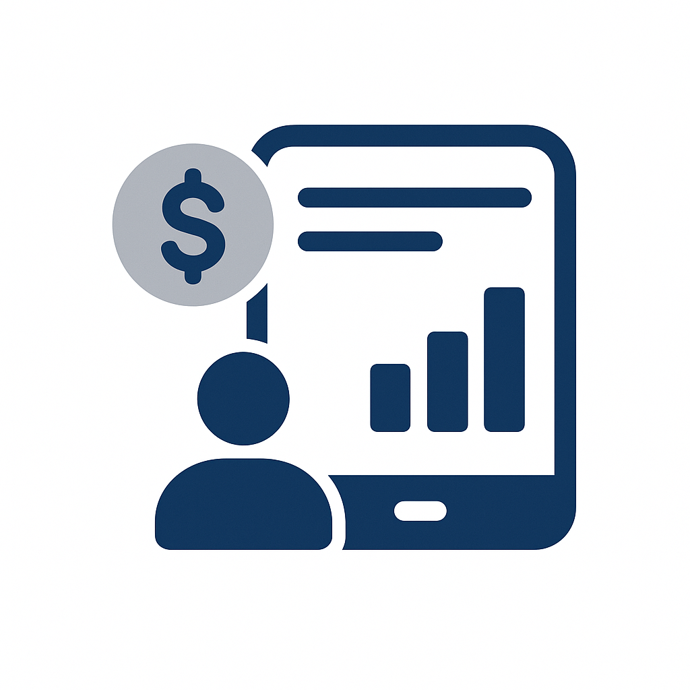
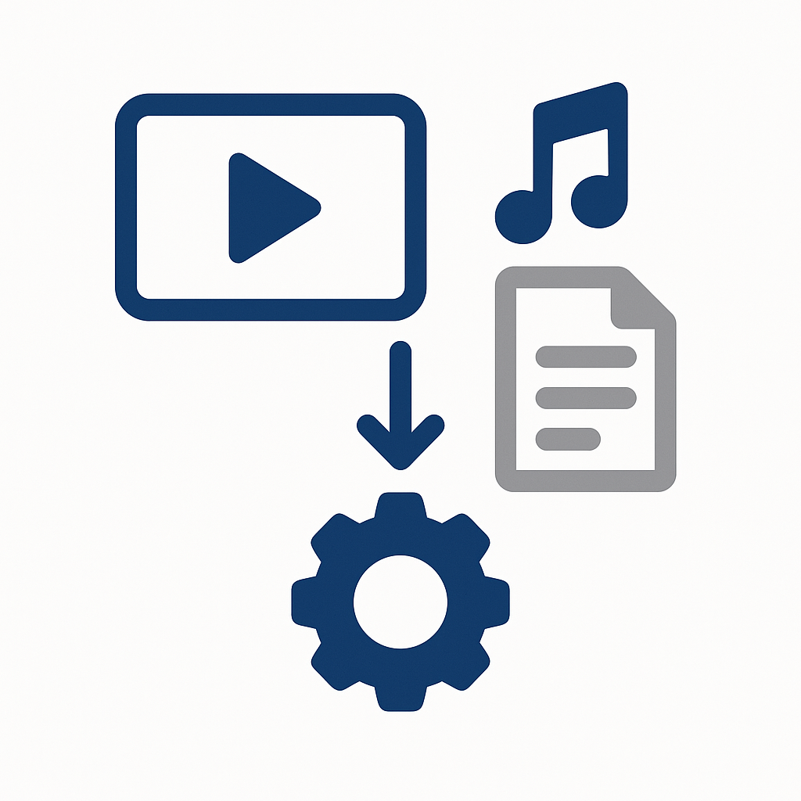
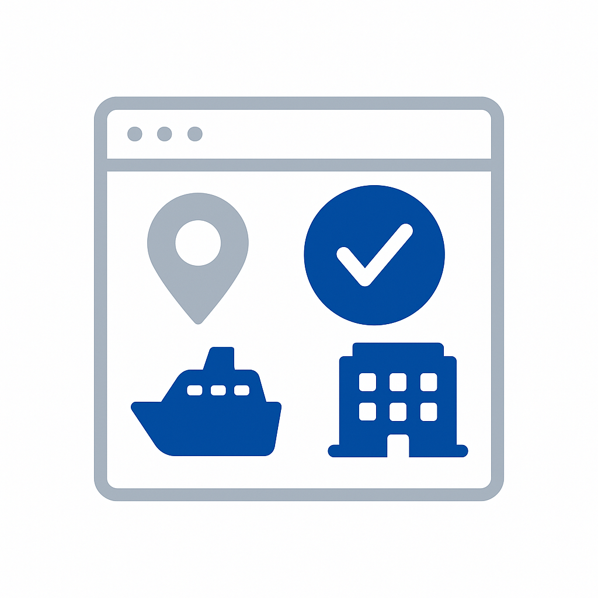
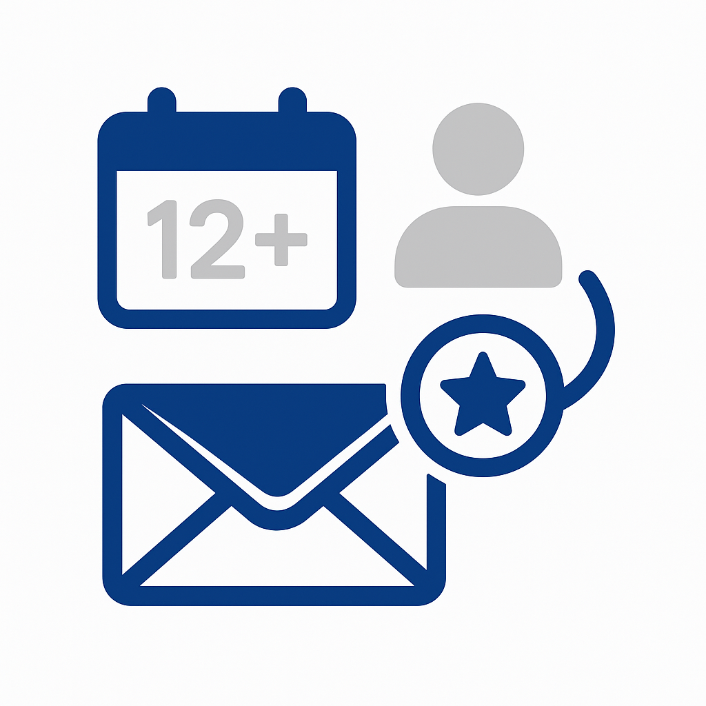

# Use case catalog

Explore proven use cases across industries to accelerate your [!DNL Adobe Experience Platform] implementation. Browse by industry vertical to find use cases relevant to your business, by maturity level to match your organization's readiness, or by implementation pattern to understand the technical approach.

## Browse by industry

>[!BEGINTABS]

>[!TAB Retail]

| | Use Case | Description | Maturity | Pattern |
| --- | --- | --- | --- | --- |
|  | [Abandoned Cart Email Recovery](retail/retail-overview.md#abandoned-cart-email-recovery) | Send personalized reminders for abandoned shopping carts | [!BADGE Foundational]{type=Neutral} | [Event-Triggered Messaging](/help/blueprints/use-case-patterns/campaign-management-orchestration/event-triggered-messaging.md) |
|  | [Inventory-Based Urgency Campaigns](retail/retail-overview.md#inventory-based-urgency-campaigns) | Trigger real-time alerts when product inventory is low | [!BADGE Foundational]{type=Neutral} | [Event-Triggered Messaging](/help/blueprints/use-case-patterns/campaign-management-orchestration/event-triggered-messaging.md) |
|  | [Price Drop Alerts](retail/retail-overview.md#price-drop-alerts) | Notify customers when wishlist or viewed items drop in price | [!BADGE Foundational]{type=Neutral} | [Event-Triggered Messaging](/help/blueprints/use-case-patterns/campaign-management-orchestration/event-triggered-messaging.md) |
| | [Out-of-Stock Notifications](retail/retail-overview.md#out-of-stock-notifications) | Notify customers when out-of-stock products become available | [!BADGE Foundational]{type=Neutral} | [Event-Triggered Messaging](/help/blueprints/use-case-patterns/campaign-management-orchestration/event-triggered-messaging.md) |
|  | [Personalized Product Recommendations](retail/retail-overview.md#personalized-product-recommendations) | Show personalized products based on browsing and purchase history | [!BADGE Emerging]{type=Informative} | [Behavioral Recommendation](/help/blueprints/use-case-patterns/personalization/behavioral-recommendation.md) |
|  | [Personalized Category Pages](retail/retail-overview.md#personalized-category-pages) | Dynamically reorder category pages based on customer preferences | [!BADGE Emerging]{type=Informative} | [Behavioral Recommendation](/help/blueprints/use-case-patterns/personalization/behavioral-recommendation.md) |
|  | [New Customer Welcome Series](retail/retail-overview.md#new-customer-welcome-series) | Automate multi-email welcome series with personalized recommendations | [!BADGE Emerging]{type=Informative} | [Multi-Step Orchestrated Journey](/help/blueprints/use-case-patterns/campaign-management-orchestration/multi-step-orchestrated-journey.md) |
|  | [Replenishment Reminders](retail/retail-overview.md#replenishment-reminders) | Send automated reminders for regularly purchased consumable products | [!BADGE Emerging]{type=Informative} | [Multi-Step Orchestrated Journey](/help/blueprints/use-case-patterns/campaign-management-orchestration/multi-step-orchestrated-journey.md) |
|  | [Post-Purchase Follow-Up Campaigns](retail/retail-overview.md#post-purchase-follow-up-campaigns) | Send care tips, review requests, and related product suggestions | [!BADGE Emerging]{type=Informative} | [Multi-Step Orchestrated Journey](/help/blueprints/use-case-patterns/campaign-management-orchestration/multi-step-orchestrated-journey.md) |
| | [Social Proof Personalization](retail/retail-overview.md#social-proof-personalization) | Display personalized reviews and ratings based on customer profile | [!BADGE Emerging]{type=Informative} | [Known-Visitor Web/App Personalization](/help/blueprints/use-case-patterns/personalization/known-visitor-web-app-personalization.md) |
|  | [Cross-Sell and Upsell Recommendations](retail/retail-overview.md#cross-sell-and-upsell-recommendations) | Display relevant cross-sell and upsell products at checkout and in email | [!BADGE Advanced]{type=Caution} | [Offer Decisioning](/help/blueprints/use-case-patterns/personalization/offer-decisioning.md) |
| | [VIP Customer Exclusive Offers](retail/retail-overview.md#vip-customer-exclusive-offers) | Provide exclusive offers and early access to high-value customers | [!BADGE Advanced]{type=Caution} | [Cross-Channel Journey with Decisioning](/help/blueprints/use-case-patterns/campaign-management-orchestration/cross-channel-journey-with-decisioning.md) |

>[!TAB Automotive]

| | Use Case | Description | Maturity | Pattern |
| --- | --- | --- | --- | --- |
|  | [Service Appointment Reminders](automotive/automotive-overview.md#service-appointment-reminders) | Send personalized service reminders based on vehicle mileage and service history | [!BADGE Foundational]{type=Neutral} | [Event-Triggered Messaging](/help/blueprints/use-case-patterns/campaign-management-orchestration/event-triggered-messaging.md) |
|  | [Vehicle Recall Notifications](automotive/automotive-overview.md#vehicle-recall-notifications) | Send personalized recall notifications with service scheduling options | [!BADGE Foundational]{type=Neutral} | [Event-Triggered Messaging](/help/blueprints/use-case-patterns/campaign-management-orchestration/event-triggered-messaging.md) |
|  | [Test Drive Scheduling](automotive/automotive-overview.md#test-drive-scheduling) | Enable personalized test drive scheduling with dealer recommendations | [!BADGE Foundational]{type=Neutral} | [Event-Triggered Messaging](/help/blueprints/use-case-patterns/campaign-management-orchestration/event-triggered-messaging.md) |
|  | [New Model Launch Campaigns](automotive/automotive-overview.md#new-model-launch-campaigns) | Target customers interested in new models based on current vehicle and preferences | [!BADGE Foundational]{type=Neutral} | [Batch Outbound Message Activation](/help/blueprints/use-case-patterns/campaign-management-orchestration/batch-outbound-message-activation.md) |
|  | [Trade-In Value Campaigns](automotive/automotive-overview.md#trade-in-value-campaigns) | Proactively offer trade-in value assessments to customers ready to upgrade | [!BADGE Emerging]{type=Informative} | [Multi-Step Orchestrated Journey](/help/blueprints/use-case-patterns/campaign-management-orchestration/multi-step-orchestrated-journey.md) |
|  | [Parts and Accessories Recommendations](automotive/automotive-overview.md#parts-and-accessories-recommendations) | Recommend parts and accessories based on vehicle model and ownership duration | [!BADGE Emerging]{type=Informative} | [Behavioral Recommendation](/help/blueprints/use-case-patterns/personalization/behavioral-recommendation.md) |
|  | [Warranty and Extended Service Plans](automotive/automotive-overview.md#warranty-and-extended-service-plans) | Recommend warranty and service plans at optimal times based on vehicle age | [!BADGE Emerging]{type=Informative} | [Multi-Step Orchestrated Journey](/help/blueprints/use-case-patterns/campaign-management-orchestration/multi-step-orchestrated-journey.md) |
|  | [Connected Car Feature Activation](automotive/automotive-overview.md#connected-car-feature-activation) | Personalize connected car feature recommendations based on vehicle capabilities | [!BADGE Emerging]{type=Informative} | [Multi-Step Orchestrated Journey](/help/blueprints/use-case-patterns/campaign-management-orchestration/multi-step-orchestrated-journey.md) |
|  | [Dealer Network Coordination](automotive/automotive-overview.md#dealer-network-coordination) | Enable personalized dealer recommendations based on location and preferences | [!BADGE Emerging]{type=Informative} | [Known-Visitor Web/App Personalization](/help/blueprints/use-case-patterns/personalization/known-visitor-web-app-personalization.md) |
|  | [Vehicle Purchase Journey Personalization](automotive/automotive-overview.md#vehicle-purchase-journey-personalization) | Personalize the vehicle purchase journey from research to purchase | [!BADGE Advanced]{type=Caution} | [Cross-Channel Journey with Decisioning](/help/blueprints/use-case-patterns/campaign-management-orchestration/cross-channel-journey-with-decisioning.md) |
|  | [Financing and Insurance Offers](automotive/automotive-overview.md#financing-and-insurance-offers) | Present personalized financing and insurance offers based on credit profile | [!BADGE Advanced]{type=Caution} | [Offer Decisioning](/help/blueprints/use-case-patterns/personalization/offer-decisioning.md) |
|  | [Owner Loyalty Programs](automotive/automotive-overview.md#owner-loyalty-programs) | Personalize loyalty communications, rewards, and exclusive offers by ownership history | [!BADGE Advanced]{type=Caution} | [Cross-Channel Journey with Decisioning](/help/blueprints/use-case-patterns/campaign-management-orchestration/cross-channel-journey-with-decisioning.md) |

>[!TAB Financial Services]

| | Use Case | Description | Maturity | Pattern |
| --- | --- | --- | --- | --- |
| | [Transaction-Based Alerts and Recommendations](financial-services/financial-services-overview.md#transaction-based-alerts-and-recommendations) | Send real-time alerts for transactions and personalized recommendations | [!BADGE Foundational]{type=Neutral} | [Event-Triggered Messaging](/help/blueprints/use-case-patterns/campaign-management-orchestration/event-triggered-messaging.md) |
| | [Credit Card Application Abandonment Recovery](financial-services/financial-services-overview.md#credit-card-application-abandonment-recovery) | Re-engage customers who started but did not complete credit card applications | [!BADGE Foundational]{type=Neutral} | [Event-Triggered Messaging](/help/blueprints/use-case-patterns/campaign-management-orchestration/event-triggered-messaging.md) |
| | [Fraud Alert Personalization](financial-services/financial-services-overview.md#fraud-alert-personalization) | Personalize fraud alerts and security communications by customer preferences | [!BADGE Foundational]{type=Neutral} | [Event-Triggered Messaging](/help/blueprints/use-case-patterns/campaign-management-orchestration/event-triggered-messaging.md) |
|  | [High-Value Lead Nurturing](financial-services/financial-services-overview.md#high-value-lead-nurturing) | Identify high-value prospects and nurture with personalized content and offers | [!BADGE Emerging]{type=Informative} | [Multi-Step Orchestrated Journey](/help/blueprints/use-case-patterns/campaign-management-orchestration/multi-step-orchestrated-journey.md) |
|  | [Personalized Account Dashboard](financial-services/financial-services-overview.md#personalized-account-dashboard) | Personalize online banking dashboard based on account activity and financial goals | [!BADGE Emerging]{type=Informative} | [Known-Visitor Web/App Personalization](/help/blueprints/use-case-patterns/personalization/known-visitor-web-app-personalization.md) |
| | [Investment Portfolio Recommendations](financial-services/financial-services-overview.md#investment-portfolio-recommendations) | Provide personalized investment recommendations based on risk profile and goals | [!BADGE Emerging]{type=Informative} | [Behavioral Recommendation](/help/blueprints/use-case-patterns/personalization/behavioral-recommendation.md) |
| | [Mortgage Pre-Approval Campaigns](financial-services/financial-services-overview.md#mortgage-pre-approval-campaigns) | Target customers likely in the market for a mortgage based on profile and life stage | [!BADGE Emerging]{type=Informative} | [Multi-Step Orchestrated Journey](/help/blueprints/use-case-patterns/campaign-management-orchestration/multi-step-orchestrated-journey.md) |
|  | [Product Recommendation for Existing Customers](financial-services/financial-services-overview.md#product-recommendation-for-existing-customers) | Recommend relevant financial products based on profile, transactions, and life stage | [!BADGE Advanced]{type=Caution} | [Offer Decisioning](/help/blueprints/use-case-patterns/personalization/offer-decisioning.md) |
|  | [Churn Prevention Campaigns](financial-services/financial-services-overview.md#churn-prevention-campaigns) | Identify at-risk customers with AI-powered prediction and engage with retention offers | [!BADGE Advanced]{type=Caution} | [Cross-Channel Journey with Decisioning](/help/blueprints/use-case-patterns/campaign-management-orchestration/cross-channel-journey-with-decisioning.md) |
|  | [Life Stage-Based Product Offers](financial-services/financial-services-overview.md#life-stage-based-product-offers) | Identify customers entering new life stages and offer relevant financial products | [!BADGE Advanced]{type=Caution} | [Cross-Channel Journey with Decisioning](/help/blueprints/use-case-patterns/campaign-management-orchestration/cross-channel-journey-with-decisioning.md) |
| | [Loyalty Program Engagement](financial-services/financial-services-overview.md#loyalty-program-engagement) | Personalize loyalty communications, rewards, and offers by tier and history | [!BADGE Advanced]{type=Caution} | [Cross-Channel Journey with Decisioning](/help/blueprints/use-case-patterns/campaign-management-orchestration/cross-channel-journey-with-decisioning.md) |
| | [Personalized Financial Education Content](financial-services/financial-services-overview.md#personalized-financial-education-content) | Deliver personalized financial education based on customer profile and interests | [!BADGE Advanced]{type=Caution} | [Cross-Channel Journey with Decisioning](/help/blueprints/use-case-patterns/campaign-management-orchestration/cross-channel-journey-with-decisioning.md) |

>[!TAB Healthcare]

| | Use Case | Description | Maturity | Pattern |
| --- | --- | --- | --- | --- |
|  | [Appointment Reminder Automation](healthcare/healthcare-overview.md#appointment-reminder-automation) | Send personalized appointment reminders through preferred communication channels | [!BADGE Foundational]{type=Neutral} | [Event-Triggered Messaging](/help/blueprints/use-case-patterns/campaign-management-orchestration/event-triggered-messaging.md) |
|  | [Post-Visit Follow-Up Campaigns](healthcare/healthcare-overview.md#post-visit-follow-up-campaigns) | Send post-visit surveys, care instructions, and follow-up appointment reminders | [!BADGE Foundational]{type=Neutral} | [Event-Triggered Messaging](/help/blueprints/use-case-patterns/campaign-management-orchestration/event-triggered-messaging.md) |
| | [Lab Results Notification](healthcare/healthcare-overview.md#lab-results-notification) | Notify patients when lab results are available through their preferred channel | [!BADGE Foundational]{type=Neutral} | [Event-Triggered Messaging](/help/blueprints/use-case-patterns/campaign-management-orchestration/event-triggered-messaging.md) |
| | [Insurance Coverage Verification](healthcare/healthcare-overview.md#insurance-coverage-verification) | Proactively verify and communicate insurance coverage before appointments | [!BADGE Foundational]{type=Neutral} | [Event-Triggered Messaging](/help/blueprints/use-case-patterns/campaign-management-orchestration/event-triggered-messaging.md) |
| | [Telehealth Appointment Reminders](healthcare/healthcare-overview.md#telehealth-appointment-reminders) | Send personalized reminders for telehealth appointments with connection instructions | [!BADGE Foundational]{type=Neutral} | [Event-Triggered Messaging](/help/blueprints/use-case-patterns/campaign-management-orchestration/event-triggered-messaging.md) |
|  | [Preventive Care Reminders](healthcare/healthcare-overview.md#preventive-care-reminders) | Remind patients about recommended preventive care based on age and medical history | [!BADGE Foundational]{type=Neutral} | [Batch Outbound Message Activation](/help/blueprints/use-case-patterns/campaign-management-orchestration/batch-outbound-message-activation.md) |
|  | [Medication Adherence Campaigns](healthcare/healthcare-overview.md#medication-adherence-campaigns) | Send personalized reminders to help patients stay on track with medications | [!BADGE Emerging]{type=Informative} | [Multi-Step Orchestrated Journey](/help/blueprints/use-case-patterns/campaign-management-orchestration/multi-step-orchestrated-journey.md) |
| | [Chronic Disease Management Programs](healthcare/healthcare-overview.md#chronic-disease-management-programs) | Personalize chronic disease management communications and monitoring reminders | [!BADGE Emerging]{type=Informative} | [Multi-Step Orchestrated Journey](/help/blueprints/use-case-patterns/campaign-management-orchestration/multi-step-orchestrated-journey.md) |
| | [New Patient Onboarding Journey](healthcare/healthcare-overview.md#new-patient-onboarding-journey) | Automate multi-step onboarding with welcome info, portal access, and scheduling | [!BADGE Emerging]{type=Informative} | [Multi-Step Orchestrated Journey](/help/blueprints/use-case-patterns/campaign-management-orchestration/multi-step-orchestrated-journey.md) |
| | [Wellness Program Engagement](healthcare/healthcare-overview.md#wellness-program-engagement) | Personalize wellness program communications, challenges, and rewards | [!BADGE Emerging]{type=Informative} | [Multi-Step Orchestrated Journey](/help/blueprints/use-case-patterns/campaign-management-orchestration/multi-step-orchestrated-journey.md) |
| | [Care Team Coordination](healthcare/healthcare-overview.md#care-team-coordination) | Enable personalized communication between patients and their care team | [!BADGE Emerging]{type=Informative} | [Multi-Step Orchestrated Journey](/help/blueprints/use-case-patterns/campaign-management-orchestration/multi-step-orchestrated-journey.md) |
| | [Personalized Health Content Delivery](healthcare/healthcare-overview.md#personalized-health-content-delivery) | Deliver personalized health education content tailored to patient conditions | [!BADGE Advanced]{type=Caution} | [Cross-Channel Journey with Decisioning](/help/blueprints/use-case-patterns/campaign-management-orchestration/cross-channel-journey-with-decisioning.md) |

>[!TAB Insurance]

| | Use Case | Description | Maturity | Pattern |
| --- | --- | --- | --- | --- |
|  | [Policy Renewal Campaigns](insurance/insurance-overview.md#policy-renewal-campaigns) | Send personalized policy renewal reminders and offers | [!BADGE Foundational]{type=Neutral} | [Event-Triggered Messaging](/help/blueprints/use-case-patterns/campaign-management-orchestration/event-triggered-messaging.md) |
| | [Policy Change Notifications](insurance/insurance-overview.md#policy-change-notifications) | Send personalized notifications about policy changes and coverage updates | [!BADGE Foundational]{type=Neutral} | [Event-Triggered Messaging](/help/blueprints/use-case-patterns/campaign-management-orchestration/event-triggered-messaging.md) |
| | [Quote Abandonment Recovery](insurance/insurance-overview.md#quote-abandonment-recovery) | Re-engage customers who started but did not complete an insurance quote | [!BADGE Foundational]{type=Neutral} | [Event-Triggered Messaging](/help/blueprints/use-case-patterns/campaign-management-orchestration/event-triggered-messaging.md) |
| | [Claims Fraud Prevention](insurance/insurance-overview.md#claims-fraud-prevention) | Use intelligent fraud detection to identify suspicious claims patterns | [!BADGE Foundational]{type=Neutral} | [Event-Triggered Messaging](/help/blueprints/use-case-patterns/campaign-management-orchestration/event-triggered-messaging.md) |
| | [Catastrophic Event Response](insurance/insurance-overview.md#catastrophic-event-response) | Proactively communicate with customers in affected areas during natural disasters | [!BADGE Foundational]{type=Neutral} | [Event-Triggered Messaging](/help/blueprints/use-case-patterns/campaign-management-orchestration/event-triggered-messaging.md) |
| | [Agent and Broker Coordination](insurance/insurance-overview.md#agent-and-broker-coordination) | Enable personalized communication between customers and assigned agents | [!BADGE Foundational]{type=Neutral} | [Batch Outbound Message Activation](/help/blueprints/use-case-patterns/campaign-management-orchestration/batch-outbound-message-activation.md) |
|  | [Claims Process Personalization](insurance/insurance-overview.md#claims-process-personalization) | Personalize claims process communications, status updates, and support resources | [!BADGE Emerging]{type=Informative} | [Multi-Step Orchestrated Journey](/help/blueprints/use-case-patterns/campaign-management-orchestration/multi-step-orchestrated-journey.md) |
| | [Risk Assessment and Prevention](insurance/insurance-overview.md#risk-assessment-and-prevention) | Provide personalized risk assessment information and prevention tips | [!BADGE Emerging]{type=Informative} | [Multi-Step Orchestrated Journey](/help/blueprints/use-case-patterns/campaign-management-orchestration/multi-step-orchestrated-journey.md) |
| | [Wellness and Prevention Programs](insurance/insurance-overview.md#wellness-and-prevention-programs) | Personalize wellness program communications and rewards for insurance customers | [!BADGE Emerging]{type=Informative} | [Multi-Step Orchestrated Journey](/help/blueprints/use-case-patterns/campaign-management-orchestration/multi-step-orchestrated-journey.md) |
|  | [Cross-Sell Product Recommendations](insurance/insurance-overview.md#cross-sell-product-recommendations) | Recommend additional insurance products based on existing policies and life stage | [!BADGE Advanced]{type=Caution} | [Offer Decisioning](/help/blueprints/use-case-patterns/personalization/offer-decisioning.md) |
| | [Life Stage-Based Product Offers](insurance/insurance-overview.md#life-stage-based-product-offers) | Identify customers entering new life stages and offer relevant insurance products | [!BADGE Advanced]{type=Caution} | [Cross-Channel Journey with Decisioning](/help/blueprints/use-case-patterns/campaign-management-orchestration/cross-channel-journey-with-decisioning.md) |
| | [Discount and Savings Opportunities](insurance/insurance-overview.md#discount-and-savings-opportunities) | Identify and communicate personalized discount opportunities | [!BADGE Advanced]{type=Caution} | [Offer Decisioning](/help/blueprints/use-case-patterns/personalization/offer-decisioning.md) |

>[!TAB Media & Entertainment]

| | Use Case | Description | Maturity | Pattern |
| --- | --- | --- | --- | --- |
|  | [New Content Release Notifications](media-entertainment/media-entertainment-overview.md#new-content-release-notifications) | Notify subscribers about new content matching their preferences | [!BADGE Foundational]{type=Neutral} | [Event-Triggered Messaging](/help/blueprints/use-case-patterns/campaign-management-orchestration/event-triggered-messaging.md) |
| | [Watchlist and Favorites Reminders](media-entertainment/media-entertainment-overview.md#watchlist-and-favorites-reminders) | Send reminders about unwatched content in watchlists | [!BADGE Foundational]{type=Neutral} | [Event-Triggered Messaging](/help/blueprints/use-case-patterns/campaign-management-orchestration/event-triggered-messaging.md) |
| | [Live Event Viewing Reminders](media-entertainment/media-entertainment-overview.md#live-event-viewing-reminders) | Notify users about upcoming live events matching their interests | [!BADGE Foundational]{type=Neutral} | [Event-Triggered Messaging](/help/blueprints/use-case-patterns/campaign-management-orchestration/event-triggered-messaging.md) |
| | [Content Completion Campaigns](media-entertainment/media-entertainment-overview.md#content-completion-campaigns) | Remind users to finish content they started but did not complete | [!BADGE Foundational]{type=Neutral} | [Event-Triggered Messaging](/help/blueprints/use-case-patterns/campaign-management-orchestration/event-triggered-messaging.md) |
|  | [Content Recommendation Engine](media-entertainment/media-entertainment-overview.md#content-recommendation-engine) | Provide personalized content recommendations based on viewing history | [!BADGE Emerging]{type=Informative} | [Behavioral Recommendation](/help/blueprints/use-case-patterns/personalization/behavioral-recommendation.md) |
| | [Personalized Homepage Experience](media-entertainment/media-entertainment-overview.md#personalized-homepage-experience) | Dynamically personalize homepage to show most relevant content first | [!BADGE Emerging]{type=Informative} | [Behavioral Recommendation](/help/blueprints/use-case-patterns/personalization/behavioral-recommendation.md) |
| | [Personalized Playlist Generation](media-entertainment/media-entertainment-overview.md#personalized-playlist-generation) | Automatically generate playlists based on listening history and preferences | [!BADGE Emerging]{type=Informative} | [Behavioral Recommendation](/help/blueprints/use-case-patterns/personalization/behavioral-recommendation.md) |
| | [Free Trial Conversion Campaigns](media-entertainment/media-entertainment-overview.md#free-trial-conversion-campaigns) | Engage free trial users with personalized content to encourage conversion | [!BADGE Emerging]{type=Informative} | [Multi-Step Orchestrated Journey](/help/blueprints/use-case-patterns/campaign-management-orchestration/multi-step-orchestrated-journey.md) |
| | [Cross-Platform Content Sync](media-entertainment/media-entertainment-overview.md#cross-platform-content-sync) | Provide seamless content experience across devices with synced preferences | [!BADGE Emerging]{type=Informative} | [Known-Visitor Web/App Personalization](/help/blueprints/use-case-patterns/personalization/known-visitor-web-app-personalization.md) |
| | [Social Sharing Personalization](media-entertainment/media-entertainment-overview.md#social-sharing-personalization) | Personalize social sharing prompts based on content preferences | [!BADGE Emerging]{type=Informative} | [Known-Visitor Web/App Personalization](/help/blueprints/use-case-patterns/personalization/known-visitor-web-app-personalization.md) |
|  | [Subscription Churn Prevention](media-entertainment/media-entertainment-overview.md#subscription-churn-prevention) | Identify at-risk subscribers and engage with retention offers | [!BADGE Advanced]{type=Caution} | [Cross-Channel Journey with Decisioning](/help/blueprints/use-case-patterns/campaign-management-orchestration/cross-channel-journey-with-decisioning.md) |
| | [Premium Feature Upsell](media-entertainment/media-entertainment-overview.md#premium-feature-upsell) | Identify users who would benefit from premium features with personalized offers | [!BADGE Advanced]{type=Caution} | [Offer Decisioning](/help/blueprints/use-case-patterns/personalization/offer-decisioning.md) |

>[!TAB Telecommunications]

| | Use Case | Description | Maturity | Pattern |
| --- | --- | --- | --- | --- |
| | [Data Usage Alerts and Recommendations](telecommunications/telecommunications-overview.md#data-usage-alerts-and-recommendations) | Send personalized alerts when customers approach data limits | [!BADGE Foundational]{type=Neutral} | [Event-Triggered Messaging](/help/blueprints/use-case-patterns/campaign-management-orchestration/event-triggered-messaging.md) |
| | [Service Outage Notifications](telecommunications/telecommunications-overview.md#service-outage-notifications) | Proactively notify customers about service outages in their area | [!BADGE Foundational]{type=Neutral} | [Event-Triggered Messaging](/help/blueprints/use-case-patterns/campaign-management-orchestration/event-triggered-messaging.md) |
| | [Bill Payment Reminders](telecommunications/telecommunications-overview.md#bill-payment-reminders) | Send personalized bill payment reminders with payment options | [!BADGE Foundational]{type=Neutral} | [Event-Triggered Messaging](/help/blueprints/use-case-patterns/campaign-management-orchestration/event-triggered-messaging.md) |
| | [5G Upgrade Campaigns](telecommunications/telecommunications-overview.md#5g-upgrade-campaigns) | Target customers eligible for 5G upgrades with personalized offers | [!BADGE Foundational]{type=Neutral} | [Batch Outbound Message Activation](/help/blueprints/use-case-patterns/campaign-management-orchestration/batch-outbound-message-activation.md) |
|  | [Plan Optimization Campaigns](telecommunications/telecommunications-overview.md#plan-optimization-campaigns) | Analyze usage patterns and recommend optimal plan changes | [!BADGE Emerging]{type=Informative} | [Multi-Step Orchestrated Journey](/help/blueprints/use-case-patterns/campaign-management-orchestration/multi-step-orchestrated-journey.md) |
| | [New Customer Onboarding Journey](telecommunications/telecommunications-overview.md#new-customer-onboarding-journey) | Automate personalized onboarding with welcome info and feature tutorials | [!BADGE Emerging]{type=Informative} | [Multi-Step Orchestrated Journey](/help/blueprints/use-case-patterns/campaign-management-orchestration/multi-step-orchestrated-journey.md) |
| | [Network Performance Personalization](telecommunications/telecommunications-overview.md#network-performance-personalization) | Personalize network performance information based on location and device | [!BADGE Emerging]{type=Informative} | [Known-Visitor Web/App Personalization](/help/blueprints/use-case-patterns/personalization/known-visitor-web-app-personalization.md) |
|  | [Device Upgrade Recommendations](telecommunications/telecommunications-overview.md#device-upgrade-recommendations) | Identify eligible customers and present personalized device recommendations | [!BADGE Advanced]{type=Caution} | [Cross-Channel Journey with Decisioning](/help/blueprints/use-case-patterns/campaign-management-orchestration/cross-channel-journey-with-decisioning.md) |
|  | [Churn Prevention for High-Value Customers](telecommunications/telecommunications-overview.md#churn-prevention-for-high-value-customers) | Identify high-value at-risk customers and engage with retention offers | [!BADGE Advanced]{type=Caution} | [Cross-Channel Journey with Decisioning](/help/blueprints/use-case-patterns/campaign-management-orchestration/cross-channel-journey-with-decisioning.md) |
| | [Family Plan Management](telecommunications/telecommunications-overview.md#family-plan-management) | Personalize communications for family plan administrators by family usage | [!BADGE Advanced]{type=Caution} | [Cross-Channel Journey with Decisioning](/help/blueprints/use-case-patterns/campaign-management-orchestration/cross-channel-journey-with-decisioning.md) |
| | [Add-On Service Recommendations](telecommunications/telecommunications-overview.md#add-on-service-recommendations) | Recommend relevant add-on services based on plan, usage, and preferences | [!BADGE Advanced]{type=Caution} | [Offer Decisioning](/help/blueprints/use-case-patterns/personalization/offer-decisioning.md) |
| | [Loyalty Program Engagement](telecommunications/telecommunications-overview.md#loyalty-program-engagement) | Personalize loyalty communications, rewards, and offers by tier and history | [!BADGE Advanced]{type=Caution} | [Cross-Channel Journey with Decisioning](/help/blueprints/use-case-patterns/campaign-management-orchestration/cross-channel-journey-with-decisioning.md) |

>[!TAB Travel & Hospitality]

| | Use Case | Description | Maturity | Pattern |
| --- | --- | --- | --- | --- |
|  | [Cart Abandonment Recovery Journey](travel-hospitality/travel-hospitality-overview.md#cart-abandonment-recovery-journey) | Detect abandoned booking carts and trigger personalized email journey | [!BADGE Foundational]{type=Neutral} | [Event-Triggered Messaging](/help/blueprints/use-case-patterns/campaign-management-orchestration/event-triggered-messaging.md) |
|  | [Multi-Channel Booking Reminders](travel-hospitality/travel-hospitality-overview.md#multi-channel-booking-reminders) | Send personalized booking reminders via email, text, and push | [!BADGE Foundational]{type=Neutral} | [Event-Triggered Messaging](/help/blueprints/use-case-patterns/campaign-management-orchestration/event-triggered-messaging.md) |
|  | [Seasonal Campaign Personalization](travel-hospitality/travel-hospitality-overview.md#seasonal-campaign-personalization) | Personalize campaigns based on seasonal preferences and past bookings | [!BADGE Foundational]{type=Neutral} | [Batch Outbound Message Activation](/help/blueprints/use-case-patterns/campaign-management-orchestration/batch-outbound-message-activation.md) |
|  | [Personalized Homepage for New Visitors](travel-hospitality/travel-hospitality-overview.md#personalized-homepage-for-new-visitors) | Show personalized recommendations based on location and browsing behavior | [!BADGE Emerging]{type=Informative} | [Anonymous Visitor Web Personalization](/help/blueprints/use-case-patterns/personalization/anonymous-visitor-web-personalization.md) |
|  | [High-Intent Visitor Targeting](travel-hospitality/travel-hospitality-overview.md#high-intent-visitor-targeting) | Identify high-intent visitors with AI scoring and target with personalized offers | [!BADGE Emerging]{type=Informative} | [Known-Visitor Web/App Personalization](/help/blueprints/use-case-patterns/personalization/known-visitor-web-app-personalization.md) |
|  | [Post-Booking Upsell Campaigns](travel-hospitality/travel-hospitality-overview.md#post-booking-upsell-campaigns) | Trigger upsell campaigns for upgrades, excursions, and packages after booking | [!BADGE Emerging]{type=Informative} | [Multi-Step Orchestrated Journey](/help/blueprints/use-case-patterns/campaign-management-orchestration/multi-step-orchestrated-journey.md) |
|  | [Win-Back Campaigns for Lapsed Customers](travel-hospitality/travel-hospitality-overview.md#win-back-campaigns-for-lapsed-customers) | Engage lapsed customers with personalized win-back offers | [!BADGE Emerging]{type=Informative} | [Multi-Step Orchestrated Journey](/help/blueprints/use-case-patterns/campaign-management-orchestration/multi-step-orchestrated-journey.md) |
|  | [Dynamic Itinerary Recommendations](travel-hospitality/travel-hospitality-overview.md#dynamic-itinerary-recommendations) | Show personalized itineraries based on past bookings and preferences | [!BADGE Emerging]{type=Informative} | [Known-Visitor Web/App Personalization](/help/blueprints/use-case-patterns/personalization/known-visitor-web-app-personalization.md) |
|  | [Recently Browsed Products on Homepage](travel-hospitality/travel-hospitality-overview.md#recently-browsed-products-on-homepage) | Display recently viewed destinations to encourage return visits | [!BADGE Emerging]{type=Informative} | [Known-Visitor Web/App Personalization](/help/blueprints/use-case-patterns/personalization/known-visitor-web-app-personalization.md) |
|  | [Group Booking Recommendations](travel-hospitality/travel-hospitality-overview.md#group-booking-recommendations) | Recommend group packages and family-friendly options to frequent group bookers | [!BADGE Emerging]{type=Informative} | [Behavioral Recommendation](/help/blueprints/use-case-patterns/personalization/behavioral-recommendation.md) |
|  | [Exit Intent Modal with Targeted Offers](travel-hospitality/travel-hospitality-overview.md#exit-intent-modal-with-targeted-offers) | Display personalized modal with relevant offers when visitor shows exit intent | [!BADGE Advanced]{type=Caution} | [Offer Decisioning](/help/blueprints/use-case-patterns/personalization/offer-decisioning.md) |
|  | [Loyalty Program Personalization](travel-hospitality/travel-hospitality-overview.md#loyalty-program-personalization) | Personalize website, offers, and communications by loyalty tier and point balance | [!BADGE Advanced]{type=Caution} | [Cross-Channel Journey with Decisioning](/help/blueprints/use-case-patterns/campaign-management-orchestration/cross-channel-journey-with-decisioning.md) |

>[!TAB B2B]

| | Use Case | Description | Maturity | Pattern |
| --- | --- | --- | --- | --- |
|  | [Webinar and Demo Scheduling](b2b/b2b-overview.md#webinar-and-demo-scheduling) | Personalize webinar invitations and demo scheduling based on prospect interests | [!BADGE Foundational]{type=Neutral} | [Event-Triggered Messaging](/help/blueprints/use-case-patterns/campaign-management-orchestration/event-triggered-messaging.md) |
|  | [Account-Based Marketing Personalization](b2b/b2b-overview.md#account-based-marketing-personalization) | Personalize marketing communications for target accounts based on buying signals | [!BADGE Emerging]{type=Informative} | [B2B Audience Activation](/help/blueprints/use-case-patterns/audience-building-activation/b2b-audience-activation.md) |
|  | [Lead Scoring and Nurturing](b2b/b2b-overview.md#lead-scoring-and-nurturing) | Automatically score leads and route high-scoring ones to sales with nurture campaigns | [!BADGE Emerging]{type=Informative} | [Multi-Step Orchestrated Journey](/help/blueprints/use-case-patterns/campaign-management-orchestration/multi-step-orchestrated-journey.md) |
|  | [Content Personalization for Prospects](b2b/b2b-overview.md#content-personalization-for-prospects) | Personalize website content and resources based on prospect industry, role, and engagement | [!BADGE Emerging]{type=Informative} | [Known-Visitor Web/App Personalization](/help/blueprints/use-case-patterns/personalization/known-visitor-web-app-personalization.md) |
|  | [Event Registration and Follow-Up](b2b/b2b-overview.md#event-registration-and-follow-up) | Automate personalized event registration confirmations, reminders, and follow-up | [!BADGE Emerging]{type=Informative} | [Multi-Step Orchestrated Journey](/help/blueprints/use-case-patterns/campaign-management-orchestration/multi-step-orchestrated-journey.md) |
|  | [Product Trial Conversion Campaigns](b2b/b2b-overview.md#product-trial-conversion-campaigns) | Engage trial users with personalized recommendations to encourage paid conversion | [!BADGE Emerging]{type=Informative} | [Multi-Step Orchestrated Journey](/help/blueprints/use-case-patterns/campaign-management-orchestration/multi-step-orchestrated-journey.md) |
|  | [Customer Success and Onboarding](b2b/b2b-overview.md#customer-success-and-onboarding) | Personalize onboarding journeys with relevant training and resources | [!BADGE Emerging]{type=Informative} | [Multi-Step Orchestrated Journey](/help/blueprints/use-case-patterns/campaign-management-orchestration/multi-step-orchestrated-journey.md) |
|  | [Competitive Replacement Campaigns](b2b/b2b-overview.md#competitive-replacement-campaigns) | Target prospects using competitor products with personalized migration offers | [!BADGE Emerging]{type=Informative} | [Multi-Step Orchestrated Journey](/help/blueprints/use-case-patterns/campaign-management-orchestration/multi-step-orchestrated-journey.md) |
|  | [Case Study and ROI Personalization](b2b/b2b-overview.md#case-study-and-roi-personalization) | Deliver personalized case studies and ROI calculators based on prospect's industry | [!BADGE Emerging]{type=Informative} | [Known-Visitor Web/App Personalization](/help/blueprints/use-case-patterns/personalization/known-visitor-web-app-personalization.md) |
| | [Customer Advocacy Programs](b2b/b2b-overview.md#customer-advocacy-programs) | Identify and engage satisfied customers for references and testimonials | [!BADGE Emerging]{type=Informative} | [Multi-Step Orchestrated Journey](/help/blueprints/use-case-patterns/campaign-management-orchestration/multi-step-orchestrated-journey.md) |
|  | [Contract Renewal Campaigns](b2b/b2b-overview.md#contract-renewal-campaigns) | Proactively engage customers approaching renewal with personalized offers | [!BADGE Advanced]{type=Caution} | [Cross-Channel Journey with Decisioning](/help/blueprints/use-case-patterns/campaign-management-orchestration/cross-channel-journey-with-decisioning.md) |
|  | [Upsell and Expansion Opportunities](b2b/b2b-overview.md#upsell-and-expansion-opportunities) | Identify customers ready for upgrades based on usage patterns and growth indicators | [!BADGE Advanced]{type=Caution} | [Cross-Channel Journey with Decisioning](/help/blueprints/use-case-patterns/campaign-management-orchestration/cross-channel-journey-with-decisioning.md) |

>[!ENDTABS]

## Browse by maturity level

>[!BEGINTABS]

>[!TAB Foundational]

| | Use Case | Industry | Business Impact | Pattern |
| --- | --- | --- | --- | --- |
|  | [Abandoned Cart Email Recovery](retail/retail-overview.md#abandoned-cart-email-recovery) | Retail | 25-35% cart recovery rate | [Event-Triggered Messaging](/help/blueprints/use-case-patterns/campaign-management-orchestration/event-triggered-messaging.md) |
|  | [Inventory-Based Urgency Campaigns](retail/retail-overview.md#inventory-based-urgency-campaigns) | Retail | 30-40% increase in conversion | [Event-Triggered Messaging](/help/blueprints/use-case-patterns/campaign-management-orchestration/event-triggered-messaging.md) |
|  | [Price Drop Alerts](retail/retail-overview.md#price-drop-alerts) | Retail | 20-30% conversion rate | [Event-Triggered Messaging](/help/blueprints/use-case-patterns/campaign-management-orchestration/event-triggered-messaging.md) |
| | [Out-of-Stock Notifications](retail/retail-overview.md#out-of-stock-notifications) | Retail | 40-50% conversion rate | [Event-Triggered Messaging](/help/blueprints/use-case-patterns/campaign-management-orchestration/event-triggered-messaging.md) |
|  | [Service Appointment Reminders](automotive/automotive-overview.md#service-appointment-reminders) | Automotive | 40-50% increase in show rates | [Event-Triggered Messaging](/help/blueprints/use-case-patterns/campaign-management-orchestration/event-triggered-messaging.md) |
|  | [Vehicle Recall Notifications](automotive/automotive-overview.md#vehicle-recall-notifications) | Automotive | 60-70% increase in recall response rates | [Event-Triggered Messaging](/help/blueprints/use-case-patterns/campaign-management-orchestration/event-triggered-messaging.md) |
|  | [Test Drive Scheduling](automotive/automotive-overview.md#test-drive-scheduling) | Automotive | 50-60% increase in test drive completion | [Event-Triggered Messaging](/help/blueprints/use-case-patterns/campaign-management-orchestration/event-triggered-messaging.md) |
|  | [New Model Launch Campaigns](automotive/automotive-overview.md#new-model-launch-campaigns) | Automotive | 35-45% increase in launch campaign engagement | [Batch Outbound Message Activation](/help/blueprints/use-case-patterns/campaign-management-orchestration/batch-outbound-message-activation.md) |
| | [Transaction-Based Alerts and Recommendations](financial-services/financial-services-overview.md#transaction-based-alerts-and-recommendations) | Financial Services | 50-60% engagement rate | [Event-Triggered Messaging](/help/blueprints/use-case-patterns/campaign-management-orchestration/event-triggered-messaging.md) |
| | [Credit Card Application Abandonment Recovery](financial-services/financial-services-overview.md#credit-card-application-abandonment-recovery) | Financial Services | 20-30% improvement in application completion | [Event-Triggered Messaging](/help/blueprints/use-case-patterns/campaign-management-orchestration/event-triggered-messaging.md) |
| | [Fraud Alert Personalization](financial-services/financial-services-overview.md#fraud-alert-personalization) | Financial Services | 40-50% improvement in alert response rates | [Event-Triggered Messaging](/help/blueprints/use-case-patterns/campaign-management-orchestration/event-triggered-messaging.md) |
|  | [Appointment Reminder Automation](healthcare/healthcare-overview.md#appointment-reminder-automation) | Healthcare | 30-40% improvement in show rates | [Event-Triggered Messaging](/help/blueprints/use-case-patterns/campaign-management-orchestration/event-triggered-messaging.md) |
|  | [Post-Visit Follow-Up Campaigns](healthcare/healthcare-overview.md#post-visit-follow-up-campaigns) | Healthcare | 40-50% improvement in survey response | [Event-Triggered Messaging](/help/blueprints/use-case-patterns/campaign-management-orchestration/event-triggered-messaging.md) |
| | [Lab Results Notification](healthcare/healthcare-overview.md#lab-results-notification) | Healthcare | 60-70% increase in result viewing rates | [Event-Triggered Messaging](/help/blueprints/use-case-patterns/campaign-management-orchestration/event-triggered-messaging.md) |
| | [Insurance Coverage Verification](healthcare/healthcare-overview.md#insurance-coverage-verification) | Healthcare | 25-35% improvement in pre-visit coverage confirmation | [Event-Triggered Messaging](/help/blueprints/use-case-patterns/campaign-management-orchestration/event-triggered-messaging.md) |
| | [Telehealth Appointment Reminders](healthcare/healthcare-overview.md#telehealth-appointment-reminders) | Healthcare | 40-50% improvement in virtual visit show rates | [Event-Triggered Messaging](/help/blueprints/use-case-patterns/campaign-management-orchestration/event-triggered-messaging.md) |
|  | [Preventive Care Reminders](healthcare/healthcare-overview.md#preventive-care-reminders) | Healthcare | 25-35% increase in preventive care completion | [Batch Outbound Message Activation](/help/blueprints/use-case-patterns/campaign-management-orchestration/batch-outbound-message-activation.md) |
|  | [Policy Renewal Campaigns](insurance/insurance-overview.md#policy-renewal-campaigns) | Insurance | 25-35% improvement in renewal rates | [Event-Triggered Messaging](/help/blueprints/use-case-patterns/campaign-management-orchestration/event-triggered-messaging.md) |
| | [Policy Change Notifications](insurance/insurance-overview.md#policy-change-notifications) | Insurance | 50-60% improvement in notification acknowledgment | [Event-Triggered Messaging](/help/blueprints/use-case-patterns/campaign-management-orchestration/event-triggered-messaging.md) |
| | [Quote Abandonment Recovery](insurance/insurance-overview.md#quote-abandonment-recovery) | Insurance | 20-30% improvement in quote completion | [Event-Triggered Messaging](/help/blueprints/use-case-patterns/campaign-management-orchestration/event-triggered-messaging.md) |
| | [Claims Fraud Prevention](insurance/insurance-overview.md#claims-fraud-prevention) | Insurance | 15-25% improvement in fraud detection | [Event-Triggered Messaging](/help/blueprints/use-case-patterns/campaign-management-orchestration/event-triggered-messaging.md) |
| | [Catastrophic Event Response](insurance/insurance-overview.md#catastrophic-event-response) | Insurance | 60-70% improvement in communication rates | [Event-Triggered Messaging](/help/blueprints/use-case-patterns/campaign-management-orchestration/event-triggered-messaging.md) |
| | [Agent and Broker Coordination](insurance/insurance-overview.md#agent-and-broker-coordination) | Insurance | 35-45% improvement in agent engagement | [Batch Outbound Message Activation](/help/blueprints/use-case-patterns/campaign-management-orchestration/batch-outbound-message-activation.md) |
|  | [New Content Release Notifications](media-entertainment/media-entertainment-overview.md#new-content-release-notifications) | Media & Entertainment | 40-50% increase in new content engagement within first week | [Event-Triggered Messaging](/help/blueprints/use-case-patterns/campaign-management-orchestration/event-triggered-messaging.md) |
| | [Watchlist and Favorites Reminders](media-entertainment/media-entertainment-overview.md#watchlist-and-favorites-reminders) | Media & Entertainment | 30-40% increase in watchlist completion | [Event-Triggered Messaging](/help/blueprints/use-case-patterns/campaign-management-orchestration/event-triggered-messaging.md) |
| | [Live Event Viewing Reminders](media-entertainment/media-entertainment-overview.md#live-event-viewing-reminders) | Media & Entertainment | 50-60% increase in live event viewership | [Event-Triggered Messaging](/help/blueprints/use-case-patterns/campaign-management-orchestration/event-triggered-messaging.md) |
| | [Content Completion Campaigns](media-entertainment/media-entertainment-overview.md#content-completion-campaigns) | Media & Entertainment | 35-45% improvement in content completion | [Event-Triggered Messaging](/help/blueprints/use-case-patterns/campaign-management-orchestration/event-triggered-messaging.md) |
| | [Data Usage Alerts and Recommendations](telecommunications/telecommunications-overview.md#data-usage-alerts-and-recommendations) | Telecommunications | 40-50% increase in data add-on purchases | [Event-Triggered Messaging](/help/blueprints/use-case-patterns/campaign-management-orchestration/event-triggered-messaging.md) |
| | [Service Outage Notifications](telecommunications/telecommunications-overview.md#service-outage-notifications) | Telecommunications | 60-70% notification acknowledgment rate | [Event-Triggered Messaging](/help/blueprints/use-case-patterns/campaign-management-orchestration/event-triggered-messaging.md) |
| | [Bill Payment Reminders](telecommunications/telecommunications-overview.md#bill-payment-reminders) | Telecommunications | 20-30% improvement in on-time payment | [Event-Triggered Messaging](/help/blueprints/use-case-patterns/campaign-management-orchestration/event-triggered-messaging.md) |
| | [5G Upgrade Campaigns](telecommunications/telecommunications-overview.md#5g-upgrade-campaigns) | Telecommunications | 25-35% increase in 5G adoption | [Batch Outbound Message Activation](/help/blueprints/use-case-patterns/campaign-management-orchestration/batch-outbound-message-activation.md) |
|  | [Cart Abandonment Recovery Journey](travel-hospitality/travel-hospitality-overview.md#cart-abandonment-recovery-journey) | Travel & Hospitality | 25-35% cart recovery rate | [Event-Triggered Messaging](/help/blueprints/use-case-patterns/campaign-management-orchestration/event-triggered-messaging.md) |
|  | [Multi-Channel Booking Reminders](travel-hospitality/travel-hospitality-overview.md#multi-channel-booking-reminders) | Travel & Hospitality | 20-30% improvement in booking completion | [Event-Triggered Messaging](/help/blueprints/use-case-patterns/campaign-management-orchestration/event-triggered-messaging.md) |
|  | [Seasonal Campaign Personalization](travel-hospitality/travel-hospitality-overview.md#seasonal-campaign-personalization) | Travel & Hospitality | 15-25% lift in seasonal booking conversion | [Batch Outbound Message Activation](/help/blueprints/use-case-patterns/campaign-management-orchestration/batch-outbound-message-activation.md) |
|  | [Webinar and Demo Scheduling](b2b/b2b-overview.md#webinar-and-demo-scheduling) | B2B | 35-45% increase in webinar attendance | [Event-Triggered Messaging](/help/blueprints/use-case-patterns/campaign-management-orchestration/event-triggered-messaging.md) |

>[!TAB Emerging]

| | Use Case | Industry | Business Impact | Pattern |
| --- | --- | --- | --- | --- |
|  | [Personalized Product Recommendations](retail/retail-overview.md#personalized-product-recommendations) | Retail | 20-30% increase in CTR, 15-25% conversion lift | [Behavioral Recommendation](/help/blueprints/use-case-patterns/personalization/behavioral-recommendation.md) |
|  | [Personalized Category Pages](retail/retail-overview.md#personalized-category-pages) | Retail | 25-35% increase in engagement | [Behavioral Recommendation](/help/blueprints/use-case-patterns/personalization/behavioral-recommendation.md) |
|  | [New Customer Welcome Series](retail/retail-overview.md#new-customer-welcome-series) | Retail | 40-50% engagement rate | [Multi-Step Orchestrated Journey](/help/blueprints/use-case-patterns/campaign-management-orchestration/multi-step-orchestrated-journey.md) |
|  | [Replenishment Reminders](retail/retail-overview.md#replenishment-reminders) | Retail | 30-40% repeat purchase rate | [Multi-Step Orchestrated Journey](/help/blueprints/use-case-patterns/campaign-management-orchestration/multi-step-orchestrated-journey.md) |
|  | [Post-Purchase Follow-Up Campaigns](retail/retail-overview.md#post-purchase-follow-up-campaigns) | Retail | 15-20% review rate, 10-15% repeat purchase | [Multi-Step Orchestrated Journey](/help/blueprints/use-case-patterns/campaign-management-orchestration/multi-step-orchestrated-journey.md) |
| | [Social Proof Personalization](retail/retail-overview.md#social-proof-personalization) | Retail | 10-15% conversion rate increase | [Known-Visitor Web/App Personalization](/help/blueprints/use-case-patterns/personalization/known-visitor-web-app-personalization.md) |
|  | [Trade-In Value Campaigns](automotive/automotive-overview.md#trade-in-value-campaigns) | Automotive | 25-35% increase in trade-in engagement | [Multi-Step Orchestrated Journey](/help/blueprints/use-case-patterns/campaign-management-orchestration/multi-step-orchestrated-journey.md) |
|  | [Parts and Accessories Recommendations](automotive/automotive-overview.md#parts-and-accessories-recommendations) | Automotive | 30-40% increase in parts/accessories purchases | [Behavioral Recommendation](/help/blueprints/use-case-patterns/personalization/behavioral-recommendation.md) |
|  | [Warranty and Extended Service Plans](automotive/automotive-overview.md#warranty-and-extended-service-plans) | Automotive | 20-30% increase in extended warranty adoption | [Multi-Step Orchestrated Journey](/help/blueprints/use-case-patterns/campaign-management-orchestration/multi-step-orchestrated-journey.md) |
|  | [Connected Car Feature Activation](automotive/automotive-overview.md#connected-car-feature-activation) | Automotive | 35-45% increase in feature activation rates | [Multi-Step Orchestrated Journey](/help/blueprints/use-case-patterns/campaign-management-orchestration/multi-step-orchestrated-journey.md) |
|  | [Dealer Network Coordination](automotive/automotive-overview.md#dealer-network-coordination) | Automotive | 30-40% increase in dealer engagement | [Known-Visitor Web/App Personalization](/help/blueprints/use-case-patterns/personalization/known-visitor-web-app-personalization.md) |
|  | [High-Value Lead Nurturing](financial-services/financial-services-overview.md#high-value-lead-nurturing) | Financial Services | 25-35% increase in lead-to-customer conversion | [Multi-Step Orchestrated Journey](/help/blueprints/use-case-patterns/campaign-management-orchestration/multi-step-orchestrated-journey.md) |
|  | [Personalized Account Dashboard](financial-services/financial-services-overview.md#personalized-account-dashboard) | Financial Services | 30-40% increase in engagement | [Known-Visitor Web/App Personalization](/help/blueprints/use-case-patterns/personalization/known-visitor-web-app-personalization.md) |
| | [Investment Portfolio Recommendations](financial-services/financial-services-overview.md#investment-portfolio-recommendations) | Financial Services | 25-35% increase in investment product adoption | [Behavioral Recommendation](/help/blueprints/use-case-patterns/personalization/behavioral-recommendation.md) |
| | [Mortgage Pre-Approval Campaigns](financial-services/financial-services-overview.md#mortgage-pre-approval-campaigns) | Financial Services | 20-30% increase in application rates | [Multi-Step Orchestrated Journey](/help/blueprints/use-case-patterns/campaign-management-orchestration/multi-step-orchestrated-journey.md) |
|  | [Medication Adherence Campaigns](healthcare/healthcare-overview.md#medication-adherence-campaigns) | Healthcare | 20-30% improvement in adherence rates | [Multi-Step Orchestrated Journey](/help/blueprints/use-case-patterns/campaign-management-orchestration/multi-step-orchestrated-journey.md) |
| | [Chronic Disease Management Programs](healthcare/healthcare-overview.md#chronic-disease-management-programs) | Healthcare | 30-40% increase in program engagement | [Multi-Step Orchestrated Journey](/help/blueprints/use-case-patterns/campaign-management-orchestration/multi-step-orchestrated-journey.md) |
| | [New Patient Onboarding Journey](healthcare/healthcare-overview.md#new-patient-onboarding-journey) | Healthcare | 50-60% improvement in portal activation | [Multi-Step Orchestrated Journey](/help/blueprints/use-case-patterns/campaign-management-orchestration/multi-step-orchestrated-journey.md) |
| | [Wellness Program Engagement](healthcare/healthcare-overview.md#wellness-program-engagement) | Healthcare | 30-40% increase in program participation | [Multi-Step Orchestrated Journey](/help/blueprints/use-case-patterns/campaign-management-orchestration/multi-step-orchestrated-journey.md) |
| | [Care Team Coordination](healthcare/healthcare-overview.md#care-team-coordination) | Healthcare | 35-45% improvement in care team engagement | [Multi-Step Orchestrated Journey](/help/blueprints/use-case-patterns/campaign-management-orchestration/multi-step-orchestrated-journey.md) |
|  | [Claims Process Personalization](insurance/insurance-overview.md#claims-process-personalization) | Insurance | 40-50% improvement in claims satisfaction | [Multi-Step Orchestrated Journey](/help/blueprints/use-case-patterns/campaign-management-orchestration/multi-step-orchestrated-journey.md) |
| | [Risk Assessment and Prevention](insurance/insurance-overview.md#risk-assessment-and-prevention) | Insurance | 30-40% improvement in prevention engagement | [Multi-Step Orchestrated Journey](/help/blueprints/use-case-patterns/campaign-management-orchestration/multi-step-orchestrated-journey.md) |
| | [Wellness and Prevention Programs](insurance/insurance-overview.md#wellness-and-prevention-programs) | Insurance | 30-40% improvement in program participation | [Multi-Step Orchestrated Journey](/help/blueprints/use-case-patterns/campaign-management-orchestration/multi-step-orchestrated-journey.md) |
|  | [Content Recommendation Engine](media-entertainment/media-entertainment-overview.md#content-recommendation-engine) | Media & Entertainment | 30-40% increase in content engagement | [Behavioral Recommendation](/help/blueprints/use-case-patterns/personalization/behavioral-recommendation.md) |
| | [Personalized Homepage Experience](media-entertainment/media-entertainment-overview.md#personalized-homepage-experience) | Media & Entertainment | 25-35% increase in homepage engagement | [Behavioral Recommendation](/help/blueprints/use-case-patterns/personalization/behavioral-recommendation.md) |
| | [Personalized Playlist Generation](media-entertainment/media-entertainment-overview.md#personalized-playlist-generation) | Media & Entertainment | 40-50% increase in playlist engagement | [Behavioral Recommendation](/help/blueprints/use-case-patterns/personalization/behavioral-recommendation.md) |
| | [Free Trial Conversion Campaigns](media-entertainment/media-entertainment-overview.md#free-trial-conversion-campaigns) | Media & Entertainment | 25-35% improvement in trial-to-paid conversion | [Multi-Step Orchestrated Journey](/help/blueprints/use-case-patterns/campaign-management-orchestration/multi-step-orchestrated-journey.md) |
| | [Cross-Platform Content Sync](media-entertainment/media-entertainment-overview.md#cross-platform-content-sync) | Media & Entertainment | 30-40% increase in cross-device engagement | [Known-Visitor Web/App Personalization](/help/blueprints/use-case-patterns/personalization/known-visitor-web-app-personalization.md) |
| | [Social Sharing Personalization](media-entertainment/media-entertainment-overview.md#social-sharing-personalization) | Media & Entertainment | 20-30% increase in social sharing rate | [Known-Visitor Web/App Personalization](/help/blueprints/use-case-patterns/personalization/known-visitor-web-app-personalization.md) |
|  | [Plan Optimization Campaigns](telecommunications/telecommunications-overview.md#plan-optimization-campaigns) | Telecommunications | 25-35% increase in plan change rates | [Multi-Step Orchestrated Journey](/help/blueprints/use-case-patterns/campaign-management-orchestration/multi-step-orchestrated-journey.md) |
| | [New Customer Onboarding Journey](telecommunications/telecommunications-overview.md#new-customer-onboarding-journey) | Telecommunications | 50-60% increase in feature activation | [Multi-Step Orchestrated Journey](/help/blueprints/use-case-patterns/campaign-management-orchestration/multi-step-orchestrated-journey.md) |
| | [Network Performance Personalization](telecommunications/telecommunications-overview.md#network-performance-personalization) | Telecommunications | 35-45% increase in app engagement | [Known-Visitor Web/App Personalization](/help/blueprints/use-case-patterns/personalization/known-visitor-web-app-personalization.md) |
|  | [Personalized Homepage for New Visitors](travel-hospitality/travel-hospitality-overview.md#personalized-homepage-for-new-visitors) | Travel & Hospitality | 15-20% increase in conversion rate | [Anonymous Visitor Web Personalization](/help/blueprints/use-case-patterns/personalization/anonymous-visitor-web-personalization.md) |
|  | [High-Intent Visitor Targeting](travel-hospitality/travel-hospitality-overview.md#high-intent-visitor-targeting) | Travel & Hospitality | 30-40% increase in conversion | [Known-Visitor Web/App Personalization](/help/blueprints/use-case-patterns/personalization/known-visitor-web-app-personalization.md) |
|  | [Post-Booking Upsell Campaigns](travel-hospitality/travel-hospitality-overview.md#post-booking-upsell-campaigns) | Travel & Hospitality | 15-25% lift in ancillary revenue | [Multi-Step Orchestrated Journey](/help/blueprints/use-case-patterns/campaign-management-orchestration/multi-step-orchestrated-journey.md) |
|  | [Win-Back Campaigns for Lapsed Customers](travel-hospitality/travel-hospitality-overview.md#win-back-campaigns-for-lapsed-customers) | Travel & Hospitality | 10-15% reactivation rate | [Multi-Step Orchestrated Journey](/help/blueprints/use-case-patterns/campaign-management-orchestration/multi-step-orchestrated-journey.md) |
|  | [Dynamic Itinerary Recommendations](travel-hospitality/travel-hospitality-overview.md#dynamic-itinerary-recommendations) | Travel & Hospitality | 20-30% increase in itinerary page engagement | [Known-Visitor Web/App Personalization](/help/blueprints/use-case-patterns/personalization/known-visitor-web-app-personalization.md) |
|  | [Recently Browsed Products on Homepage](travel-hospitality/travel-hospitality-overview.md#recently-browsed-products-on-homepage) | Travel & Hospitality | 15-20% increase in return visit engagement | [Known-Visitor Web/App Personalization](/help/blueprints/use-case-patterns/personalization/known-visitor-web-app-personalization.md) |
|  | [Group Booking Recommendations](travel-hospitality/travel-hospitality-overview.md#group-booking-recommendations) | Travel & Hospitality | $1,000-$3,000 increase in AOV | [Behavioral Recommendation](/help/blueprints/use-case-patterns/personalization/behavioral-recommendation.md) |
|  | [Account-Based Marketing Personalization](b2b/b2b-overview.md#account-based-marketing-personalization) | B2B | 30-40% increase in account engagement | [B2B Audience Activation](/help/blueprints/use-case-patterns/audience-building-activation/b2b-audience-activation.md) |
|  | [Lead Scoring and Nurturing](b2b/b2b-overview.md#lead-scoring-and-nurturing) | B2B | 25-35% increase in lead-to-opportunity conversion | [Multi-Step Orchestrated Journey](/help/blueprints/use-case-patterns/campaign-management-orchestration/multi-step-orchestrated-journey.md) |
|  | [Content Personalization for Prospects](b2b/b2b-overview.md#content-personalization-for-prospects) | B2B | 20-30% increase in content engagement | [Known-Visitor Web/App Personalization](/help/blueprints/use-case-patterns/personalization/known-visitor-web-app-personalization.md) |
|  | [Event Registration and Follow-Up](b2b/b2b-overview.md#event-registration-and-follow-up) | B2B | 40-50% increase in event attendance | [Multi-Step Orchestrated Journey](/help/blueprints/use-case-patterns/campaign-management-orchestration/multi-step-orchestrated-journey.md) |
|  | [Product Trial Conversion Campaigns](b2b/b2b-overview.md#product-trial-conversion-campaigns) | B2B | 25-35% increase in trial-to-paid conversion | [Multi-Step Orchestrated Journey](/help/blueprints/use-case-patterns/campaign-management-orchestration/multi-step-orchestrated-journey.md) |
|  | [Customer Success and Onboarding](b2b/b2b-overview.md#customer-success-and-onboarding) | B2B | 50-60% increase in feature adoption within 90 days | [Multi-Step Orchestrated Journey](/help/blueprints/use-case-patterns/campaign-management-orchestration/multi-step-orchestrated-journey.md) |
|  | [Competitive Replacement Campaigns](b2b/b2b-overview.md#competitive-replacement-campaigns) | B2B | 15-25% increase in competitive win rate | [Multi-Step Orchestrated Journey](/help/blueprints/use-case-patterns/campaign-management-orchestration/multi-step-orchestrated-journey.md) |
|  | [Case Study and ROI Personalization](b2b/b2b-overview.md#case-study-and-roi-personalization) | B2B | 25-35% increase in case study engagement | [Known-Visitor Web/App Personalization](/help/blueprints/use-case-patterns/personalization/known-visitor-web-app-personalization.md) |
| | [Customer Advocacy Programs](b2b/b2b-overview.md#customer-advocacy-programs) | B2B | 20-30% increase in advocacy participation | [Multi-Step Orchestrated Journey](/help/blueprints/use-case-patterns/campaign-management-orchestration/multi-step-orchestrated-journey.md) |

>[!TAB Advanced]

| | Use Case | Industry | Business Impact | Pattern |
| --- | --- | --- | --- | --- |
|  | [Cross-Sell and Upsell Recommendations](retail/retail-overview.md#cross-sell-and-upsell-recommendations) | Retail | $25-$75 increase in AOV, 10-15% revenue lift | [Offer Decisioning](/help/blueprints/use-case-patterns/personalization/offer-decisioning.md) |
| | [VIP Customer Exclusive Offers](retail/retail-overview.md#vip-customer-exclusive-offers) | Retail | 50-70% engagement rate from VIPs | [Cross-Channel Journey with Decisioning](/help/blueprints/use-case-patterns/campaign-management-orchestration/cross-channel-journey-with-decisioning.md) |
|  | [Vehicle Purchase Journey Personalization](automotive/automotive-overview.md#vehicle-purchase-journey-personalization) | Automotive | 20-30% increase in lead-to-purchase conversion | [Cross-Channel Journey with Decisioning](/help/blueprints/use-case-patterns/campaign-management-orchestration/cross-channel-journey-with-decisioning.md) |
|  | [Financing and Insurance Offers](automotive/automotive-overview.md#financing-and-insurance-offers) | Automotive | 25-35% increase in financing acceptance rates | [Offer Decisioning](/help/blueprints/use-case-patterns/personalization/offer-decisioning.md) |
|  | [Owner Loyalty Programs](automotive/automotive-overview.md#owner-loyalty-programs) | Automotive | 40-50% increase in loyalty program engagement | [Cross-Channel Journey with Decisioning](/help/blueprints/use-case-patterns/campaign-management-orchestration/cross-channel-journey-with-decisioning.md) |
|  | [Product Recommendation for Existing Customers](financial-services/financial-services-overview.md#product-recommendation-for-existing-customers) | Financial Services | 20-30% increase in product adoption | [Offer Decisioning](/help/blueprints/use-case-patterns/personalization/offer-decisioning.md) |
|  | [Churn Prevention Campaigns](financial-services/financial-services-overview.md#churn-prevention-campaigns) | Financial Services | 15-25% reduction in customer attrition | [Cross-Channel Journey with Decisioning](/help/blueprints/use-case-patterns/campaign-management-orchestration/cross-channel-journey-with-decisioning.md) |
|  | [Life Stage-Based Product Offers](financial-services/financial-services-overview.md#life-stage-based-product-offers) | Financial Services | 35-45% product adoption rate | [Cross-Channel Journey with Decisioning](/help/blueprints/use-case-patterns/campaign-management-orchestration/cross-channel-journey-with-decisioning.md) |
| | [Loyalty Program Engagement](financial-services/financial-services-overview.md#loyalty-program-engagement) | Financial Services | 30-40% increase in program participation | [Cross-Channel Journey with Decisioning](/help/blueprints/use-case-patterns/campaign-management-orchestration/cross-channel-journey-with-decisioning.md) |
| | [Personalized Financial Education Content](financial-services/financial-services-overview.md#personalized-financial-education-content) | Financial Services | 25-35% increase in content engagement | [Cross-Channel Journey with Decisioning](/help/blueprints/use-case-patterns/campaign-management-orchestration/cross-channel-journey-with-decisioning.md) |
| | [Personalized Health Content Delivery](healthcare/healthcare-overview.md#personalized-health-content-delivery) | Healthcare | 35-45% increase in content engagement | [Cross-Channel Journey with Decisioning](/help/blueprints/use-case-patterns/campaign-management-orchestration/cross-channel-journey-with-decisioning.md) |
|  | [Cross-Sell Product Recommendations](insurance/insurance-overview.md#cross-sell-product-recommendations) | Insurance | 20-30% improvement in cross-sell conversion | [Offer Decisioning](/help/blueprints/use-case-patterns/personalization/offer-decisioning.md) |
| | [Life Stage-Based Product Offers](insurance/insurance-overview.md#life-stage-based-product-offers) | Insurance | 35-45% improvement in life stage product adoption | [Cross-Channel Journey with Decisioning](/help/blueprints/use-case-patterns/campaign-management-orchestration/cross-channel-journey-with-decisioning.md) |
| | [Discount and Savings Opportunities](insurance/insurance-overview.md#discount-and-savings-opportunities) | Insurance | 25-35% improvement in discount utilization | [Offer Decisioning](/help/blueprints/use-case-patterns/personalization/offer-decisioning.md) |
|  | [Subscription Churn Prevention](media-entertainment/media-entertainment-overview.md#subscription-churn-prevention) | Media & Entertainment | 20-30% reduction in subscriber churn | [Cross-Channel Journey with Decisioning](/help/blueprints/use-case-patterns/campaign-management-orchestration/cross-channel-journey-with-decisioning.md) |
| | [Premium Feature Upsell](media-entertainment/media-entertainment-overview.md#premium-feature-upsell) | Media & Entertainment | 15-25% increase in premium feature adoption | [Offer Decisioning](/help/blueprints/use-case-patterns/personalization/offer-decisioning.md) |
|  | [Device Upgrade Recommendations](telecommunications/telecommunications-overview.md#device-upgrade-recommendations) | Telecommunications | 30-40% increase in upgrade conversion | [Cross-Channel Journey with Decisioning](/help/blueprints/use-case-patterns/campaign-management-orchestration/cross-channel-journey-with-decisioning.md) |
|  | [Churn Prevention for High-Value Customers](telecommunications/telecommunications-overview.md#churn-prevention-for-high-value-customers) | Telecommunications | 20-30% reduction in churn | [Cross-Channel Journey with Decisioning](/help/blueprints/use-case-patterns/campaign-management-orchestration/cross-channel-journey-with-decisioning.md) |
| | [Family Plan Management](telecommunications/telecommunications-overview.md#family-plan-management) | Telecommunications | 30-40% increase in family plan engagement | [Cross-Channel Journey with Decisioning](/help/blueprints/use-case-patterns/campaign-management-orchestration/cross-channel-journey-with-decisioning.md) |
| | [Add-On Service Recommendations](telecommunications/telecommunications-overview.md#add-on-service-recommendations) | Telecommunications | 15-25% increase in add-on adoption | [Offer Decisioning](/help/blueprints/use-case-patterns/personalization/offer-decisioning.md) |
| | [Loyalty Program Engagement](telecommunications/telecommunications-overview.md#loyalty-program-engagement) | Telecommunications | 30-40% increase in program participation | [Cross-Channel Journey with Decisioning](/help/blueprints/use-case-patterns/campaign-management-orchestration/cross-channel-journey-with-decisioning.md) |
|  | [Exit Intent Modal with Targeted Offers](travel-hospitality/travel-hospitality-overview.md#exit-intent-modal-with-targeted-offers) | Travel & Hospitality | 5-10% conversion rate among exiting visitors | [Offer Decisioning](/help/blueprints/use-case-patterns/personalization/offer-decisioning.md) |
|  | [Loyalty Program Personalization](travel-hospitality/travel-hospitality-overview.md#loyalty-program-personalization) | Travel & Hospitality | 25-35% increase in engagement from loyalty members | [Cross-Channel Journey with Decisioning](/help/blueprints/use-case-patterns/campaign-management-orchestration/cross-channel-journey-with-decisioning.md) |
|  | [Contract Renewal Campaigns](b2b/b2b-overview.md#contract-renewal-campaigns) | B2B | 30-40% increase in renewal rate | [Cross-Channel Journey with Decisioning](/help/blueprints/use-case-patterns/campaign-management-orchestration/cross-channel-journey-with-decisioning.md) |
|  | [Upsell and Expansion Opportunities](b2b/b2b-overview.md#upsell-and-expansion-opportunities) | B2B | 20-30% increase in expansion revenue | [Cross-Channel Journey with Decisioning](/help/blueprints/use-case-patterns/campaign-management-orchestration/cross-channel-journey-with-decisioning.md) |

>[!ENDTABS]

## Browse by implementation pattern

>[!BEGINTABS]

>[!TAB Campaign Management & Orchestration]

### Event-Triggered Messaging

| | Use Case | Industry | Maturity | Business Impact |
| --- | --- | --- | --- | --- |
|  | [Abandoned Cart Email Recovery](retail/retail-overview.md#abandoned-cart-email-recovery) | Retail | [!BADGE Foundational]{type=Neutral} | 25-35% cart recovery rate |
|  | [Inventory-Based Urgency Campaigns](retail/retail-overview.md#inventory-based-urgency-campaigns) | Retail | [!BADGE Foundational]{type=Neutral} | 30-40% increase in conversion |
|  | [Price Drop Alerts](retail/retail-overview.md#price-drop-alerts) | Retail | [!BADGE Foundational]{type=Neutral} | 20-30% conversion rate |
| | [Out-of-Stock Notifications](retail/retail-overview.md#out-of-stock-notifications) | Retail | [!BADGE Foundational]{type=Neutral} | 40-50% conversion rate |
|  | [Service Appointment Reminders](automotive/automotive-overview.md#service-appointment-reminders) | Automotive | [!BADGE Foundational]{type=Neutral} | 40-50% increase in show rates |
|  | [Vehicle Recall Notifications](automotive/automotive-overview.md#vehicle-recall-notifications) | Automotive | [!BADGE Foundational]{type=Neutral} | 60-70% increase in recall response rates |
|  | [Test Drive Scheduling](automotive/automotive-overview.md#test-drive-scheduling) | Automotive | [!BADGE Foundational]{type=Neutral} | 50-60% increase in test drive completion |
| | [Transaction-Based Alerts and Recommendations](financial-services/financial-services-overview.md#transaction-based-alerts-and-recommendations) | Financial Services | [!BADGE Foundational]{type=Neutral} | 50-60% engagement rate |
| | [Credit Card Application Abandonment Recovery](financial-services/financial-services-overview.md#credit-card-application-abandonment-recovery) | Financial Services | [!BADGE Foundational]{type=Neutral} | 20-30% improvement in application completion |
| | [Fraud Alert Personalization](financial-services/financial-services-overview.md#fraud-alert-personalization) | Financial Services | [!BADGE Foundational]{type=Neutral} | 40-50% improvement in alert response rates |
|  | [Appointment Reminder Automation](healthcare/healthcare-overview.md#appointment-reminder-automation) | Healthcare | [!BADGE Foundational]{type=Neutral} | 30-40% improvement in show rates |
|  | [Post-Visit Follow-Up Campaigns](healthcare/healthcare-overview.md#post-visit-follow-up-campaigns) | Healthcare | [!BADGE Foundational]{type=Neutral} | 40-50% improvement in survey response |
| | [Lab Results Notification](healthcare/healthcare-overview.md#lab-results-notification) | Healthcare | [!BADGE Foundational]{type=Neutral} | 60-70% increase in result viewing rates |
| | [Insurance Coverage Verification](healthcare/healthcare-overview.md#insurance-coverage-verification) | Healthcare | [!BADGE Foundational]{type=Neutral} | 25-35% improvement in pre-visit coverage confirmation |
| | [Telehealth Appointment Reminders](healthcare/healthcare-overview.md#telehealth-appointment-reminders) | Healthcare | [!BADGE Foundational]{type=Neutral} | 40-50% improvement in virtual visit show rates |
|  | [Policy Renewal Campaigns](insurance/insurance-overview.md#policy-renewal-campaigns) | Insurance | [!BADGE Foundational]{type=Neutral} | 25-35% improvement in renewal rates |
| | [Policy Change Notifications](insurance/insurance-overview.md#policy-change-notifications) | Insurance | [!BADGE Foundational]{type=Neutral} | 50-60% improvement in notification acknowledgment |
| | [Quote Abandonment Recovery](insurance/insurance-overview.md#quote-abandonment-recovery) | Insurance | [!BADGE Foundational]{type=Neutral} | 20-30% improvement in quote completion |
| | [Claims Fraud Prevention](insurance/insurance-overview.md#claims-fraud-prevention) | Insurance | [!BADGE Foundational]{type=Neutral} | 15-25% improvement in fraud detection |
| | [Catastrophic Event Response](insurance/insurance-overview.md#catastrophic-event-response) | Insurance | [!BADGE Foundational]{type=Neutral} | 60-70% improvement in communication rates |
|  | [New Content Release Notifications](media-entertainment/media-entertainment-overview.md#new-content-release-notifications) | Media & Entertainment | [!BADGE Foundational]{type=Neutral} | 40-50% increase in new content engagement within first week |
| | [Watchlist and Favorites Reminders](media-entertainment/media-entertainment-overview.md#watchlist-and-favorites-reminders) | Media & Entertainment | [!BADGE Foundational]{type=Neutral} | 30-40% increase in watchlist completion |
| | [Live Event Viewing Reminders](media-entertainment/media-entertainment-overview.md#live-event-viewing-reminders) | Media & Entertainment | [!BADGE Foundational]{type=Neutral} | 50-60% increase in live event viewership |
| | [Content Completion Campaigns](media-entertainment/media-entertainment-overview.md#content-completion-campaigns) | Media & Entertainment | [!BADGE Foundational]{type=Neutral} | 35-45% improvement in content completion |
| | [Data Usage Alerts and Recommendations](telecommunications/telecommunications-overview.md#data-usage-alerts-and-recommendations) | Telecommunications | [!BADGE Foundational]{type=Neutral} | 40-50% increase in data add-on purchases |
| | [Service Outage Notifications](telecommunications/telecommunications-overview.md#service-outage-notifications) | Telecommunications | [!BADGE Foundational]{type=Neutral} | 60-70% notification acknowledgment rate |
| | [Bill Payment Reminders](telecommunications/telecommunications-overview.md#bill-payment-reminders) | Telecommunications | [!BADGE Foundational]{type=Neutral} | 20-30% improvement in on-time payment |
|  | [Cart Abandonment Recovery Journey](travel-hospitality/travel-hospitality-overview.md#cart-abandonment-recovery-journey) | Travel & Hospitality | [!BADGE Foundational]{type=Neutral} | 25-35% cart recovery rate |
|  | [Multi-Channel Booking Reminders](travel-hospitality/travel-hospitality-overview.md#multi-channel-booking-reminders) | Travel & Hospitality | [!BADGE Foundational]{type=Neutral} | 20-30% improvement in booking completion |
|  | [Webinar and Demo Scheduling](b2b/b2b-overview.md#webinar-and-demo-scheduling) | B2B | [!BADGE Foundational]{type=Neutral} | 35-45% increase in webinar attendance |

### Batch Outbound Message Activation

| | Use Case | Industry | Maturity | Business Impact |
| --- | --- | --- | --- | --- |
|  | [New Model Launch Campaigns](automotive/automotive-overview.md#new-model-launch-campaigns) | Automotive | [!BADGE Foundational]{type=Neutral} | 35-45% increase in launch campaign engagement |
|  | [Preventive Care Reminders](healthcare/healthcare-overview.md#preventive-care-reminders) | Healthcare | [!BADGE Foundational]{type=Neutral} | 25-35% increase in preventive care completion |
| | [Agent and Broker Coordination](insurance/insurance-overview.md#agent-and-broker-coordination) | Insurance | [!BADGE Foundational]{type=Neutral} | 35-45% improvement in agent engagement |
| | [5G Upgrade Campaigns](telecommunications/telecommunications-overview.md#5g-upgrade-campaigns) | Telecommunications | [!BADGE Foundational]{type=Neutral} | 25-35% increase in 5G adoption |
|  | [Seasonal Campaign Personalization](travel-hospitality/travel-hospitality-overview.md#seasonal-campaign-personalization) | Travel & Hospitality | [!BADGE Foundational]{type=Neutral} | 15-25% lift in seasonal booking conversion |

### Multi-Step Orchestrated Journey

| | Use Case | Industry | Maturity | Business Impact |
| --- | --- | --- | --- | --- |
|  | [New Customer Welcome Series](retail/retail-overview.md#new-customer-welcome-series) | Retail | [!BADGE Emerging]{type=Informative} | 40-50% engagement rate |
|  | [Replenishment Reminders](retail/retail-overview.md#replenishment-reminders) | Retail | [!BADGE Emerging]{type=Informative} | 30-40% repeat purchase rate |
|  | [Post-Purchase Follow-Up Campaigns](retail/retail-overview.md#post-purchase-follow-up-campaigns) | Retail | [!BADGE Emerging]{type=Informative} | 15-20% review rate, 10-15% repeat purchase |
|  | [Trade-In Value Campaigns](automotive/automotive-overview.md#trade-in-value-campaigns) | Automotive | [!BADGE Emerging]{type=Informative} | 25-35% increase in trade-in engagement |
|  | [Warranty and Extended Service Plans](automotive/automotive-overview.md#warranty-and-extended-service-plans) | Automotive | [!BADGE Emerging]{type=Informative} | 20-30% increase in extended warranty adoption |
|  | [Connected Car Feature Activation](automotive/automotive-overview.md#connected-car-feature-activation) | Automotive | [!BADGE Emerging]{type=Informative} | 35-45% increase in feature activation rates |
|  | [High-Value Lead Nurturing](financial-services/financial-services-overview.md#high-value-lead-nurturing) | Financial Services | [!BADGE Emerging]{type=Informative} | 25-35% increase in lead-to-customer conversion |
| | [Mortgage Pre-Approval Campaigns](financial-services/financial-services-overview.md#mortgage-pre-approval-campaigns) | Financial Services | [!BADGE Emerging]{type=Informative} | 20-30% increase in application rates |
|  | [Medication Adherence Campaigns](healthcare/healthcare-overview.md#medication-adherence-campaigns) | Healthcare | [!BADGE Emerging]{type=Informative} | 20-30% improvement in adherence rates |
| | [Chronic Disease Management Programs](healthcare/healthcare-overview.md#chronic-disease-management-programs) | Healthcare | [!BADGE Emerging]{type=Informative} | 30-40% increase in program engagement |
| | [New Patient Onboarding Journey](healthcare/healthcare-overview.md#new-patient-onboarding-journey) | Healthcare | [!BADGE Emerging]{type=Informative} | 50-60% improvement in portal activation |
| | [Wellness Program Engagement](healthcare/healthcare-overview.md#wellness-program-engagement) | Healthcare | [!BADGE Emerging]{type=Informative} | 30-40% increase in program participation |
| | [Care Team Coordination](healthcare/healthcare-overview.md#care-team-coordination) | Healthcare | [!BADGE Emerging]{type=Informative} | 35-45% improvement in care team engagement |
|  | [Claims Process Personalization](insurance/insurance-overview.md#claims-process-personalization) | Insurance | [!BADGE Emerging]{type=Informative} | 40-50% improvement in claims satisfaction |
| | [Risk Assessment and Prevention](insurance/insurance-overview.md#risk-assessment-and-prevention) | Insurance | [!BADGE Emerging]{type=Informative} | 30-40% improvement in prevention engagement |
| | [Wellness and Prevention Programs](insurance/insurance-overview.md#wellness-and-prevention-programs) | Insurance | [!BADGE Emerging]{type=Informative} | 30-40% improvement in program participation |
| | [Free Trial Conversion Campaigns](media-entertainment/media-entertainment-overview.md#free-trial-conversion-campaigns) | Media & Entertainment | [!BADGE Emerging]{type=Informative} | 25-35% improvement in trial-to-paid conversion |
|  | [Plan Optimization Campaigns](telecommunications/telecommunications-overview.md#plan-optimization-campaigns) | Telecommunications | [!BADGE Emerging]{type=Informative} | 25-35% increase in plan change rates |
| | [New Customer Onboarding Journey](telecommunications/telecommunications-overview.md#new-customer-onboarding-journey) | Telecommunications | [!BADGE Emerging]{type=Informative} | 50-60% increase in feature activation |
|  | [Post-Booking Upsell Campaigns](travel-hospitality/travel-hospitality-overview.md#post-booking-upsell-campaigns) | Travel & Hospitality | [!BADGE Emerging]{type=Informative} | 15-25% lift in ancillary revenue |
|  | [Win-Back Campaigns for Lapsed Customers](travel-hospitality/travel-hospitality-overview.md#win-back-campaigns-for-lapsed-customers) | Travel & Hospitality | [!BADGE Emerging]{type=Informative} | 10-15% reactivation rate |
|  | [Lead Scoring and Nurturing](b2b/b2b-overview.md#lead-scoring-and-nurturing) | B2B | [!BADGE Emerging]{type=Informative} | 25-35% increase in lead-to-opportunity conversion |
|  | [Event Registration and Follow-Up](b2b/b2b-overview.md#event-registration-and-follow-up) | B2B | [!BADGE Emerging]{type=Informative} | 40-50% increase in event attendance |
|  | [Product Trial Conversion Campaigns](b2b/b2b-overview.md#product-trial-conversion-campaigns) | B2B | [!BADGE Emerging]{type=Informative} | 25-35% increase in trial-to-paid conversion |
|  | [Customer Success and Onboarding](b2b/b2b-overview.md#customer-success-and-onboarding) | B2B | [!BADGE Emerging]{type=Informative} | 50-60% increase in feature adoption within 90 days |
|  | [Competitive Replacement Campaigns](b2b/b2b-overview.md#competitive-replacement-campaigns) | B2B | [!BADGE Emerging]{type=Informative} | 15-25% increase in competitive win rate |
| | [Customer Advocacy Programs](b2b/b2b-overview.md#customer-advocacy-programs) | B2B | [!BADGE Emerging]{type=Informative} | 20-30% increase in advocacy participation |

### Cross-Channel Journey with Decisioning

| | Use Case | Industry | Maturity | Business Impact |
| --- | --- | --- | --- | --- |
| | [VIP Customer Exclusive Offers](retail/retail-overview.md#vip-customer-exclusive-offers) | Retail | [!BADGE Advanced]{type=Caution} | 50-70% engagement rate from VIPs |
|  | [Vehicle Purchase Journey Personalization](automotive/automotive-overview.md#vehicle-purchase-journey-personalization) | Automotive | [!BADGE Advanced]{type=Caution} | 20-30% increase in lead-to-purchase conversion |
|  | [Owner Loyalty Programs](automotive/automotive-overview.md#owner-loyalty-programs) | Automotive | [!BADGE Advanced]{type=Caution} | 40-50% increase in loyalty program engagement |
|  | [Churn Prevention Campaigns](financial-services/financial-services-overview.md#churn-prevention-campaigns) | Financial Services | [!BADGE Advanced]{type=Caution} | 15-25% reduction in customer attrition |
|  | [Life Stage-Based Product Offers](financial-services/financial-services-overview.md#life-stage-based-product-offers) | Financial Services | [!BADGE Advanced]{type=Caution} | 35-45% product adoption rate |
| | [Loyalty Program Engagement](financial-services/financial-services-overview.md#loyalty-program-engagement) | Financial Services | [!BADGE Advanced]{type=Caution} | 30-40% increase in program participation |
| | [Personalized Financial Education Content](financial-services/financial-services-overview.md#personalized-financial-education-content) | Financial Services | [!BADGE Advanced]{type=Caution} | 25-35% increase in content engagement |
| | [Personalized Health Content Delivery](healthcare/healthcare-overview.md#personalized-health-content-delivery) | Healthcare | [!BADGE Advanced]{type=Caution} | 35-45% increase in content engagement |
| | [Life Stage-Based Product Offers](insurance/insurance-overview.md#life-stage-based-product-offers) | Insurance | [!BADGE Advanced]{type=Caution} | 35-45% improvement in life stage product adoption |
|  | [Subscription Churn Prevention](media-entertainment/media-entertainment-overview.md#subscription-churn-prevention) | Media & Entertainment | [!BADGE Advanced]{type=Caution} | 20-30% reduction in subscriber churn |
|  | [Device Upgrade Recommendations](telecommunications/telecommunications-overview.md#device-upgrade-recommendations) | Telecommunications | [!BADGE Advanced]{type=Caution} | 30-40% increase in upgrade conversion |
|  | [Churn Prevention for High-Value Customers](telecommunications/telecommunications-overview.md#churn-prevention-for-high-value-customers) | Telecommunications | [!BADGE Advanced]{type=Caution} | 20-30% reduction in churn |
| | [Family Plan Management](telecommunications/telecommunications-overview.md#family-plan-management) | Telecommunications | [!BADGE Advanced]{type=Caution} | 30-40% increase in family plan engagement |
| | [Loyalty Program Engagement](telecommunications/telecommunications-overview.md#loyalty-program-engagement) | Telecommunications | [!BADGE Advanced]{type=Caution} | 30-40% increase in program participation |
|  | [Loyalty Program Personalization](travel-hospitality/travel-hospitality-overview.md#loyalty-program-personalization) | Travel & Hospitality | [!BADGE Advanced]{type=Caution} | 25-35% increase in engagement from loyalty members |
|  | [Contract Renewal Campaigns](b2b/b2b-overview.md#contract-renewal-campaigns) | B2B | [!BADGE Advanced]{type=Caution} | 30-40% increase in renewal rate |
|  | [Upsell and Expansion Opportunities](b2b/b2b-overview.md#upsell-and-expansion-opportunities) | B2B | [!BADGE Advanced]{type=Caution} | 20-30% increase in expansion revenue |

>[!TAB Personalization]

### Behavioral Recommendation

| | Use Case | Industry | Maturity | Business Impact |
| --- | --- | --- | --- | --- |
|  | [Personalized Product Recommendations](retail/retail-overview.md#personalized-product-recommendations) | Retail | [!BADGE Emerging]{type=Informative} | 20-30% increase in CTR, 15-25% conversion lift |
|  | [Personalized Category Pages](retail/retail-overview.md#personalized-category-pages) | Retail | [!BADGE Emerging]{type=Informative} | 25-35% increase in engagement |
|  | [Parts and Accessories Recommendations](automotive/automotive-overview.md#parts-and-accessories-recommendations) | Automotive | [!BADGE Emerging]{type=Informative} | 30-40% increase in parts/accessories purchases |
| | [Investment Portfolio Recommendations](financial-services/financial-services-overview.md#investment-portfolio-recommendations) | Financial Services | [!BADGE Emerging]{type=Informative} | 25-35% increase in investment product adoption |
|  | [Content Recommendation Engine](media-entertainment/media-entertainment-overview.md#content-recommendation-engine) | Media & Entertainment | [!BADGE Emerging]{type=Informative} | 30-40% increase in content engagement |
| | [Personalized Homepage Experience](media-entertainment/media-entertainment-overview.md#personalized-homepage-experience) | Media & Entertainment | [!BADGE Emerging]{type=Informative} | 25-35% increase in homepage engagement |
| | [Personalized Playlist Generation](media-entertainment/media-entertainment-overview.md#personalized-playlist-generation) | Media & Entertainment | [!BADGE Emerging]{type=Informative} | 40-50% increase in playlist engagement |
|  | [Group Booking Recommendations](travel-hospitality/travel-hospitality-overview.md#group-booking-recommendations) | Travel & Hospitality | [!BADGE Emerging]{type=Informative} | $1,000-$3,000 increase in AOV |

### Offer Decisioning

| | Use Case | Industry | Maturity | Business Impact |
| --- | --- | --- | --- | --- |
|  | [Cross-Sell and Upsell Recommendations](retail/retail-overview.md#cross-sell-and-upsell-recommendations) | Retail | [!BADGE Advanced]{type=Caution} | $25-$75 increase in AOV, 10-15% revenue lift |
|  | [Financing and Insurance Offers](automotive/automotive-overview.md#financing-and-insurance-offers) | Automotive | [!BADGE Advanced]{type=Caution} | 25-35% increase in financing acceptance rates |
|  | [Product Recommendation for Existing Customers](financial-services/financial-services-overview.md#product-recommendation-for-existing-customers) | Financial Services | [!BADGE Advanced]{type=Caution} | 20-30% increase in product adoption |
|  | [Cross-Sell Product Recommendations](insurance/insurance-overview.md#cross-sell-product-recommendations) | Insurance | [!BADGE Advanced]{type=Caution} | 20-30% improvement in cross-sell conversion |
| | [Discount and Savings Opportunities](insurance/insurance-overview.md#discount-and-savings-opportunities) | Insurance | [!BADGE Advanced]{type=Caution} | 25-35% improvement in discount utilization |
| | [Premium Feature Upsell](media-entertainment/media-entertainment-overview.md#premium-feature-upsell) | Media & Entertainment | [!BADGE Advanced]{type=Caution} | 15-25% increase in premium feature adoption |
| | [Add-On Service Recommendations](telecommunications/telecommunications-overview.md#add-on-service-recommendations) | Telecommunications | [!BADGE Advanced]{type=Caution} | 15-25% increase in add-on adoption |
|  | [Exit Intent Modal with Targeted Offers](travel-hospitality/travel-hospitality-overview.md#exit-intent-modal-with-targeted-offers) | Travel & Hospitality | [!BADGE Advanced]{type=Caution} | 5-10% conversion rate among exiting visitors |

### Known-Visitor Web/App Personalization

| | Use Case | Industry | Maturity | Business Impact |
| --- | --- | --- | --- | --- |
| | [Social Proof Personalization](retail/retail-overview.md#social-proof-personalization) | Retail | [!BADGE Emerging]{type=Informative} | 10-15% conversion rate increase |
|  | [Dealer Network Coordination](automotive/automotive-overview.md#dealer-network-coordination) | Automotive | [!BADGE Emerging]{type=Informative} | 30-40% increase in dealer engagement |
|  | [Personalized Account Dashboard](financial-services/financial-services-overview.md#personalized-account-dashboard) | Financial Services | [!BADGE Emerging]{type=Informative} | 30-40% increase in engagement |
| | [Cross-Platform Content Sync](media-entertainment/media-entertainment-overview.md#cross-platform-content-sync) | Media & Entertainment | [!BADGE Emerging]{type=Informative} | 30-40% increase in cross-device engagement |
| | [Social Sharing Personalization](media-entertainment/media-entertainment-overview.md#social-sharing-personalization) | Media & Entertainment | [!BADGE Emerging]{type=Informative} | 20-30% increase in social sharing rate |
| | [Network Performance Personalization](telecommunications/telecommunications-overview.md#network-performance-personalization) | Telecommunications | [!BADGE Emerging]{type=Informative} | 35-45% increase in app engagement |
|  | [High-Intent Visitor Targeting](travel-hospitality/travel-hospitality-overview.md#high-intent-visitor-targeting) | Travel & Hospitality | [!BADGE Emerging]{type=Informative} | 30-40% increase in conversion |
|  | [Dynamic Itinerary Recommendations](travel-hospitality/travel-hospitality-overview.md#dynamic-itinerary-recommendations) | Travel & Hospitality | [!BADGE Emerging]{type=Informative} | 20-30% increase in itinerary page engagement |
|  | [Recently Browsed Products on Homepage](travel-hospitality/travel-hospitality-overview.md#recently-browsed-products-on-homepage) | Travel & Hospitality | [!BADGE Emerging]{type=Informative} | 15-20% increase in return visit engagement |
|  | [Content Personalization for Prospects](b2b/b2b-overview.md#content-personalization-for-prospects) | B2B | [!BADGE Emerging]{type=Informative} | 20-30% increase in content engagement |
|  | [Case Study and ROI Personalization](b2b/b2b-overview.md#case-study-and-roi-personalization) | B2B | [!BADGE Emerging]{type=Informative} | 25-35% increase in case study engagement |

### Anonymous Visitor Web Personalization

| | Use Case | Industry | Maturity | Business Impact |
| --- | --- | --- | --- | --- |
|  | [Personalized Homepage for New Visitors](travel-hospitality/travel-hospitality-overview.md#personalized-homepage-for-new-visitors) | Travel & Hospitality | [!BADGE Emerging]{type=Informative} | 15-20% increase in conversion rate |

>[!TAB Audience Building & Activation]

### B2B Audience Activation

| | Use Case | Industry | Maturity | Business Impact |
| --- | --- | --- | --- | --- |
|  | [Account-Based Marketing Personalization](b2b/b2b-overview.md#account-based-marketing-personalization) | B2B | [!BADGE Emerging]{type=Informative} | 30-40% increase in account engagement |

>[!ENDTABS]
