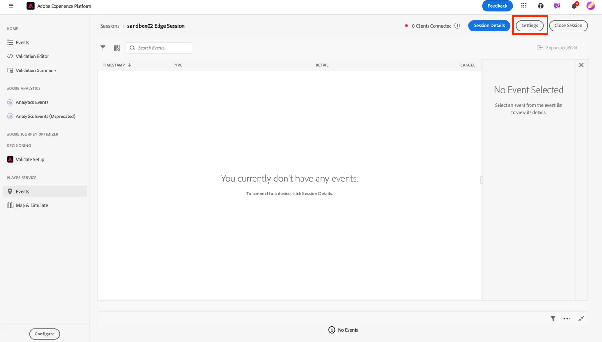

# Monitor your event

## Navigate to Assurance

[Adobe Experience Platform Assurance](https://experienceleague.adobe.com/en/docs/experience-platform/assurance/home) is a product from Adobe Experience Cloud to help you inspect, proof, simulate, and validate how you collect data to the Adobe Experience Platform Edge.

1. Go to Adobe Experience Platform -> Assurance -> Create Session

2. Click on the **Start** button

## Configure a session

1. Name --> \[Sandbox] Edge Session
1. URL --> https\://www\.adobe.com
   - Note this URL would be replaced by your customer's actual site 
1. Click the Next button

4. Copy the link somewhere you can reference later

5. Click the **Done** button

6. Navigate to **Settings**

7. Enable **Event Transactions** and **Edge Delivery** by clicking on the **+** button, then **Done**

## Open Postman

Go to Postman -> Create Web Event Edge (No Auth) -> Headers

1. Add the **x-adobe-aep-validation-token** to the Headers with the link copied above from Assurance. Grab **just the ID** value after the = in the link you copied from Assurance. e.g. [https://www.adobe.com/?adb\_validation\_sessionid=](https://www.adobe.com/?adb_validation_sessionid=efa4a9ed-02d8-4647-80fa-f01a5be273d0)[`efa4a9ed-02d8-4647-80fa-f01a5be273d0`](https://www.adobe.com/?adb_validation_sessionid=efa4a9ed-02d8-4647-80fa-f01a5be273d0)
1. We would just use the [`efa4a9ed-02d8-4647-80fa-f01a5be273d0`](https://www.adobe.com/?adb_validation_sessionid=efa4a9ed-02d8-4647-80fa-f01a5be273d0) value, not the full url

3. In Postman, save and execute the **Create Web Event Edge (No Auth)** request

## View Assurance logs

Go back to Assurance and you should see a bunch of events showing. Filter down to just relevant event types by putting your datastream ID in the search

Select an event and open any messages if needed on the right rail.

Event types to look for:

- hitReceived (shows the payload received by the Edge)
- evaluatingRule (if you set up SSF, shows rules being evaluated)
- firedDestinations (which destinations was this sent to)
- segmentsDiscovered (did it qualify for any edge segments)
- com.adobe.experience\_platform.edge\_segmentation/response (what segments did it respond with)

Explore these and see how each step is interpreted by Assurance.
