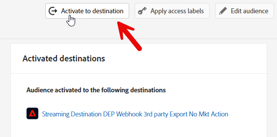

# Send order event to Hub

>[!IMPORTANT]
>
>Complete [Postman setup](../../postman-setup/postman-installation.md) before starting this lab. You also need access to [webhook.site](https://webhook.site/) and the **Streaming DEP Webhook** destination created in the [Acquisition use case](../use-case-1-acquisition/configure-destinations/setup-streaming-destination.md).

## Streaming to Hub vs Edge

In Use Case #1 we sent in an Event to the Edge.  There are some use cases where we may have a back end system that wants to stream in an event, but does not need to send it to the Edge.  This lab shows how to do that by streaming in an Order event to the Hub.

## Create an order segment (if you haven't)

Click on Audience on the left rail and click the Create Audience button in the top right.  


Find the Order Placed event type card and drag it onto the canvas.


## Update event rules

Make the following changes to the event rules (you may need to expand the event to see it)

1. In Last
1. 15
1. Minutes
1. Change to Streaming Evaluation

Save as **Order Event Streaming (within 15 minutes)**


## Activate to destination

Open the audience you just created if it is closed.

Click Activate to Destination




### Destination

Select the Streaming Destination you created earlier (Streaming DEP Webhook)


### Mapping

Leave Mapping alone and click Next


Click Finish

## Open Postman

Launch postman on your computer and navigate to the following API call:

1. **Postman Left Sidebar**  --> `Collections`
1. **Collection** --> `AEP Foundations Bootcamps (labs)`
1. **Folder** --> Profile Lab
1. **API Request** --> `Create Order Event`


## Modify API request

To create the sample API request you need to fill in the following pieces in the body of the API request.

Start by gathering the following values:

## Find account streaming endpoint

1. Navigate to **Sources** in the left rail and then click on **Accounts** in the top nav
1. Search for **dep: HTTP API \[raw]**, highlight the row and copy and save the value of the **Streaming Endpoint** somewhere you can reference later

![Search for the dep: HTTP API \[raw] account and copy its Streaming Endpoint](assets/send-order-event-to-hub-http-api-raw-streaming-endpoint.png "dep: HTTP API \[raw]")

## Find dataflow ID

1. Find the record for **dep: Orders (stream)** and click on the dataflows link
1. In the right rail copy and save the **Dataflow ID** values somewhere you can reference later

>[!NOTE]
>
>Click in an empty space on the row.  DO NOT click on the blue links!


## Create final API request

Copy the values you saved in the previous steps into the places highlighted below.  

- **Red** --> `Streaming Endpoint URL`
- **Green** --> `Dataflow ID`

Your final API request should look like this when done

>[!CAUTION]
>
>DO NOT EXECUTE YET!


## Execute the API

1. Save your API call by clicking the **Save** button
1. Execute your request by clicking the **Send** button

A successful call should result in the following response...


## Validate

1. Go over to your Profile and look up your Profile to see that the event was ingested onto Profile.  It should appear in seconds.
   1. Look up the Profile using the email in the Order
1. Validate the Profile has qualified for the Segments (it may take a few minutes). It should appear in seconds to minutes.
   1. Order Event Streaming (within 15 minutes)
1. Check your webhook to see if the Destination has notified the webhook of a Segment "realized".  It should appear in 5-10 minutes.
1. After 15-30 minutes, you can even check your dataset with the following:
   1. Change the table name below to the one from your sandbox.  To find it, go to your dataset list and filter on "`dest`", open the dataset and copy the table name on the right rail.

```sql
SELECT * FROM profile_export_for_destination_merge_policy_xxx
WHERE extSourceSystemAudit.LASTREFERENCEDDATE >= CURRENT_DATE
AND identitymap['email'][0].ID in ('depche.mode@dep.com')
ORDER BY extSourceSystemAudit.LASTREFERENCEDDATE DESC
LIMIT 10
```
