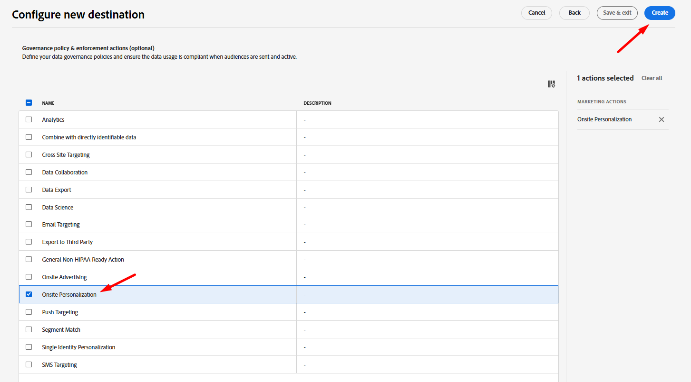

# Set up Custom Personalization destination

Using a [Custom Personalization Destination](https://experienceleague.adobe.com/en/docs/experience-platform/destinations/catalog/personalization/custom-personalization) is a way to make audiences available on the Edge for use by a third party, usually using the Network Server API, to use for Personalizing.

This lab configures the Custom Personalization Destination so that we can send Profile Attributes to the Edge.

## Browse destination catalog

>[!NOTE]
>
>For personalizing using Adobe Target, we would use the [Adobe Target Destination.](https://experienceleague.adobe.com/en/docs/experience-platform/destinations/catalog/personalization/adobe-target-v2) The behavior is identical to Custom Personalization.

1. In the left rail click on **Destinations**
1. In the top rail click on **Catalog**
1. Next select the category of **Personalization**
1. In the middle of the screen you should see the destination titled **Custom Personalization with Attributes.** Click the **Set up** button on that card.

## Configure destination

### Set up account

Name your account `DEP Labs Custom PZN` and then click the **Connect to destination button**

### Add destination details

Fill in the following Destination details:

1. Name -> **Edge Destination**
1. Integration Alias -> **edgeAlias**
1. Datastream ID -> *select the datastream name you created previously*
1. When done click the **Next** button

>[!CAUTION]
>
>Once you click Next you cannot change the **Name** or **Integration alias**.  These things will appear later on in the Edge Network responses

### Select governance policy

Select **Onsite Personalization** and then click the **Create** button

>[!NOTE]
>
>While this step is optional, it's highly encouraged that any destination you create has a governance policy assigned to avoid erroneously activating profiles

When done you should see this screen noting your success!

## Activate destination

### Select Audiences

Select the destination you just created by clicking on the row to highlight it and then click the **Next** button

Select **All Audiences** and click **Next**

### Mapping

Add a **new mapping** as follows:

| Source Field           | Target Field |
| ---------------------- | ------------ |
| \_tenantName.plan.name | Plan Name    |

>[!NOTE]
>
>Remember to replace **\_tenantName** with your tenant name

>[!NOTE]
>
>The Target Field allows for providing a friendly name that may be different than the XDM name

When done your screen should look like the image below.  You can then click the Next **button**

>[!NOTE]
>
>Since profile attributes may contain sensitive data, all [Edge Network Server API ](https://experienceleague.adobe.com/en/docs/experience-platform/edge-network-server-api/overview)calls must be made in an authenticated context in order to retrieve the attribute once it is on the Edge.

### Review

On the final screen you can review the details of your configuration and then click the Finish button.

>[!NOTE]
>
>This is the point where [Automatic Enforcement](https://experienceleague.adobe.com/en/docs/experience-platform/data-governance/enforcement/auto-enforcement) will check against your [Data Usage Policies](https://experienceleague.adobe.com/en/docs/experience-platform/data-governance/policies/overview). It will check your Marketing Actions with the Rules you created and raise any errors.
