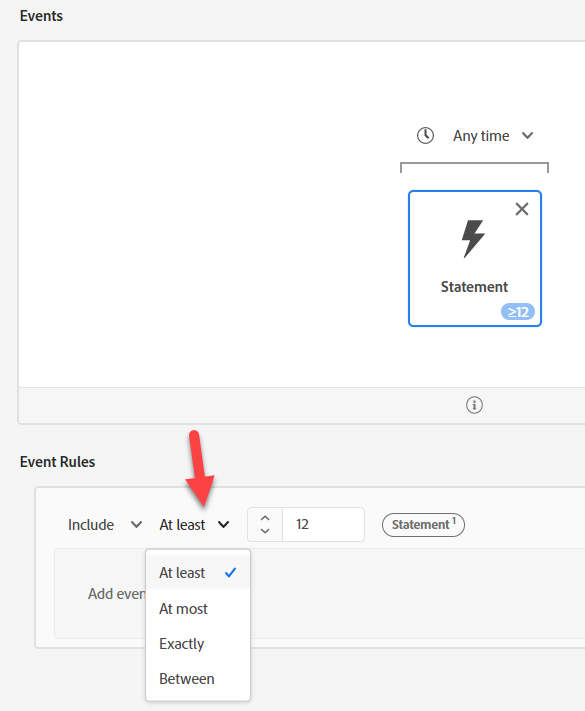
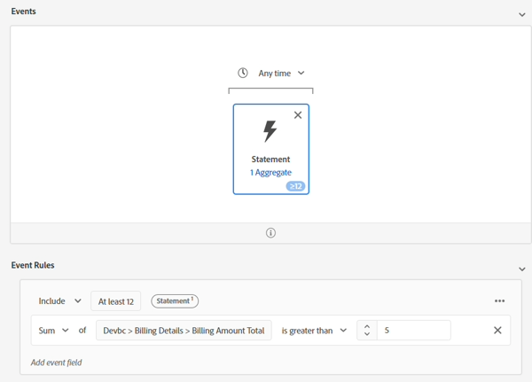

# Option #1 - using Audiences to aggregate

Aggregates in Audiences allow us to aggregate Events in the Audience rule. But since we can only do one aggregate at a time, we need to split the two from our use case. 

## Audience #1 - billing data usage in the last 6 months > 140GB

In this audience build, you determine total billing data usage in the last 6 months > 140gb. To do so, perform the following:

1. Create a new Audience.  Use the Billing Statement Event Card.

   

   >[!NOTE]
   >
   >A good Event Type structure makes it easy for your users to use and understand.  Take time to develop a standardized approach across your schemas.
   >
   >It helps with misspellings.
   >
   >You can always fall back on the Event Type field and manually type things in.

2. Click on the Ellipse in the bottom right rules and choose Aggregate. Click on Select an Attribute and type Usage. Select the Billing Data Usage field.

   

   

3. Change the Equals to Greater than and the value to 140.

4. Change the time above the Event card from Any Time to In Last and the value to 6 and the days to months

   

5. Provide a description and save.  

6. Give the Audience the name “*Billing Usage Sum > 140 GB (last 6 months)*”

>[!NOTE]
>
>Aggregate Audiences can only be saved as Batch

>[!NOTE]
>
>There are two ways to use aggregates in Audiences.
>
>- Sum/Count/Min/Max/Average (like we did above)
>- Counts only (this counts each Event as 1)
>
>
>
>Both can be used together if desired
>
>

## Audience #2 - rolling 6 month avg. monthly data usage of >= 20GB 

1. Do not click on the hyperlink, but select the row in the Audience List UI so it is highlighting the one we just created. Once it is highlighted, click copy.

   

2. Click the copy and Edit it.  Click on the Event card and change the Sum to Average. Change the greater than to greater than or equal to, and the value to 20. Copy the pseudo code into the description.

   

3. Give the Audience the name “*Billing Usage Avg > 20 GB (last 6 months)*” 

## Audience #3 - does not have an ultimate phone plan

1. Create a new Audience
1. In Attributes, search for Plan Name
1. Add Plan Name (Plan Name)  
1. Select "Ultimate".  Change to Does Not Equal

   >[!NOTE]
   >
   >Remember our Pre-Work? This uses a field on our lookup dimension:
   >
   >XDM Individual Profile > Devbc > Plan Details > Plan ID properties > **Plan Name (Plan Name)**

   

5. Click on Audiences --> Experience Platform. Drag Billing Usage Sum > 140 GB and Billing Usage Avg >= 20 GB next to Plan Name.

   

6. Copy the pseudo code into the description

7. Check this can be Streaming. **It can’t be Streaming**. Make some changes:

   >[!NOTE]
   >
   >Any use of a Lookup dataset creates a Multi-Entity Audience which becomes evaluated in Batch.  We used a field in our Audience:
   >
   >XDM Individual Profile > Devbc > Plan Details > Plan ID properties > Plan Name (Plan Name)

8. Replace **Plan Name (Plan Name)** with: XDM Individual Profile > Devbc > Plan Details > **Plan Name**

   

   >[!NOTE]
   >
   >Recall that the LID Denormalize step adds Plan Name to the Profile. This allows you to refer to it in an Audience. As a result, this removes a join to the lookup and lets you make the evaluation method Streaming.
   >
   >The tradeoff here is we have moved this logic upstream to pre data ingest instead of during Audience evaluation.
   >
   >We also now have to update any Profile if that Plan Name changes.
   >
   >The benefit though is we can now react in real time.

9. Validate that you can now save this as Streaming. Save Audience as “*Billing Data Usage High But No Ultimate Plan*” 

>[!NOTE]
>
>While this evaluation method is Streaming, it is basing Audience qualification on two batch Audiences.

>[!NOTE]
>
>This approach will work, but we now have a Streaming Audience (real time), using Batch Audiences (that will run once every 24 hours). If this works for our use cases and data loads, then this is a good choice (e.g. maybe our billing data is loaded daily or monthly which is highly likely but not all use cases will be like this). If not, a common approach is to aggregate the data before sending to AEP. Look at another option if you need a more real-time approach.
