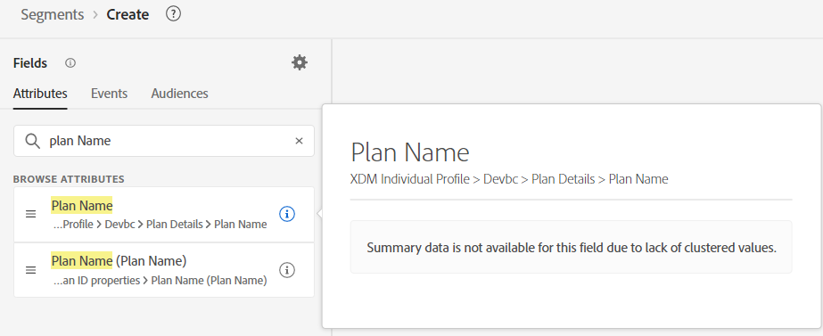

# Pre-Work

For this Use Case there isn’t much pre work to do. We basically have two things we are looking for, 1) Usage, 2) Plan.  Find where they are.

## Billing Data Usage

1. Create a new Audience
1. Search for "usage" in Attributes. Click on the "i" to review the description (there is none).

   

3. Search for "usage" in Events.  Click on the "i" to review the description (there is none).

> [!NOTE]
>
>Neither of these have any descriptions, so the Marketer may make some assumptions and guess wrong. 
>
>Descriptions are important.  Without descriptions, how will the Marketer know:
>
>- Which to use?
>- Latency of data?
>- Recommended/preferred in specific use cases?
>
>By providing this information in descriptions we can better guide them.

> [!NOTE]
>
>Try searching for “Billing”.  Notice it doesn't show up as a Profile Attribute.  It shows up as an Event Type Card along with the "Billing Data Usage" field.
>
>Naming conventions exist for your Marketer too.  Depending on what they search on or if they are looking/expecting this to be an Event or on Profile affects what they find and eventually use.

## Plan

Search for "Plan" in Attributes.  Notice we have a number of things to choose from.  Narrow it down to "Plan Name".  We have two Plan Names?!

The Plan Name (Plan Name) seems to be the one we need based on the description and the other one is missing a description.
