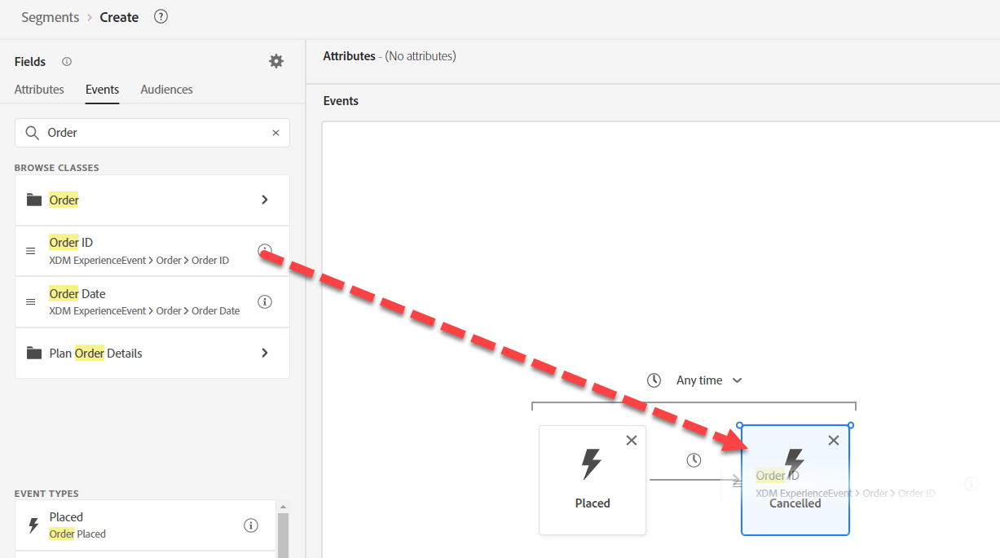
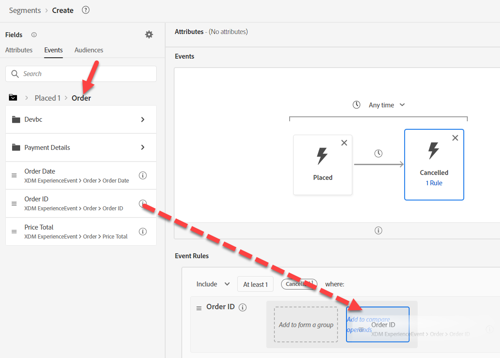

# Build use case #3

## Create the Audience

1. Create a new Audience
1. Add the Order Placed Event to the canvas
1. Add the Order Cancelled Event to the right of the Order Placed Event
1. Change the time to within a week 

>[!NOTE]
>
>**Event Type Field**
>
>We could have used:
>
>- Any Event filtered by Event Type=order.placed
>- Any Event filtered by Event Type=order.cancelled

>[!NOTE]
>
>**Time**
>
>The Audience Engine uses only the Timestamp to interpret the order of Events. Thus, if you have multiple datetime fields on the Event, keep in mind the Timestamp field is the one used.

## Configure the Cancelled Event

Search for Order ID and drag the field onto the Order Cancelled Event.

>[!NOTE]
>
>We are adding a filter for Order ID to ensure the Order Placed is the same Order Cancelled

Clear any search and click into **Placed** under the **Browse Variables**

Drill down to Order ID, then drag over to add a compare operand 

>[!WARNING]
>
>**Do not use search within a Variable**
>
>It will not keep the context of the variable

Your final result should be as you've seen below

>[!NOTE]
>
>**Containers**
>
>This is using the variable container to ensure the Order Cancelled is the same Order that was Placed
>
>Earlier we used a Container to isolate an element in an Array. Here we are using Containers to reference a specific Event in a filter criteria inside another Event.
>
>The Order Cancelled Event is ensuring its own Order ID is the same as the Placed Order ID
>
>How else could we use this?
>
>- Comparing a Product SKU for a Page View is the Product SKU Purchased
>- Comparing a Ship to City is different than the Bill to City
>- Comparing any two fields of the same data type should be possible even though the Events can come from different Schemas
>
>https\://experienceleaguecommunities.adobe.com/t5/adobe-experience-platform-blogs/how-exactly-do-containers-work-in-aep-segmentation-a-deeper-look/ba-p/458780

>[!NOTE]
>
>**Container Names**
>
>Containers will inherit their variable name from their context.  
>
>e.g. If you use the Any Event card, the container name will be Any1

## Save your Audience

1. Provide a description. Set your Evaluation method as Batch. 
1. Save your Audience as "*Order Placed and Order Cancelled within a Week*"

>[!TIP]
>
>**Optional Challenge Lab**
>
>Finished early? Try this...
>
>We would like to start a new campaign for Abandon Cart.  Create an Audience for Abandon Cart but make sure we don't start targeting people for an hour.
>
>
>
>Still have time? Try this...
>
>The business went through a merger and acquired two new business units for:
>
>- ISP
>- Cable
>
>How might you need to modify the schemas to include these?
