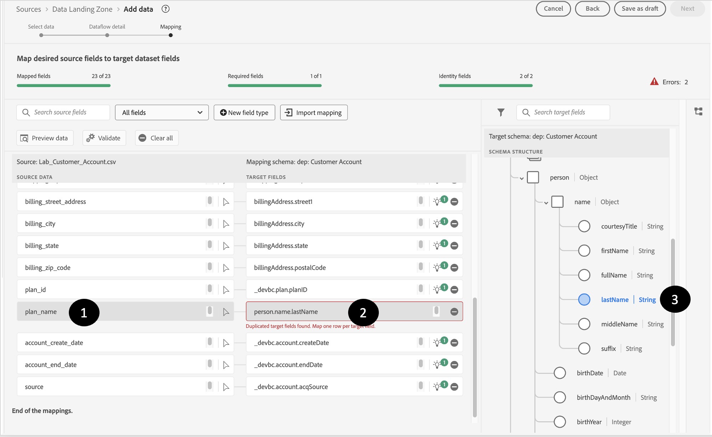

# Fix passthrough mappings

## Drop specific mappings

Some of the source data that you have needs to be handled using calculated fields.  To address these, drop them from the mappings and re-validate the mappings.

1. Drop the following source data from the mappings:
   - birth\_date
   - source
   - sms\_optIn
1. Re-validate the mappings by clicking on the validate button

>[!NOTE]
>
>After clicking the Validate you may still have errors present

## Wrong mapping examples

While AI/ML recommendations are helpful they are sometimes wrong.  If you inspect your recommendations you may find these type of errors that you need to fix

>[!NOTE]
>
>Below are some examples of invalid mappings that you may see in your own sandbox. You may also see others errors.

## Duplicate mappings

In this scenario you see that the AI/ML recommender mapped two different source fields to the same target field **person.name.lastName**

## Bad mappings

This mapping looks right but upon closer inspection **email** is not the same as **emailFormat**

And this one where **email\_optIn** is incorrectly mapping to the wrong consent object

## Fixing passthrough mappings

To fix passthrough mappings that are incorrectly pointing to the wrong target field, perform the following steps.

### Example

1. Start with an invalid mapping and click on the target field box. For example, in the mapping below, the field **person.name.lastName** is not mapped correctly and is mapped to **planName**
1. In the target schema panel that opens on the right, choose the appropriate target field and select **\_devbc.plan.name**
1. The target field should now be updated in the target field box
1. After you fix each such error, you should press the **Validate** button so that you can make sure you are reducing these kinds of errors and not introducing new ones. 

>[!WARNING]
>
>Do not continue to the next step until you have resolved all your mapping errors
