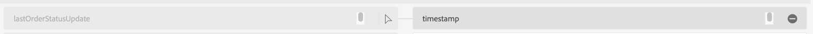

# Initial mappings

As in the previous exercise, you will need to verify the mapping and in some cases, modify it. 

## Verify ML recommendations

1. In the Mapping step, ML Recommendations automatically map most attributes. However, you also see several errors. The initial screen may look similar to below.


>[!NOTE]
>
>Since we are mapping an Experience Event dataset for the first time, note that **\_id** and **timestamp** are never recommended or mapped by default for Experience Events. You have to manually ensure that these are mapped correctly.

## Map \_id, timestamp and order.\_devbc.acqSource fields

1. To map **\_id,** write the following calculated field expression and click preview

```none
concat(orderID, "-", lastOrderStatusUpdate)
```


1. Ensure that **timestamp** field in the target schema is mapped to the following calculated field:

```none
lastOrderStatusUpdate
```




1. Map the calculated field expression **"inStore"** to **order.\_devbc.acqSource**


## Handling duplicate mappings

If the mapping screen now complains there is a duplicate mapping such as **orderStatus** mapped to **order.\_devbc.acqSource,** click the "-" icon to remove the mapping.

> [!NOTE]
>
>Remember that multiple input fields cannot be mapped to the same output field as this makes the mapping ambiguous. But a single input field can be mapped to multiple output fields in the XDM schema. 


