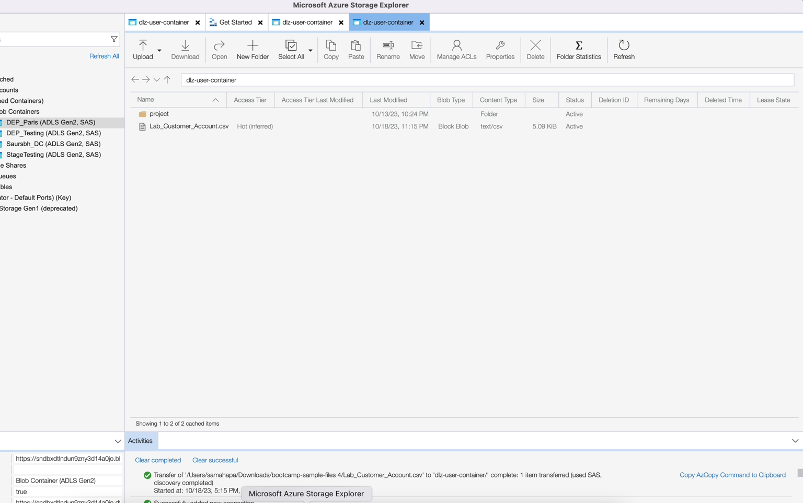

# Set up the source

## Upload sample file

You need to upload a sample data file to your Data Landing Zone via Azure Storage Explorer so that you can use it during the lab.  To do so, do the following:

1. Download the [Sample Files](../../sample-files.md) 
1. Drag 'n drop and/or upload the **Lab\_Customer\_Account.csv** file to the Data Landing Zone you saved from the previous step.

When uploaded your screen should look like the below screenshot. 

>[!WARNING]
>
>Make sure you do not upload the file into the *project* folder. It contains preloaded data that you don't use in our labs.

## Navigate to Sources

1. Go to Adobe Experience Platform and navigate to: **Sources** -> **Catalog** -> **Cloud storage**
1. Click on **Setup** / **Add Data** for the Data Landing Zone

>[!NOTE]
>
>If at least one connection exists for that source, you see **Add data** as the default action. If no connections exist for that source, you see **Setup** as the default action

## Preview the file

1. Select the **Lab\_Customer\_Account.csv**

1. In the preview pane, look at the following attributes and observe the following:

- **sms\_optIn** is a consent field that has several missing values (shown in preview as - )
- **account\_create\_date** does not have the proper date format. It has string values along with date and time values in one string.
- **account\_end\_date** has the proper date format.

>[!NOTE]
>
>You will need to deal with the missing values, dates and improperly formatted fields in the mapping steps later in this lab

1. Click **Next** in the upper right corner of the screen to continue to the next step

## Set up the dataflow

1. In the Dataflow detail screen, choose **New dataset**. 
1. Name the output dataset as **Customer Account - \<Your Initials>**
1. Select the **dep: Customer Account** schema from the dropdown list.
1. Turn on the **Profile dataset** toggle box.
   (If you do not turn this on, the Profile Store is not able to monitor for new data entering this dataset and hence does not ingest this data into Profile)
1. Turn on the **Enable partial ingestion**.
   (If you do not turn this on, the ingestion may fail if one of the records has errors)
1. Set the Dataflow name as **Customer Account Batch Ingestion – \<Your Initials>** 
1. Turn on all the alerts **Sources Dataflow Start/Success/Failure**

>[!CAUTION]
>
> Ensure you have **enabled the** dataset for both profile and partial ingestion.

Click **Next** in the upper right corner of the screen to continue to the next step.

>[!NOTE]
>
>**Enable partial ingestion** specifies the number of errors (**INGEST** and **DCVS**) as a percentage of the total number of records that can fail before the entire dataflow is declared a failure.
