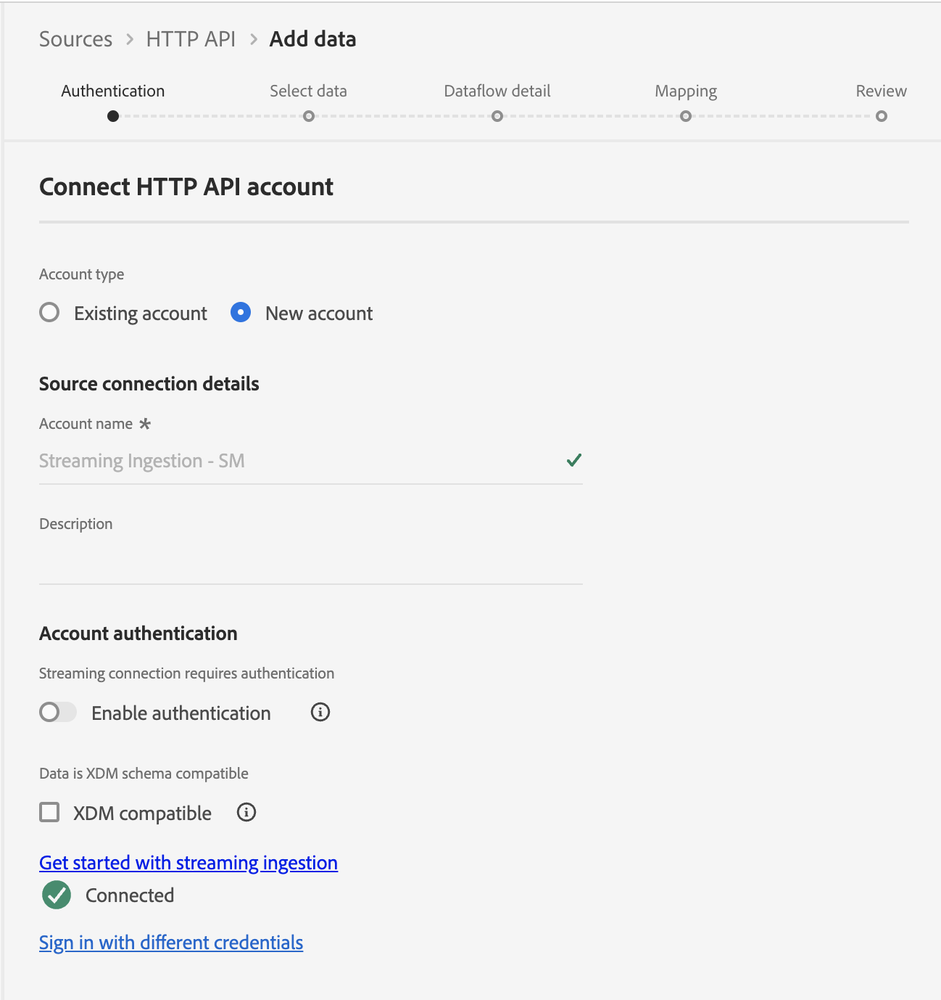

# Set up the source

## Navigate to streaming sources

1. Go to Adobe Experience Platform UI and navigate to **Sources**
1. Click on **Catalog** in the top nav
1. Select **Streaming** from the list of sources (ensure the All sources radio button is selected)
1. Click on **Setup** / **Add Data** for the HTTP API

## Create HTTP API account

The first thing you need to do is create a new account. This account holds the details around how authentication is handled and if the data being streamed in is XDM compatible (i.e. already matching the structure of the underlying XDM schema)

Perform the following tasks:

1. Select **New Account** and add the following details:
   - Account Name -> `Streaming Ingestion - <Your Initials>`
1. Leave the toggle for **Enable authentication** disabled
1. Leave the checkbox for **XDM compatible** unchecked
1. Click the **Connect to source** button to continue

>[!CAUTION]
>
>DO NOT toggle on the **Enable authentication** or check the box for **XDM compatible**. This breaks the lab

Your screen should look like this: 

You should now see a green checkbox with the message "Connected". Click the **Next** button in the upper right to continue setting up your dataflow:

## Upload sample data

>[!NOTE]
>
>If you haven't already, be sure to download the [Sample Files](../sample-files.md) 

1. In the Source data schema section of the screen, upload the JSON file **Lab\_Single\_Customer\_sample.json** from your local file system you downloaded from the previous lab.
1. Once the file is uploaded, a preview appears as follows. Click the **Next** button in the upper right to continue. Observe how the birth_Date field is in a different format YYYY-MM-DD compared to the MM/DD/YYYY format that you saw in the batch ingestion lab earlier. 

>[!NOTE]
>
>The JSON sample file contains a single record for designing and validating the pipeline. If you want to scroll, you have to click on the XDM nodes to cause the nodes to scroll. 

## Configure dataflow detail

In this screen, you are creating a specific dataflow that leverages the HTTP API account you set up.  You can have many dataflows per account.  In this scenario, you need to create a dataflow for streaming customer account data. A dataflow requires an association between a source account, a dataset with associated schema, and configuration details. 

Perform the following steps:

1. Create a New dataset and name it as -> `Customer Account Stream - <Your Initials>`
1. Choose the **Schema** as ->`dep: Customer Account`
1. Ensure the **Profile dataset** toggle is **enabled**.  If not **enable** it.
1. Update the **Dataflow name** like so:
   - `Customer Account Stream - <Your Initials>`
1. Click the **Next** button to continue

>[!NOTE]
>
>If you do not enable the dataset for Profile then data streams into the Data Lake only. You don't see your streaming events in the Profile or the Identity Graph.
