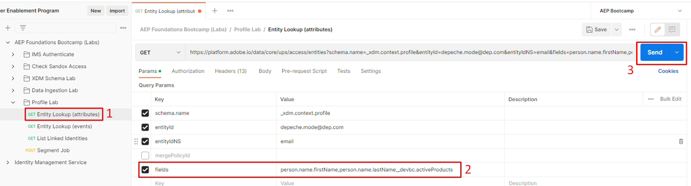

# Profile & identity APIs

## Profile Entity API

Knowing how to utilize the profile APIs is critical when it comes to working with the Real-Time Customer Profile. It unlocks the ability for fast triage and debug while also exposing you to endless possibilities around system integrations from call centers to kiosks.

One of the most important APIs is the Profile Entity API.  This API allows you to lookup an individual profile (just like you saw in the UI) but uses params to dictate whether you want to see the attributes or events of the profile.

Below is the entire spec for the GET method for the Profile Entity API

## API overview

Below is the minimum information needed to call the Profile Entity API.

`GET https://platform.adobe.io/data/core/ups/access/entities`

### Required query parameter

Send this parameter with every request. Its value depends on whether you're looking up a profile's attributes or its events:

| Parameter     | Type   | Description                                                                                                                                    | Example                        |
| ------------- | ------ | ---------------------------------------------------------------------------------------------------------------------------------------------- | ------------------------------ |
| `schema.name` | string | XDM schema class name of the entity you're looking up.                                                                                         | `_xdm.context.profile`         |
| `schema.name` | string | Use this value instead to look up a profile's events. Pair it with `relatedSchema.name=_xdm.context.profile` to scope the events to a profile. | `_xdm.context.experienceevent` |

### Identifying the entity to look up

Most requests use `entityId` and `entityIdNS` to identify the entity by any known identity value — such as an email address, CRM ID, or loyalty ID — rather than requiring you to already know its XID. An XID is a base64-encoded identifier that Identity Service generates and assigns internally to represent an identity, consolidating its namespace and ID value into a single compact token (see [Native XID](https://experienceleague.adobe.com/docs/experience-platform/identity/api/list-native-id.html?lang=en) for details):

| Parameter    | Type   | Description                                                                                                                                    | Example                |
| ------------ | ------ | ---------------------------------------------------------------------------------------------------------------------------------------------- | ---------------------- |
| `entityId`   | string | The identifier value to look up. If you already know the entity's XID, use it here on its own and omit `entityIdNS`.                           | `depeche.mode@dep.com` |
| `entityIdNS` | string | Identity namespace code that `entityId` belongs to (for example, `email`, `crmid`, `ECID`). Required whenever `entityId` isn't already an XID. | `email`                |

>[!NOTE]
>
>This lab's Postman requests look up the Depeche Mode profile by its email address (`entityIdNS=email`, `entityId=depeche.mode@dep.com`) rather than its XID.

### Required headers

Every request also needs these headers:

| Header            | Type   | Description                                    | Example               |
| ----------------- | ------ | ---------------------------------------------- | --------------------- |
| `x-gw-ims-org-id` | string | IMS Organization ID.                           | `<your IMS org>`      |
| `x-api-key`       | string | API key of your registered project/credential. | `<your API key>`      |
| `Authorization`   | string | Bearer token for the request.                  | `Bearer <your token>` |

>[!NOTE]
>
>See the [Profile Entities API reference](https://developer.adobe.com/experience-platform-apis/references/profile#tag/Entities) for the complete list of query parameters, including additional identity lookup options, event filtering (`startTime`, `endTime`, `property`, `orderby`, `limit`), field selection, and merge policy overrides.

>[!WARNING]
>
>Remember all API requests are sandbox specific so it's important when working with the APIs that you ensure your header param in each request called `x-sandbox-name` is correctly set to the appropriate sandbox.
>
>For this lab you already have the `x-sandbox-name` set in your environment file

## Entity Lookup (attributes)

To get a feel for the Entity Lookup API you use the Depeche Mode profile from the previous lab.

1. Open up **Postman** and navigate to the **Profile Lab** folder
1. Click on the **Entity Lookup (attributes)** request to open it
1. Execute the call by clicking the **Send** button

    API")

   A successful request should respond with a `200 OK` and you should see a result that contains all the attributes for the Depeche Mode profile.

    API Response")

   >[!NOTE]
   >
   >By default if no merge policy is specified in a profile entity request it uses the default merge policy in the sandbox

   With the Entity API there are a number of query parameters that you can utilize to change what is returned in response.  

1. In the Entity Lookup (attributes) request click on the **Params** option for the request
1. Check the box next to **Key** named **fields**
1. Execute the request by clicking the **Send** button

>[!NOTE]
>
>Notice there is also a parameter for specifying the `mergePolicyId`.  You can find the value for this utilizing other APIs or looking up the ID using the UI.

A successful request should respond with a `200 OK` and you should see only the fields specified in the param filter you just enabled:  First Name, Last Name and an array of Active Products.

 API Response with filter enabled")

>[!TIP]
>
>Congratulations!  You've successfully looked up a profile's attributes utilizing the Profile Entity API

## Entity Lookup (events)

To look up the events of a profile you use the same exact Profile Entity API.  The only difference is you have to tell the profile service that you want to change which class type to use in the response.

1. Click on the **Entity Lookup (events)** request to open it
1. Execute the call by clicking the **Send** button

A successful request should respond with a `200 OK` and you should see a result that contains all the events for the Depeche Mode profile.

 API Response")

Just like when looking up profile attributes the Entity API has even more query parameters that can be utilized to change what is returned in response.

You can try a few of them by enabling them in the Params section and executing the request.  Try it out and see how it works!

**Sample Query Param Definitions**

| Key           | Value                           | Description                                                                                                                                               |
| ------------- | ------------------------------- | --------------------------------------------------------------------------------------------------------------------------------------------------------- |
| mergePolicyId | \<blank>                        | If provided you can switch the merge policy used to perform the lookup. For the lab leaving it blank means it will use the sandboxes default merge policy |
| fields        | eventType,timestamp,identityMap | Only displays these fields from each event regardless if the field specified has a value                                                                 |
| property      | eventType="order.placed"        | Filters down the events of the profile to only those that are of type "order.placed"                                                                      |
| orderby       | +timestamp                      | Sorts the events in descending order                                                                                                                      |
| limit         | 5                               | Only shows 5 events in the response                                                                                                                       |

>[!NOTE]
>
>You can learn more about all the Query Parameter options here -> [https://developer.adobe.com/experience-platform-apis/references/profile/#tag/Entities/operation/retrieveEntity](https://developer.adobe.com/experience-platform-apis/references/profile/#tag/Entities/operation/retrieveEntity)

## Identity Service Cluster API

At some point you may have a question about what identities are part of a specific profile's identity cluster within the identity graph.  This API allows you to pass a single identity namespace/value and in response you receive the full identity cluster for that profile.

Try it yourself:

1. Click on the **List Linked Identities** request to open it
1. Execute the call by clicking the **Send** button

>[!NOTE]
>
>Note the parameters in the request are the identity namespace and id (i.e. value)

A successful response should look like the below screenshot

>[!NOTE]
>
>You notice the response contains all the identities of the profile Depeche Mode
