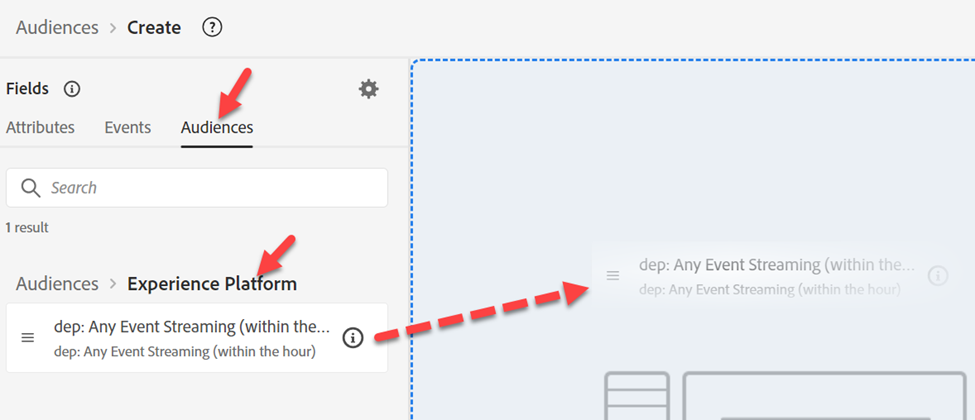
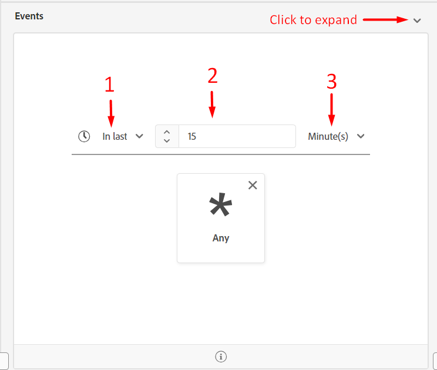

# Create Edge Audience

This Audience will be used to qualify someone when a payload (e.g. page view) comes from the client (e.g. Web SDK) to the Edge.

>[!NOTE]
>
>We evaluate an audience on the Edge usually so that we can turn around and use it in Personalization. If we aren't doing Personalization on the Edge, then we can just have the audience evaluate as Streaming on the Hub.

## Create audience

1. In the left rail click on Audiences
1. Then click on Create Audience in the upper right corner of your screen
1. Then click on Build Rule

## Convert audience to rules

1. Go to **Audiences** and click into the **Experience Platform** folder
1. Drag 'n drop the audience named **dep: Any Event Streaming (within the hour)** onto the canvas

1. Convert the audience to a set of rules in the canvas by clicking on the **icon** show below and then click **Convert**

## Update event rules

Make the following changes to the event rules (you may need to expand the event to see it)

1. In Last
1. 15
1. Minutes

## Publish segment

1. Update the name of the segment to **Any Event Edge (within 15 minutes)**
1. Update the evaluation method to Edge
1. Publish the segment

## Create batch evaluated segment

Repeat the same steps you just did for the edge segment you created but use the following information instead:

>[!NOTE]
>
>We will be creating a batch audience so you can see that even though an event is passed into the Edge, any audiences saved as batch evaluation are not evaluated in a streaming fashion.

Event rules:

- In Last
- 1
- Day

Segment Details:

- Name -> **Any Event Batch (within 1 day)**
- Evaluation Method -> Batch
