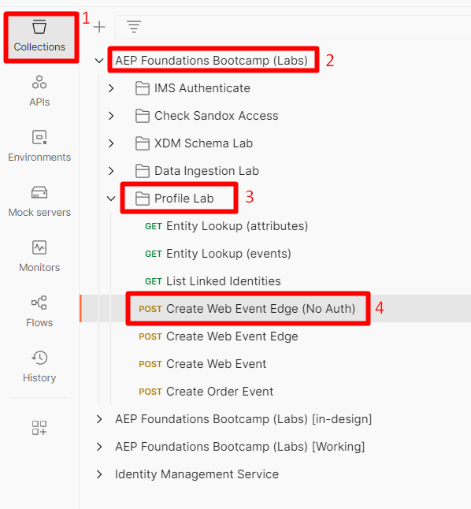

# Send an Edge Event

Now that everything is configured, send in an event to the Edge to see it all work.

To do this, use Postman to send a Web Event to the Datastream you created.

This sends in an event **with no OAuth Token** to simulate a page view coming in from the web to the Edge.  Ensure you have Postman open on your machine to perform this lab.

>[!NOTE]
>
>Because you are not passing in an authenticated token, you don't get back any attributes.

## Lab expectations

1. Experience Event to hit the Edge
1. Datastream configuration to use Event Forwarding Service
1. Event Forwarding to send the Event to the webhook
1. Datastream configuration to use AEP Service
   1. Edge Audience to run
   1. Send Event to the Hub
1. Postman Response to include Edge Audience (but no attributes)
1. Profile Store to receive event and add an Event Profile Fragment
1. Identity Store to add a relationship
1. Dataset to receive data and store in Data Lake

## Navigate to the call

1. **Postman Left Sidebar**  -> Collections
1. **Collection** -> AEP Foundations Bootcamps (Labs)
1. **Folder** -> Profile Lab
1. **API Request** -> Create Web Event Edge (No Auth)

## Modify API request

Before you can execute the API request you need to add some additional pieces of information to the request. Start by gathering the following values:

## Gather the datastream ID

1. In the left rail click on **Datastreams** (under the Data Collection heading)
1. Select your Datastream and copy the **Datastream ID** value

## Update Postman query param

1. In the request itself click on **Params**
1. Update the **Value** with the datastream ID from the previous step
1. Click the **Save** button to save your update

Change email to your email

## Execute the API

Execute your request by clicking the **Send** button. 

What you should see coming back in the response is this core thing:

- A 200 OK response means the data was successfully sent and accepted by the Edge Network

>[!NOTE]
>
>Any streaming and batch segments don't show until they are evaluated at the hub first

## Validate event forwarding

On webhook.site you should immediately see the same payload body you sent via your Postman request appear. 

>[!NOTE]
>
>Notice the payload has added the geo lookup information you asked for when you set up the datastream you used in your edge setup

## Look up the profile

In Adobe Experience Platform look up the profile you just sent in from the event you just sent into the Edge Network. Navigate to Profiles -> Browse to perform the lookup using the following information:

- Merge policy -> Default Time-based
- Identity Namespace -> Email
- Identity Value -> edge-email\@dep.com
  - Note: change this to match the email you used in the *Update Postman Query Param* step above

1. Click **View** to look up the profile
1. Click on the **Profile ID** to open the profile

1. Click on **Events** in the top nav and you can see the event you just sent in

1. Validate the Profile has qualified for the Audiences by reviewing the Audience Membership tab in the top nav. You should see the following:

- Any Event Edge (within 15 minutes)
- dep: Any Event Streaming (within the hour)

## How to interpret the checks

1. Check for 200 response in Postman (properly formatted payload)
1. Check if the webhook has the event (properly configured Event Forwarding)
1. Check if the Profile has the events (properly configured AEP Service, event received and processed event on the Hub)
1. Check if the Profile has two identities (Identity Graph has linked on the Hub) after a few minutes
1. Check if the Profile qualified for the audiences (properly defined audience)
1. Check if Data Lake has the event.
