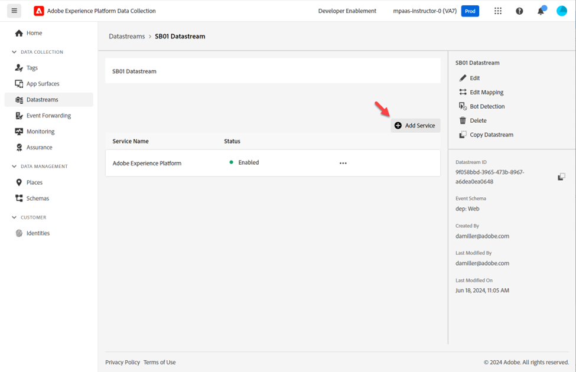

# Create Datastream

A Datastream defines which services will utilize it.

- When sending data to the Edge you specify which Datastream to use
- Data sent to these Datastreams can then take action according to the service configured
  - Event Forwarding 
  - Adobe Experience Platform

## Create a new datastream

1. In the left rail under **Data Collection** click on **Datastreams**
1. Then click on **New Datastream** to create one

## Configure datastream

Configure the datastream with following information:

1. Name -> **Datastream SB + \<sandbox name> (i.e. Datastream SB01)**
1. Event Schema -> **dep: Web**
1. Toggle **on** all the options under **Geolocation and Network Lookup**
1. Click on the **Save** button when done

>[!WARNING]
>
>Do not click on Save and Add Mapping.  If you accidently do just cancel out

After you save your datastream you see the following screen:

## Add event forwarding service

This allows you to use Event Forwarding for data received by this Datastream.

1. Click on **Add Service**

   

1. Configure the following items:

   - Service -> Event Forwarding
   - Property -> Select the property you created in the previous step.  It should be named like so: Event Forwarding Property SB + \<your sandbox number>
   - Environment -> Development

1. When done click **Save**

## Add Adobe Experience Platform service

This allows you to send data to the Hub and land in a dataset for data received by this Datastream.

1. Click on **Add Service**

   

1. Configure the following items:

   - Service -> Adobe Experience Platform
   - Event Dataset -> dep: Web
   - Profile Dataset -> dep: Customer Account
   - Select Checkbox -> Edge Segmentation
   - Select Checkbox -> Personalization Destination

   

1. When done click **Save**.  

1. Your final screen should look like below with two services present. **Copy** and **save** the **Datastream ID** to your local computer (you use it later in Postman)

