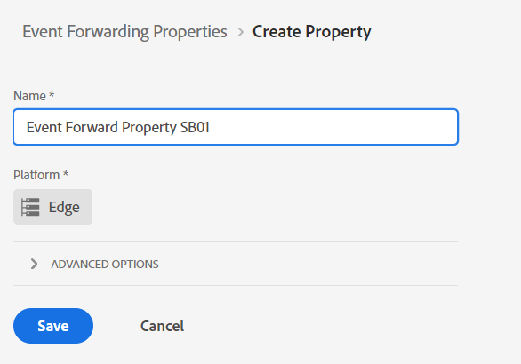
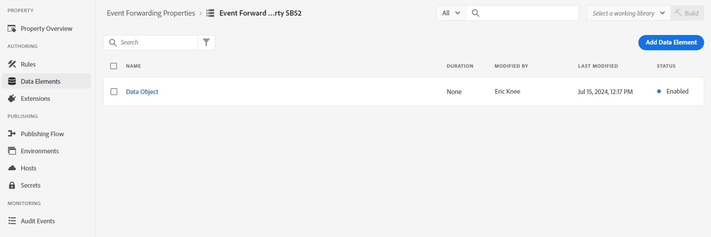
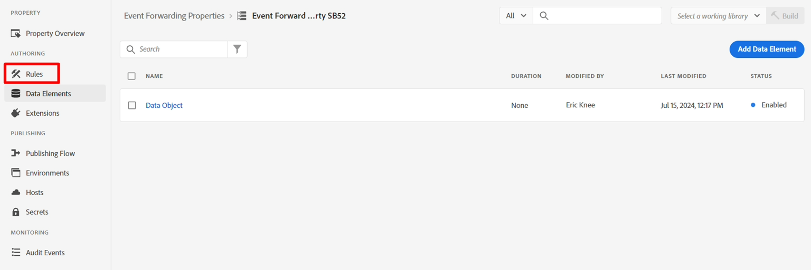

# Create Property

We usually want to forward an Experience Event out to a third party (though it doesn't have to be). This is usually used when a copy of an Event is needed in real time to notify a third party under specific circumstances (e.g. notifying Google, Meta or TikTok about a purchase).

>[!NOTE]
>
>Reminder: A Property contains all the extensions, data elements and rules needed to decide what to forward and where to

1. In the left rail click on Event Forwarding
2. Then click on New Property


3. Update the property name using the following formula: `Event Forward Property SB + [sandbox number]`. Your final name would look something like this: **Event Forward Property SB01**

4. Click **Save** when done



## Install extension

1. Click on the Event Forwarding Property you just created


2. You should see a screen like below.  Click on **Extensions**.


3. Install the extension Adobe Cloud Connector by doing the following:

4. Click on **Catalog** in the top nav
5. Click on the **Adobe Cloud Connector** card
6. In the right rail click on the **Install** button


After clicking install you should see the extension show under the Installed extensions for your property as shown below


## Create data element

>[!NOTE]
>
>A Data Element references the incoming event and can parse it into multiple individual components if needed

1. In the left rail click on **Data Elements**


2. Click on the **Create New Data Element** button


3. Configure the new data element with the following information:

| Element Type      | Value to Configure |
| ----------------- | ------------------ |
| Name              | Data Object        |
| Extension         | Core               |
| Data Element Type | Custom Code        |


4. Click on the button **Open Editor** to add the following custom code:


5. Add custom code to the editor like so and save it

```none
var xdm = arc?.event || '';
return xdm;
```


>[!NOTE]
>
>This is grabbing the whole xdm object without doing any translations to the payload.  If needed we could parse out each individual pieces within the XDM object (e.g. page name, purchase amount), into one data element per field.  The reason for doing this might be if there is transformation of the structure to a different structure


6. Click the **Save** button to save your data element.


When done you should see the following screen confirming your data element has been added:




## Create rules

>[!NOTE]
>
>A Rule contains:
>
>1. Conditions on what to forward 
>2. Actions that can transform the payload and define where to send it


1. In the left rail click on **Rules**




2. Then click on **Create New Rule**


3. Update the rule name using the following formula: `"EF Rule SB" + [your sandbox number]` (i.e. EF Rule SB01). You can find your sandbox number in the top right of your browser window as shown below\...


4. Click **Save** when done

>[!NOTE]
>
>Make sure your rule name follows the formula pattern of `"EF Rule SB" + [sandbox number]`


5. Add an Action to your rule by clicking on the (+) sign to add a new action


## Get webhook URL (to use in action)

>[!NOTE]
>
>This lab uses a webhook here so you can see if the data has arrived at the destination you are sending to. In a real world scenario, you would log into that destination instead and use its tools to see what has arrived.


1. Open the following link in a new tab in your browser -> [https://webhook.site](https://webhook.site/)
2. Copy the unique URL you see and save it somewhere safe


3. Configure your action with the following information:

| Setting     | Value                                                                                                                                                               |
| ----------- | ------------------------------------------------------------------------------------------------------------------------------------------------------------------- |
| Extension   | Adobe Cloud Connector                                                                                                                                               |
| Action Type | Make Fetch Call                                                                                                                                                     |
| Method      | Post                                                                                                                                                                |
| URL         | Use the same webhook URL you used when setting up your streaming destination. You can find it by opening a new tab in the browser and navigating to Destinations -> Browse |
| Body        | Raw                                                                                                                                                                 |
| Body Data   | \{ "data": \{ "event": "\{\{Data Object\}\}" } }                                                                                                                      |

>[!NOTE]
>
>The \{\{Data Object\}\} referenced here is the Data Element you created earlier. Here the requirement by the downstream system was it wanted to wrap the event in a data object with an event object. You could put any formatting here.
>
>If we had split \{\{Data Object\}\} into multiple fields (e.g. page name, purchase, etc.), we could transform the JSON structure placing each field in the desired spot, giving us more control over matching the destination.


When you are done validate your screen looks similar to below and then click on **Keep Changes**


4. When done you should see your action added to your rule. Click **Save** to continue.


>[!WARNING]
>
>When you send an Experience Event, you are sending the Event, not the Profile, nor any of its attributes, including any Audience Qualifications (even if it is an Edge Audience).
>
>This happens for speed purposes.


## Publish the changes

1. In the left rail click on **Publishing Flow**


2. Click on the button **Add Library**


3. Configure the library with the following information:

- Name -> **EF Library**
- Environment -> **Development**
- Click on **Add All Changed Resources**


When done your screen should look similar to the below screenshot.  If everything looks good click on the **Save & Build to Development** button


4. You should then see the development build go green stating it's ready to use


