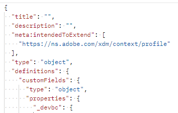

# Create Custom Field Groups

## Field group structure

A field group is always composed of the following fields. You will see this in the request in the next step.

| Required Values             | Description                                                                                                                                                                                    |
| --------------------------- | ---------------------------------------------------------------------------------------------------------------------------------------------------------------------------------------------- |
| title                       | The name of the field group you wish to create within the schema registry. Note the name MUST BE UNIQUE.                                                                                       |
| description                 | A short description about the purpose of the field group                                                                                                                                       |
| type                        | Always an object                                                                                                                                                                               |
| meta\:intendedToExtend      | Defines what classes the field group can be used with. Classes are always referenced by their `$id` value                                                                                      |
| allOf                       | Describes the resources that can be included in the field group. For custom defined fields the path is always `#/definitions/customFields`                                                     |
| definitions.customFields... | This is the default JSON schema structure required to create custom field groups. It must match the `allOf` from above                                                                         |
| \<TENANT\_NAME>             | The tenant name (i.e. unique name) is created during the provisioning process. This ensures that any customizations made do not conflict with existing or future Adobe schema registry changes |

## Create Customer Account Details field group

1. Click on the request `Step 2 - Create Customer Account Details Field Group` API call in the `XDM Schema Lab -> Create Schema` folder

Review the body of the request before executing. Notice that the required fields mentioned in the Field Group Structure section appear like so:

>[!NOTE]
>
>Notice how in the image on the right above the `allOf` references the path of "/definitions/customFields".  That must match the structure defined in the schema (image on the left) as it tells the XDM system where to locate custom created objects.
>
>

Also notice how each specific field from the mapping sheet is substantiated within the XDM JSON structure. 

2. Update the `title` and `description` for the field group using the following format: `Customer Account Details - Sandbox <your number here>`

   

3. Execute by clicking the `Send` button.  You should see a response similar to the screenshot below.

4. Copy the `$id` value of your newly created Customer Account Details field group. 

>[!WARNING]
>
>Do not continue until you have saved the `$id` somewhere.  It will be required later to create the Customer Account schema
>
>
