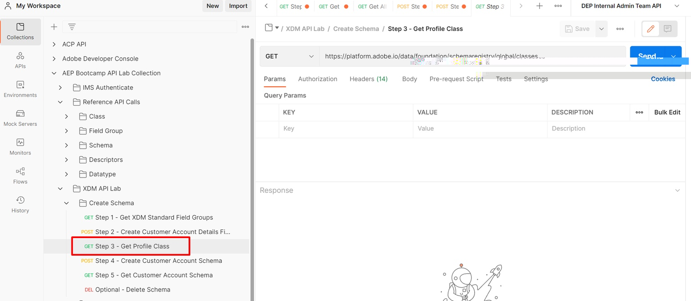

# Get Profile Class

## Execute step 3 - Get Profile Class

1. Click on the `Step 3 - Get Profile Class` request in the `XDM API Lab -> Create Schema` folder
1. Execute by clicking the `Send` button

>[!NOTE]
>
>Notice that in the GET request the `global` path:  .../schemaregistry/**global**/classes. Remember that using `global` tells the schema registry that we only want to return Adobe standard XDM objects

## Locate and save the Class $id

After you execute the API request perform the following steps to locate and save the `$id` for the XDM Individual Profile class.

1. Search for the `XDM Individual Profile` class in the response
1. Copy the `$id` for the `XDM Individual Profile` class and save it somewhere you can reference later.

>[!WARNING]
>
>Do not continue until you have saved the `$id` somewhere.  It will be required later to create the Customer Account schema
