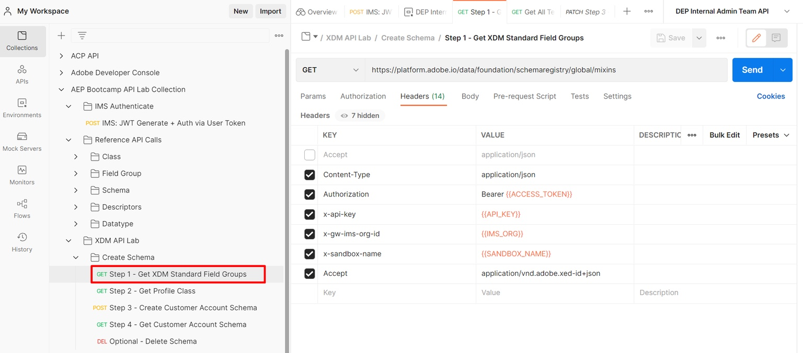

>[!NOTE]
>
>**“Field Group” **was previously referred to as a **“Mixin” **so these terms may be used interchangeably throughout the API requests and guide.

# **Request XDM Standard Field Groups**

1. Click on `Step 1 - Get XDM Standard Field Groups` API call in the `XDM Schema Lab -> Create Schema` folder
1. Execute the call by clicking the `Send` button

**Request**

>[!NOTE]
>
>Note the use of `global` value in the requests URL below:
>
>https\://platform.adobe.io/data/foundation/schemaregistry/**global**/mixins
>
>`global` is used to request only XDM standard components (field group/mixin in this case). There are two types of owners in the Experience Platform XDM registry: Adobe and Tenant (i.e. custom).  
>
>- Adobe created objects always use the word `global` in any XDM listing or lookup requests
>- Tenant created objects (i.e custom) always use the word `tenant` in any XDM listing or lookup call

**Response**

## **Identify Required XDM Standard Field Groups**

A schema is always composed of one or more field groups and a class.  For the Connection 5G Individual Profile schema find the standard XDM field groups required for the schema.

- Demographic Details
- Personal Contact Details
- Consent and Preference Details

1. Search for the `Demographic Details` field group in the calls response
1. Copy the `$id` of the field group and save it somewhere for future reference
1. Repeat steps 1 & 2 for the other two field groups listed above

>[!NOTE]
>
>Do not continue until you have saved all three (3) `$id's` somewhere.  They will be required later to create the Customer Account schema

