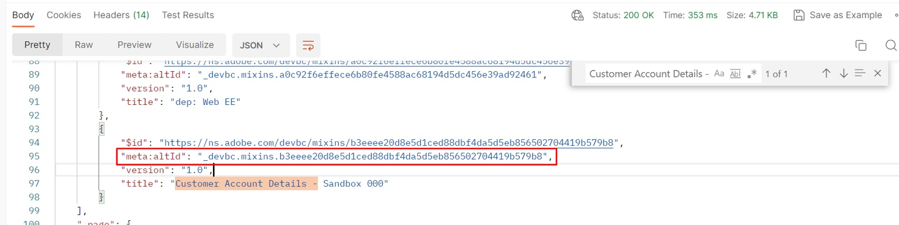
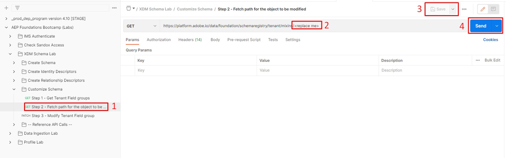

---
title: Modify Schema - JSON Patch
description: Modify Schema - JSON Patch
doc-type: article
exl-id: c0313594-d998-4525-a0a4-d9d844bed5ef
---

# Overview

Let's assume for a minute that after building the schema you need to come back and add an additional field to the `plan `object called `planDescription` because either you forgot to add it at time of creation or it was a request that came in months later.  To perform this task you can simply perform a `PATCH` operation which updates the schema with the new field.

You can learn more about JSON PATCH at the links below but for the purposes of this lab we'll assume you have some concept of how this works 😄

- [https://jsonpatch.com/](https://jsonpatch.com/)
- [Experience League API Fundamentals](https://experienceleague.adobe.com/docs/experience-platform/landing/platform-apis/api-fundamentals.html?lang=en#json-patch)


>[!NOTE]
>Remember the following points:
>
>- A schema is composed of one (1) class and one (1) or more field groups
>- You cannot add new fields directly to a schema without first adding to a field group. This ensures re-usability of a field across any schema that utilizes that field group.


To add a new field to a schema you need to perform the following operations in order.  This is what you will do in the following lab steps.

- Identify the field group where you would like to add the new property
- Construct a JSON PATCH call to update the field group
- Execute the JSON PATCH call to update the Field group (which the schema will inherit)


# **Locate & Identify the Field Group to Update**

1. Select the `Step 1 - Get Tenant Field groups` API call located in the `XDM Schema Lab -> Customize Schema` folder 
2. Execute the request by clicking the `Send` button


>[!NOTE]
>Remember that you created the `plan` object within a custom field group. Custom created objects in the XDM schema registry are referred to as "tenant" hence the API call utilizing the `/schemaregistry/tenant/mixins/` path.


3\. In the response search for the schema ID for the custom field group you created previously titled `Customer Account Details - Sandbox <your number here> `

4\. Copy the `meta:altId` and save it somewhere safe as you will need it for the next step



>[!CAUTION]
>Ensure you select the right field group to copy!  There is one that is named similarly called `dep: Customer Account Details` that you should **not** use

>[!WARNING]
>Do not continue until you have saved the `$meta:altId `somewhere.  It will be required in future lab steps


# **Lookup the Field Group by $meta\:altId**

1. Select the `Step 2 - Fetch path for the object to be modified` API call in the `XDM Schema Lab -> Customize Schema` folder
2. In the URL of the request replace the `<replace me>` with the `$meta:altId` you saved from the previous section step to the end of the call like shown below
3. Save the edits you've made to the request
4. Execute the request by clicking the `Send` button




Review the response and note the JSON pointer path for the **plan **object is constructed using each of the properties highlighted below.


The fully composed path looks like what you see below.  Copy this path and save somewhere for reference

```none
/definitions/customFields/properties/_devbc/properties/plan/properties
```

>[!CAUTION]
>Remember to update the tenant name above (\_devbc) with the your own


# **PATCH the Field Group**

## **JSON PATCH API Body Sample**

```none
[
    {
        "op": "",
        "path": "",
        "value": {
            "title": "",
            "type": "",
            "description": ""
        }
    }
]
```

- **op (Operation)** -> this provides the instruction for what action the PATCH should perform
- **Path **-> this is the path you want to create, update or delete (i.e. this is the JSON pointer to the location of the new field)
- **Value **-> this is an optional field and only used when creating or replacing an existing field


### Execute the API Request

1. Click on the `Step 3 - Modify Tenant Field group` API call in the `XDM Schema Lab -> Customize Schema` folder


2\. Update the body of the request with the following information

- **op **->` add`
- **path **-> `path from previous step +`` the new field name`
- **value **->
  - **title **-> `Plan Description`
  - **type **-> `string`
  - **description **-> `High-level details about the plan`

When you are done your API request should look something like this


>[!WARNING]
>Make sure you include the new field name, **planDescription,** in your path


3\. If everything looks good `Save` your call

4\. `Execute `the call to perform the PATCH

You should see a `200 OK `response and should now see the `planDescription` field in your field group like so:


>[!NOTE]
>Congratulations! You have successfully updated a field group/schema using JSON PATCH


# **View the Change in the UI**

Browse your Schema through the UI and have a look at your newly added field.  Pretty cool huh?


