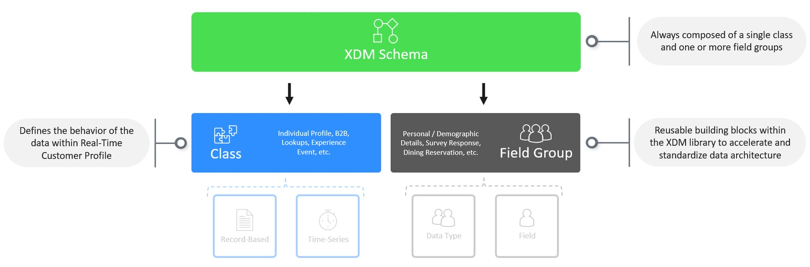

---
title: Build Schema
description: Build Schema
doc-type: overview-page
exl-id: 6a935c42-0446-43f7-8abc-442ee696a6cf
---

# **Schema Assembly**

All schemas as part of XDM are composed in the same way.  A schema is always composed of only one class and one or more field groups. Additionally a schema's class dictates how other systems within the Experience Platform will interpret the data (i.e. as a record-based or time-series).

#

# Your Objective

In this lab you will build the Connection 5G Customer Account schema utilizing the mapping sheet you filled in previously. When you are done with this part of the lab you should see a schema that looks similar to this:

