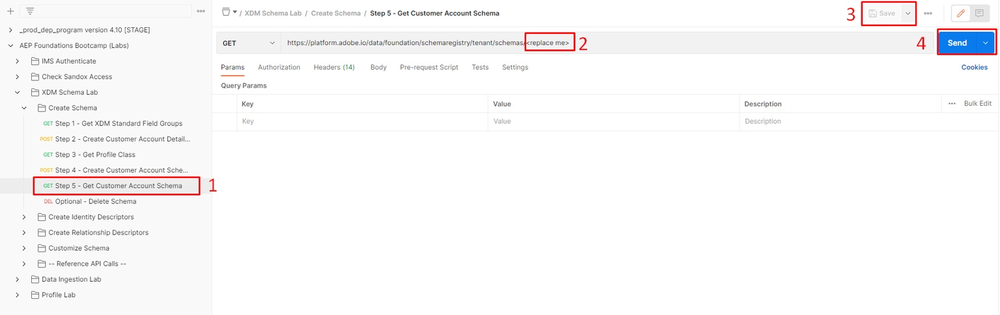

# **View via the UI**

1. Open your browser and navigate back to the `Schema -> Browse` section.

>[!NOTE]
>
>You will need to refresh the UI to see it as you just created it and need to re-query the schema registry

2\. Search for the schema `Sample Customer Schema - <your sandbox number>`

3\. Notice that the required class and the associated field groups are added to the schema

## View via the API

1. Select the `Step 5 - Get Customer Account Schema` API by clicking on it.
1. In the URL of the request replace the `<replace me>` with the `$meta:altId` you saved from the previous section (Create Your Schema) to the end of the call like shown below
1. Save the edits you've made the request
1. Execute the request by clicking the `Send` button

Example of your final request after adding the `$meta:altId`

If you received a `200 OK` response you should be able to browse the schema you created just through the lens the XDM JSON structure

