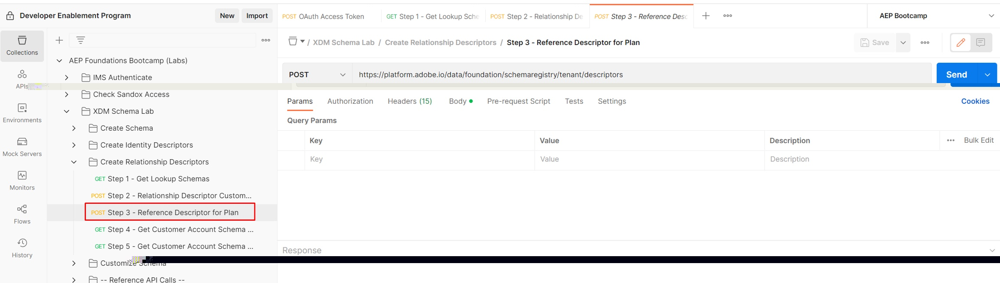

1. Click on the `Step 3 - Reference Descriptor for Plan` API request in the `XDM Schema Lab -> Create Relationship Descriptors `folder

>[!CAUTION]
>
>Do not execute the request...yet




2\. Update the following properties in the body of the API call. 

- Update the value of the `xdm:sourceSchema` property to the `$id` of the `Customer Account` schema you saved from the [Create Schema](../build-schema/create-schema.md)  step
- Update the value of the `xdm:sourceProperty` to the path of the `planID` field from the `Customer Account` schema

>[!NOTE]
>
>Use the dot notation value of the`planId` field from the `dep: Lookup Plan` schema and replace the`.` with     `/`
>
>Don't forget the leading `/` either 😄

EXAMPLE ONLY

```json
{
  "@type": "xdm:descriptorReferenceIdentity",
  "xdm:sourceSchema": "https://ns.adobe.com/devbc/schemas/8415ac18dd8943e35d12caf0c24b57b4a5a9ab7fd637245e",
  "xdm:sourceVersion": 1,
  "xdm:sourceProperty": "/_devbc/plan/planID",
  "xdm:identityNamespace": "planID"
}
```

>[!NOTE]
>
>Remember to update the tenant name above (\_devbc) with the your own


3\. Save your request before continuing using the `Save` button

4\. Execute the API by clicking the `Send` button

You should now see a `201 Created` response like below


>[!NOTE]
>
>A reference identity descriptor is always defined on the lookup schema (i.e. sourceSchema)

>[!WARNING]
>
>Reference Identity descriptors are created automatically in the backend when you create relationships from Schema UI. **You only need create them explicitly when utilizing the APIs to create schemas**

>[!NOTE]
>
>Awesome! You just created all the required descriptors to relate the `dep: Lookup Plan` schema to the `Customer Account` schema as well as enabled it to be referenced during batch segmentation

