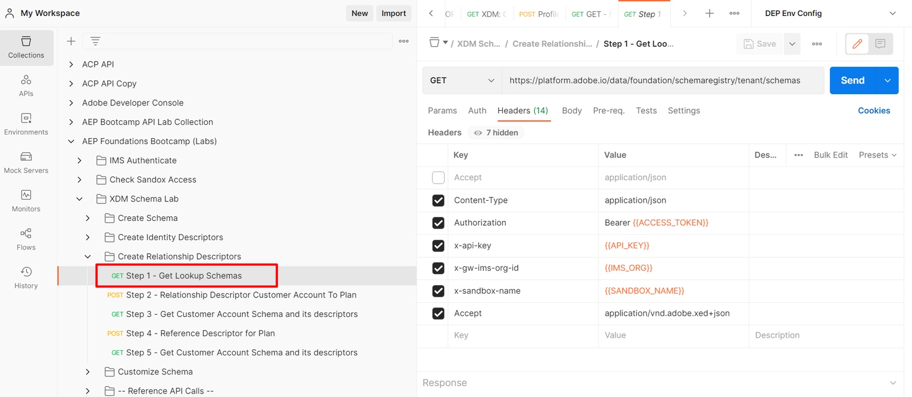

# List All Tenant Schemas

1. Click on the `Step 1 - Get Lookup Schemas`API request in the `XDM Schema Lab -> Create Relationship Descriptors` folder
1. Execute the API by clicking the `Send` button

>[!NOTE]
>
>This GET call fetches all the schemas that exist within the "tenant" part of the schema registry (i.e. custom created schemas). We only need to search for the **Plan** schema so we can relate it to the Customer Account schema. 

## Identify the Plan Schema

1. Search for the `dep: Plan [Lookup] `schema in the calls response
1. Copy the `$id` of the schema and save it somewhere for future reference

>[!NOTE]
>
>This schema should be pre-deployed in your sandbox already

>[!WARNING]
>
>Do not continue until you have saved `$id` of the schema somewhere.  It will be required later to create the Relationship Descriptor
